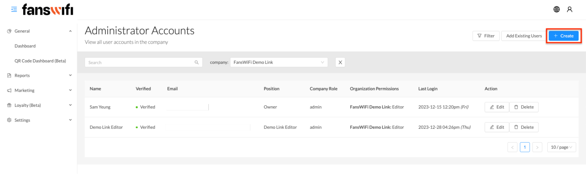
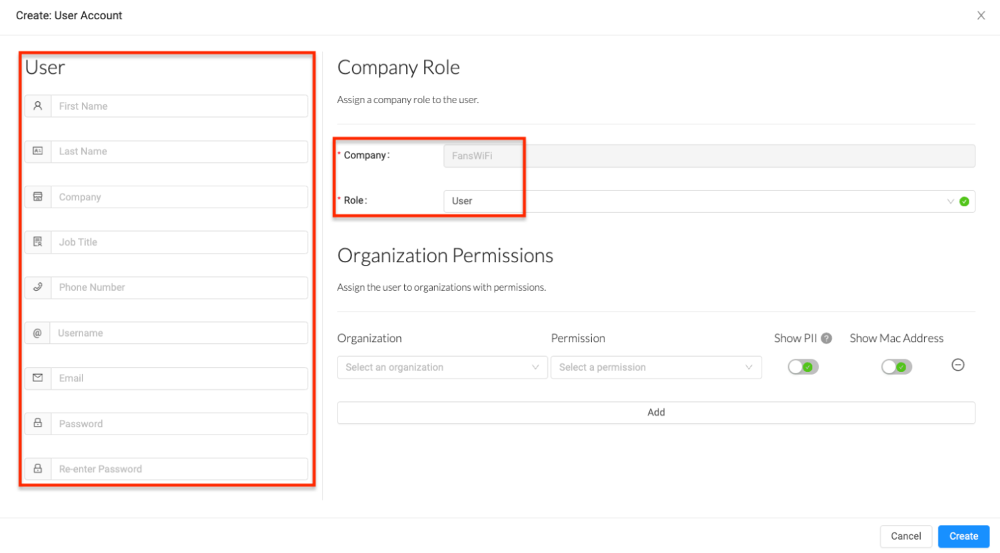
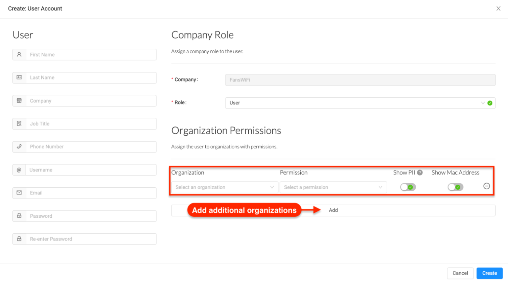
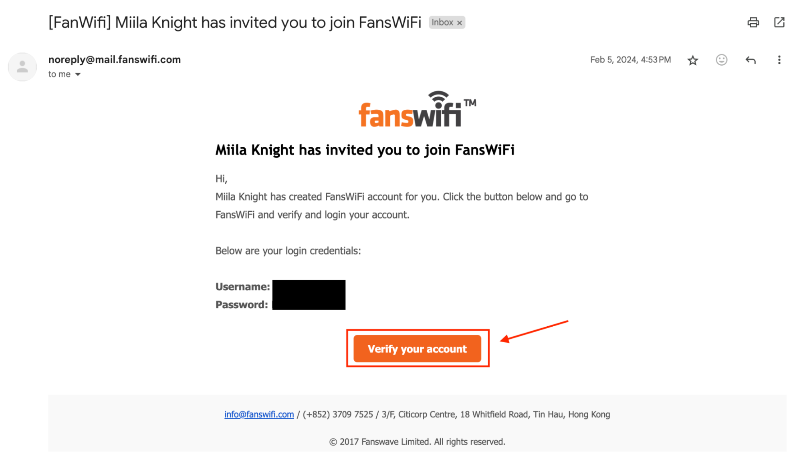
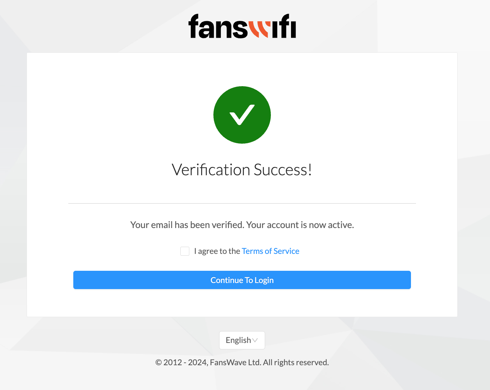

# 2.2 General - Additional Administrators

Role-Based Access Control in the FansWiFi platform ensures that users have access only to the relevant areas and functionalities based on their job roles. It assigns users specific roles with associated permissions, minimizing the risk of unauthorized entry and data breaches. This helps improve data security and ensures efficient access management.

`To give access and permissions to employees, please follow:`

`For new users, the administrator needs to create an account:`

To ensure the protection of collected data, the FansWiFi social WiFi marketing platform offers administrators the flexibility to control the visibility of users' data. Administrators have the option to choose whether to showcase **[Personal Identifiable Information (PII)](../../Security/personal-identifiable-information-pii.m)** or hide it from view. This allows businesses to comply with privacy regulations and maintain the confidentiality of user data.

In addition to data visibility and editing controls, the platform allows administrators to manage user permissions and roles for other associates within the company. The administrator has the authority to adjust the employees' permissions, granting access as ‘Editor’ or as ‘Viewer’ and the ability to see PII and Mac addresses.

By customizing employee roles and permissions, the administrator can ensure that only authorized personnel have access to sensitive data and platform functionalities. This helps enforce data security measures and prevents unauthorized handling or misuse.

`Add new user information and set role accordingly:`

`When confirming a new user’s account, the administrator will be able to set its permissions:`

Upon successful creation of a new user account, an email confirmation will be sent to the user's registered email address. This email will contain instructions and a link for the user to verify their account. The verification process ensures the user's identity and helps maintain the security of the platform.

In addition to verifying their account, the email will also include a request for the user to confirm their acceptance of the Terms of Use. This step is crucial to ensure that the user understands and agrees to abide by the terms and conditions set forth by the platform. By following the instructions in the email and completing the verification process, the user can gain full access to their account and begin utilizing the features and services provided by the platform.

`For existing users, the administrator needs to add their account to the organization:`

[Check out the demo video](../Demo-Videos/step-2-permissions-access-new-users-account.md)

