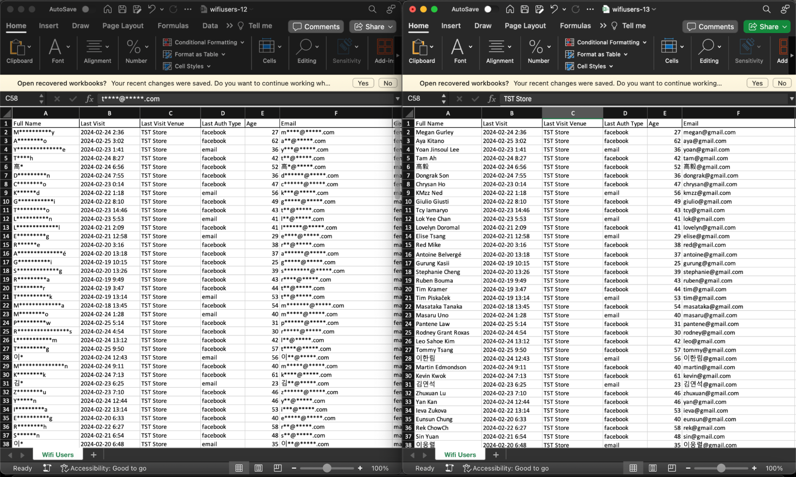

# 2.4 General - Personal Identifiable Information (PII)

To maintain the highest level of data security and protect the privacy of users, the system implements robust authorization measures through the use of authority codes, and the**One-Time Password (OTP)**feature. All PII data is securely locked to prevent unauthorized access, however, only the authorized personnel who are admins within the organization are granted access to view PII data.

## Step 1: Unlock

**The ‘Unlock’ button**becomes clickable in their designated accounts.
​`By clicking on this button, a unique OTP is generated and promptly sent to the user's registered email address, ensuring an added layer of authentication.`

## Step 2: Accessible PII data

Once the OTP is received in the user's mailbox, while still logged into the system, they are prompted to enter the OTP into the provided field.

`Upon successful verification, the locked PII data becomes accessible, enabling the authorized user to view and work with the previously restricted information.`

The unlocking process extends to include more than just the unlocking of PII data, it provides the functionality to export data in file formats such as Excel and CSV.

**For further information on Reports & CSV, kindly visithere.**

`Note: This feature enables authorized users to not just access, but also export the previously restricted data, empowering them to securely utilize the required information adhering to strict privacy protocols for user data.`

[Check out our demo videos](https://intercom.help/fanswifi/en/articles/9177793-step-2-permissions-access-new-users-account)
