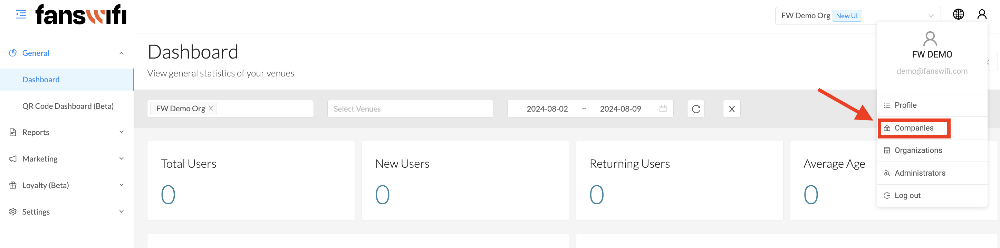

# 2.5 General - Additional Companies

To create additional companies, please select ‘Companies’ and click on ‘Create’ on the right-hand side of the page :

## Step 1: Select ‘Companies’

## Step 2: Click on ‘Create’

## Step 3: Fill out the information as needed


[Check out the demo video](../Demo-Videos/step-2-permissions-access-new-users-account.md)

