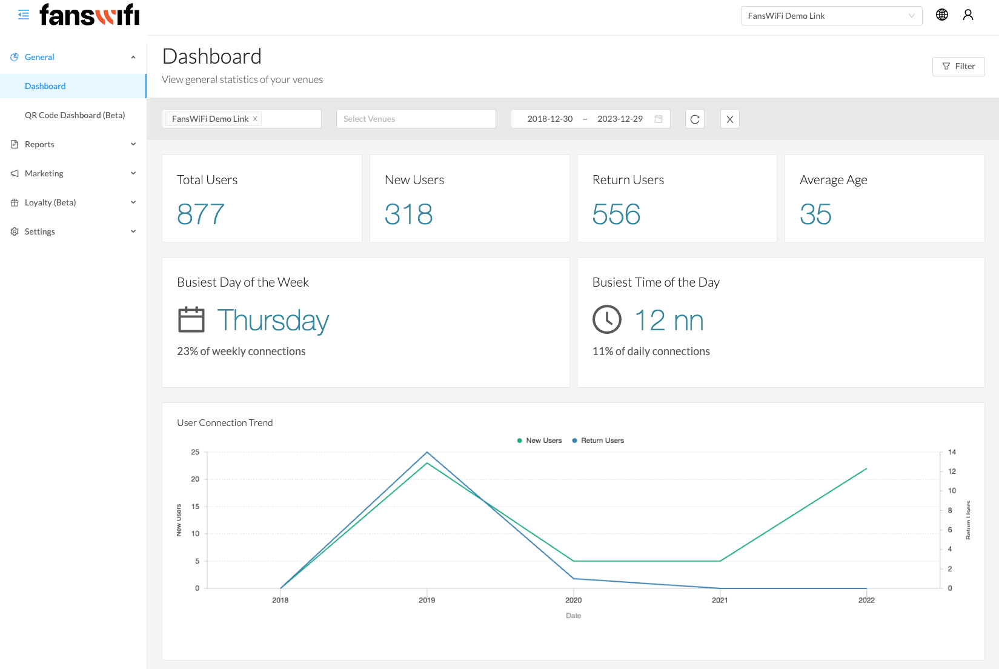
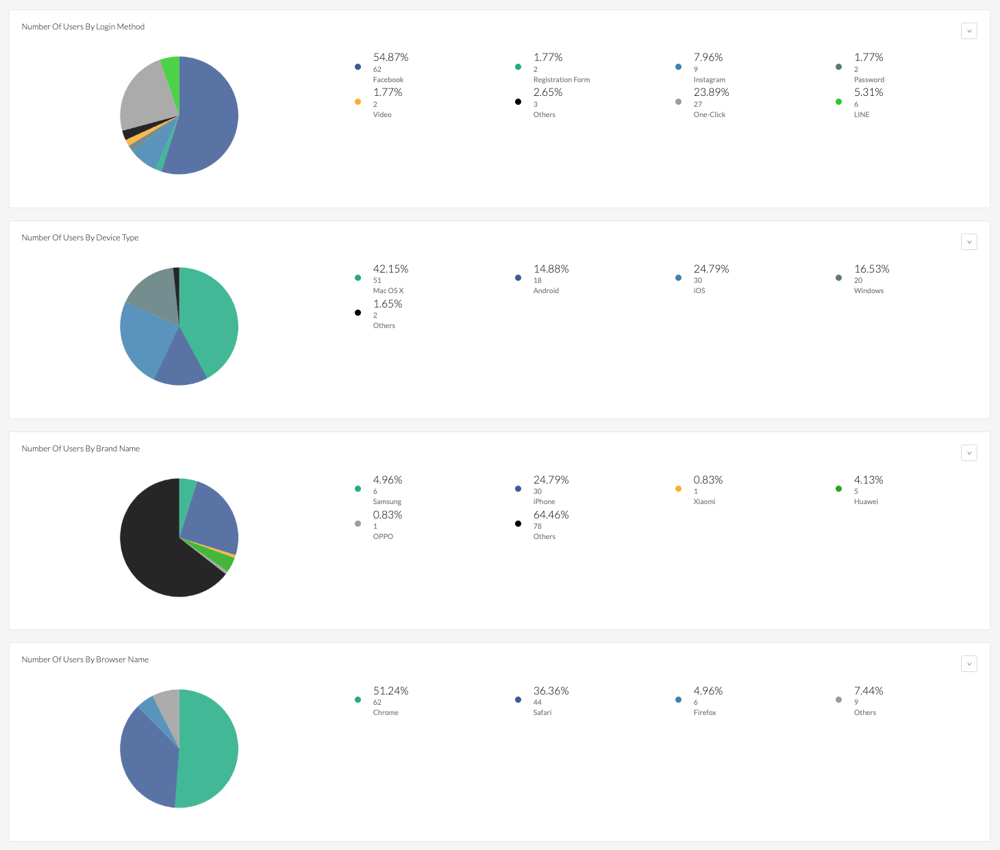
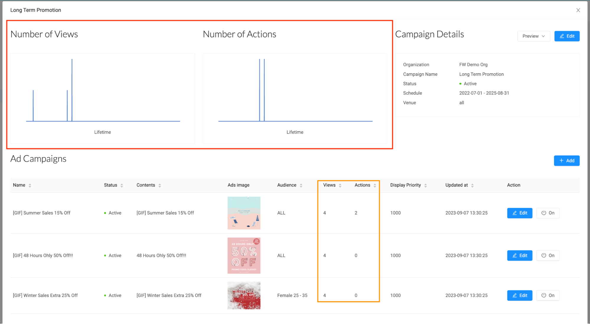

# 2.6 General - Dashboard/Data Analytics

To optimize marketing efforts and enhance personalization, FansWiFi collects and analyses user data on behavior and preferences including location, visit frequency, and past behavior actions. This data can be utilized to develop targeted marketing campaigns and deliver personalized offers that cater to individual needs.

`To gain valuable insights from the data collected through the FansWiFi platform:`

### Web-Based Dashboard View

The FansWiFi platform offers businesses valuable data on a variety of metrics to enhance their customer engagement strategies. The dashboard presents analytics such as total users, new users, return users, average age, percentages of users by age and gender, number of users by age and gender group, number of users by login method, device types, brand names, browser names, as well as the most visited users and recent users.

## Export CSV

`Each chart can be exported into CSV via:`

The administration has the option to capture screenshots of the analysis. This allows you to capture a comprehensive view of the entire dashboard interface, including the various elements, data visualizations, and any relevant information displayed.

Taking screenshots can be useful, particularly of total/new/returned users, average age, the busiest day of the week, the busiest time of the day, and the chart of new/returned users for documentation purposes, sharing insights, or preserving a snapshot of the dashboard's current state for future reference.

By capturing the entire dashboard in a screenshot, the admin can ensure that all the relevant details and visualizations are captured in a single image, providing a comprehensive representation of the dashboard's content.

**For further information on Reports & CSV, kindly visithere.**

## Campaign Performances

To view and understand the details of the marketing campaigns, navigate to the ‘Campaigns’ section on the navigation bar. In this section, one can access essential information such as the campaign name, status, schedule, number of ads, views, actions taken, and the venue where it is implemented. Under the ‘Action’ section, there are several options available for managing the campaigns.

`By clicking on the ‘Edit’ option, a comprehensive view of the campaign details can be accessed, including real-time information on how it is being interacted with and experienced by WiFi users. Users of the platform have the ability to review the details set for each ad and make any necessary edits or deactivations as needed.`

Through analyzing the campaign details, valuable insights can be gained regarding various important aspects. These include the name of each campaign ad, its current status, the images utilized in the ads, the number of views received, and the user interactions with the campaign ads. Furthermore, the campaign details offer information about the organization and company responsible for the campaign, its current status, activation schedule, and the specific venues where the campaign is active.

Within the Campaign Details section, the admin has the ability to monitor and track the cumulative number of views and actions taken on all campaigns. This information is generated from each campaign ad and is aggregated to provide an overall view of the campaign's performance. By reviewing this data, the admin can gain insights into the level of engagement and effectiveness of the campaigns as a whole.

By efficiently managing and monitoring these campaign details, the admin can ensure that marketing efforts are precisely targeted, impactful, and in alignment with overarching goals.

[Check out the demo video](../Demo-Videos/step-3-dashboard-csv-export.md)

**For further information on Ads Campaign Creation, kindly visithere.**
