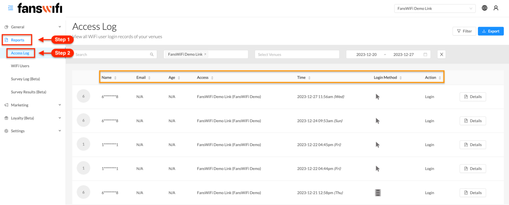
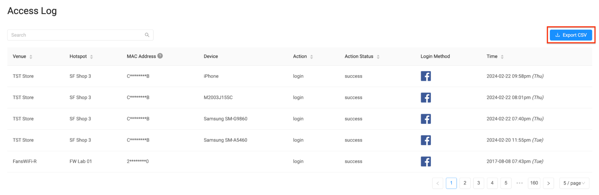

# 3.1 Reports - Access Log

## Access Log

The Access Log feature plays a crucial role in tracking social media engagement. Users can rely on it to gain a comprehensive understanding of the level of engagement by reviewing and analyzing the data within the Access Log. To view the WiFi user login records of the venues, follow these steps:

1. Go to the**‘Reports’ section**in the menu bar.
2. From the dropdown menu,**select ‘Access Log’.**
3. You will be directed to the access log page, where WiFi user login records are displayed.

The records are organized chronologically, with the most recent data at the top.

`The user's name, email address, age, accessed organization, time and date of login, login method used, and action taken are all shown.`

`On the right side of the page, a ‘Details’ button is located, which offers more specific information regarding the login activity of each user.`

The ‘Details’ section provides comprehensive information about the WiFi user and their activities. It includes:

### WiFi User Information

This includes data collected from the Captive Portal, such as the user's name, gender, age, date of birth, email address, login method used, total number of visits, last accessed network, first-time login, and last seen activity. Please note that this information is collected and updated based on the data set on the Captive Portal.

### User Devices

Information about the devices used by the user to access the WiFi is captured. This includes the MAC address, device type, operating system, number of visits, login method used, accessed network, and seen activity.

### Access Log (Details)

Every sign-in event is recorded in the Access Log. This section displays details such as the venue accessed, the specific hotspot connected to, the MAC address of the device used, the device type, the action taken (e.g., logging in or liking the fan page), the login method utilized, and the timestamp of the access. The Access Log retains all the saved records, and at the bottom of the page, there is a pagination feature for administrators to navigate through the access details. Additionally, administrators can choose the preferred number of logins to be displayed per page for easier management and analysis.

With the ‘Details’ section, administrators can gain a comprehensive understanding of user information, device usage, and a detailed log of all access activities, enabling effective monitoring and analysis of the WiFi network usage.

​
To export the collected data from the Access Log, simply click on the 'Export CSV' option. It is important to note that the exported data corresponds to the logs displayed on the current page. If a larger dataset is needed, the number of logs shown per page can be adjusted, ranging from 5 to 100. If there are more than 100 data logs, changing the page number will allow for exporting the remaining logs.

Depending on the Personal Identifiable Information (PII) arrangements, the left side will showcase the profile picture of the accessed user. In cases where PII restrictions prevent the display of specific details, the viewer will have the option to see either the first digit or an initial as a substitute.

​
