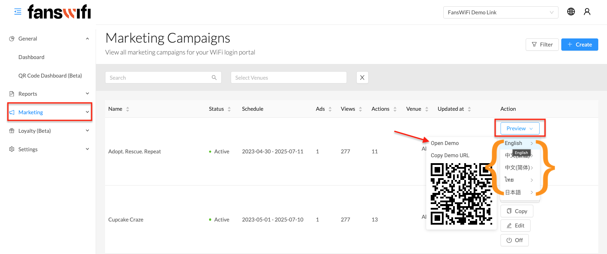

# 4.1 Marketing - Ad Campaign - Eidt Campaigns

## Create Ad Campaigns

To create a campaign, click ‘Campaigns’ in the left menu and click ‘Create’ on the right. In the campaign creation form, you can specify a campaign name, which will not be visible to WiFi users, and set the desired date range for the campaign.

Choose between ‘All venues’ or ‘Disabled’ for hotspot redirection:

- **Enabled: All hotspots in all venues will redirect users to the campaign page.**
- **Disabled: Select specific venues to display the campaign.**

If disabled, the admin will be able to select the venue they would like to showcase this campaign from the dropdown.

`In the ‘Remarks’ section, there is an option to include any remarks or notes for internal reference. To activate the campaign, users can simply toggle the button and observe the change to blue, indicating that the campaign is now active and ready to be launched.`

## Create First Ad (Campaign)

To create an advertising campaign, start by setting the name of the ad for internal reference, which will not be visible to WiFi users. Additionally, determine the preferred display priority of the campaign.

Next, curate the Audience template to precisely target your desired audience market. This step involves specifying demographic details such as age, gender, visit type as well as login method types. Moreover, generate a Content template that effectively presents and highlights the intended audience. This includes creating compelling titles, engaging descriptions, choosing appropriate images or videos, and defining action titles.

For initial campaign setup, it is necessary to create ‘Audience’ and ‘Content’ templates. These templates enable the personalization of the target audience and campaign content. If there are existing templates saved, you can conveniently choose them from the dropdown list to streamline the process.

`By following these steps, you can create an advertising campaign tailored to your specific needs, ensuring it reaches the right audience with captivating content.`

## Preview Campaign

To view the campaigns from the Marketing collection page, there are two methods to preview the campaigns:

1. Click on ‘Preview’: The Admin has the ability to select the language in which the campaign preview is displayed.

By utilizing methods such as ‘Open Demo’ to preview the campaigns, you can evaluate their appearance, functionality, and user experience. This interactive and immersive approach allows for a thorough assessment of their effectiveness and impact. It helps ensure that the campaigns are visually appealing, properly localized, and engaging to your target audience, thereby maximizing their overall effectiveness.

`Click on ‘Open Demo’: This allows viewing the campaign in action and gives a real-time demonstration of how the campaign will be presented and experienced by users.`

`Click ‘Edit’ to access the detailed campaign page for making modifications and adjustments.`

`In the top right corner, there is the ‘Preview’ action button with a dropdown menu of available languages. From there, select ‘Open Demo’ to view the campaign in action.`

### Campaigns Preview:

[Check out our demo video](https://intercom.help/fanswifi/en/articles/9177794-step-4-campaign-ads)
