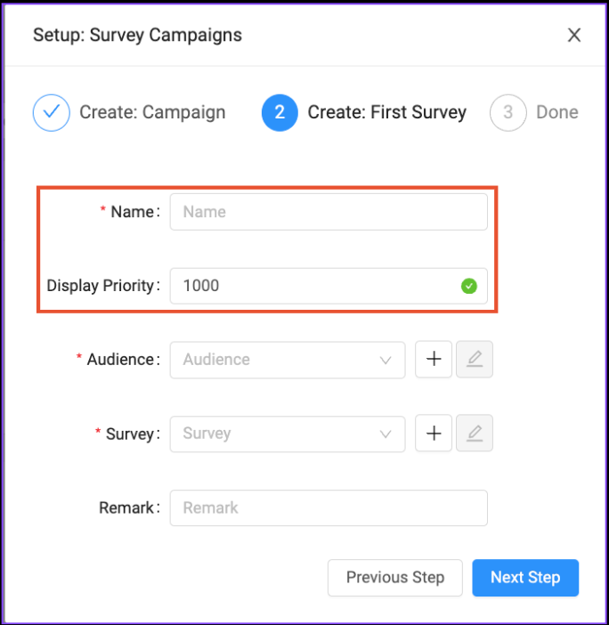
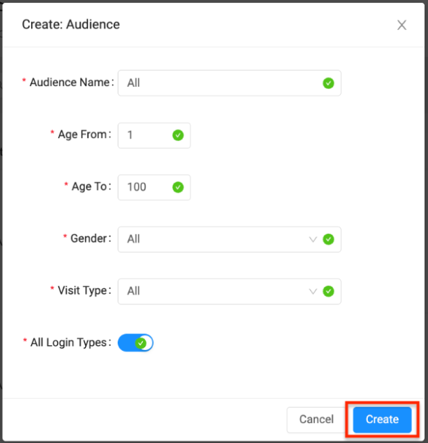
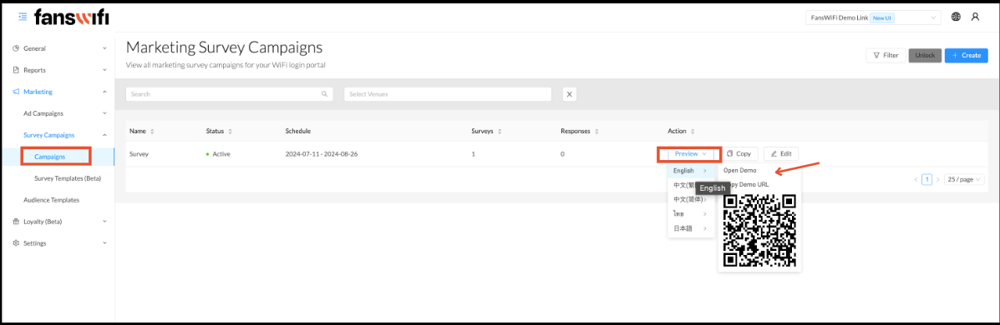

# 4.3 Marketing - Survey

## Create Survey Campaigns

To create a survey, click ‘Campaigns’ in the left menu and click ‘Create’ on the right. In the Setup Survey campaign form, you can specify a survey name, which will not be visible to WiFi users, and set the desired date range for the survey.

Choose between ‘All venues’ or ‘Disabled’ for hotspot redirection:

- **Enabled: All hotspots in all venues will redirect users to the campaign page.**
- **Disabled: Select specific venues to display the campaign.**

If disabled, the admin will be able to select the venue they would like to showcase this campaign from the dropdown.

`In the ‘Remarks’ section, there is an option to include any remarks or notes for internal reference. To activate the survey, users can simply toggle the button and observe the change to blue, indicating that the survey is now active and ready to be launched.`

## Create First Survey (Campaign)

To create an advertising campaign, start by setting the name of the ad for internal reference, which will not be visible to WiFi users. Additionally, determine the preferred display priority of the campaign.

Next, curate the Audience template to precisely target your desired audience market. This step involves specifying demographic details such as age, gender, visit type as well as login method types. Moreover, generate a Content template that effectively presents and highlights the intended audience. This includes creating compelling titles, engaging descriptions, choosing appropriate images or videos, and defining action titles.

For initial campaign setup, it is necessary to create ‘Audience’ and ‘Content’ templates. These templates enable the personalization of the target audience and campaign content. If there are existing templates saved, you can conveniently choose them from the dropdown list to streamline the process.

`By following these steps, you can create an survey  tailored to your specific needs, ensuring it reaches the right audience with captivating content.`

## Create Audience and Content Templates

## Audience Template

To create Audience templates, begin by establishing the name of the audience group. This name is intended for internal use and will not be displayed to users. Determine the priority of the campaign, which allows you to assign relative importance to it (Assign higher range to indicate greater importance). Next, define the range of ages for the targeted users by specifying the ‘Age From’ and ‘Age To’ values. For instance, you can set the minimum age as 1 and the maximum age as 100 to encompass a broad spectrum of age groups.

Determine the gender of the targeted audience plays a factor. There is an option to select ‘Male’, ‘Female’, or ‘All’ to include users of all genders or focus specifically on a particular gender.

The Visit Type can be chosen to determine which users will be exposed to the ads. The options available include selecting ‘First time users’ to exclusively display advertisements to users visiting for the first time. Alternatively, ‘Repeated users (Returning users)’ can be chosen to show ads to users who have previously visited. Opting for ‘All’ ensures that ads are shown to all users, regardless of whether they are first time or returning users.

`By following these steps, the admin can create Audience templates that define the target audience based on age, gender, visit type, and login methods. These templates enable effectively reaching and engaging with the desired audience when running surveys.`

## Survey Template

1. Survey Template Name: The title of the campaign will be shown to WiFi users.
2. Description: The description of the campaign is displayed to WiFi users.
3. Image: The campaign image is shown to WiFi users. (JPEG, PNG, PDF, GIF, and many more)
4. Action Title: Set the desired action title, such as ‘Show More’ (This can be customized to fit your preferences).

To create Survey templates, specify the Survey Name. This name will be used as the survey content and will be shown to connected WiFi users. There are several Template formats to select from the available options:

1. Multiple Choice
2. Yes/No
3. Rating

Provide the necessary details for the content template:

- Title: Enter the title of the campaign that will be displayed to WiFi users.
- Description: The description of the campaign that will be shown to WiFi users.
- Question: The question you want the WiFi users to respond to.
- Image: Upload an image that represents the campaign. Accepted formats include JPEG, PNG, PDF, GIF, and more. (Please refer to recommended size)
- Option/Style: Depending on the type of question chosen, you can add options or a type of rating.

As shown in the image above, utilize the following features:

1. **Language**:

The content can be set in various languages, including English, Traditional Chinese, and Simplified Chinese. This enables catering to a diverse audience and facilitating effective communication.

​`Once the Audience and Content settings have been configured, the page layout will appear as follows:`

## Preview Survey

To view the campaigns from the Marketing collection page, there are two methods to preview the campaigns:

1. Click on ‘Preview’: The Admin has the ability to select the language in which the campaign preview is displayed.

By utilizing methods such as ‘Open Demo’ to preview the campaigns, you can evaluate their appearance, functionality, and user experience. This interactive and immersive approach allows for a thorough assessment of their effectiveness and impact. It helps ensure that the surveys are visually appealing, properly localized, and engaging to your target audience, thereby maximizing their overall effectiveness.

`Click on ‘Open Demo’: This allows viewing the campaign in action and gives a real-time demonstration of how the campaign will be presented and experienced by users.`

`Click ‘Edit’ to access the detailed campaign page for making modifications and adjustments.`

