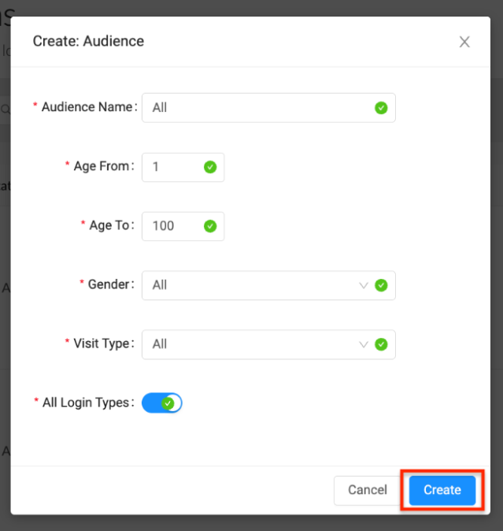
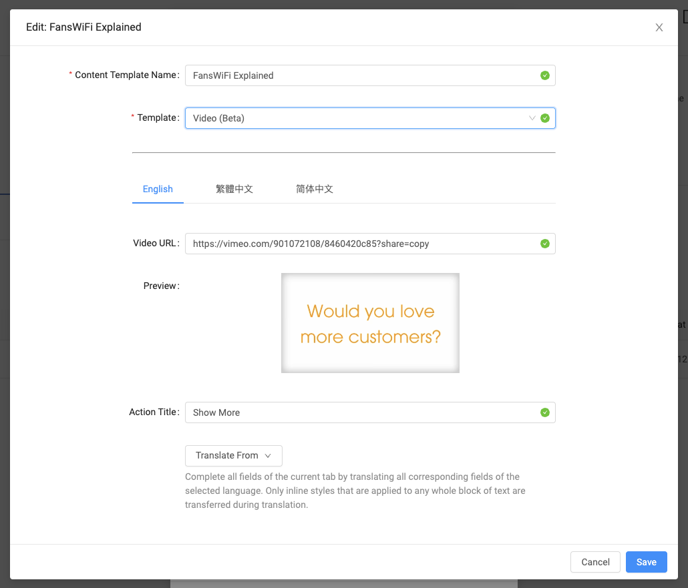
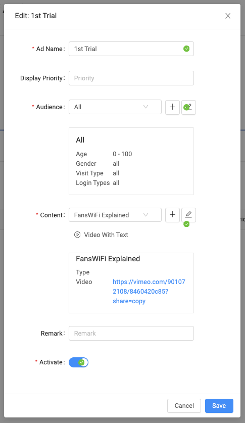

# 4.4 Marketing - Video Ads

## Video Ads Campaign Creation

## Create Ad Campaigns

To initiate the campaign creation process, navigate to the ‘Campaigns’ option in the left menu and select ‘Create’ on the right. Within the campaign creation form, you can designate a campaign name (not visible to WiFi users) and establish the desired date range for the campaign.

Choose between ‘All venues’ or ‘Disabled’ for hotspot redirection:

- All venues: Enabled - All hotspots across all venues will redirect users to the campaign page.
- Disabled: When selected, specific venues can be chosen to display the campaign. The admin has the option to make the venue selection from the dropdown menu.

In the ‘Remarks’ section, internal remarks or notes can be included for reference purposes. To activate the campaign, simply click on the button, which will change its color to blue. This signifies that the campaign is now active and ready to be launched.

## Create First Ad (Campaign)

To create an advertising campaign, start by setting an internal reference name for the ad. This name will not be visible to WiFi users but will help the admins and co-users identify the campaign easily. Additionally, the display priority can be determined based on the importance of the campaign.

Curate the Audience template to target the desired audience market involves specifying demographic details such as age, gender, visit type, and login method types. By defining these parameters, the campaign can reach the right audience. In order to effectively create a compelling Content template to showcase the target audience, includes crafting engaging titles, writing captivating descriptions, selecting suitable images or videos, and defining action titles to encourage user interaction.

If this is the first campaign, it is compulsory to create both ‘Audience’ and ’Content’ templates. These templates allow for customizing the target audience and the content of the campaign. However, previously created and saved templates, can easily be selected from the dropdown list to expedite the process.

By following these steps, the admin can create an advertising campaign that is tailored to specific marketing needs, ensuring that the campaign reaches the right audience with captivating content, maximizing its effectiveness.

## Create Audience and Content Templates

## Audience Template

To create Audience templates, begin by assigning a name to the audience group. This name is used for internal purposes only and will not be visible to users. Specify the age range of the targeted users by indicating the ‘Age From’ and ‘Age To’ values. For instance, the admin can set the minimum age to 1 and the maximum age to 100 to cover a broad spectrum of age groups.

Determining the gender of the targeted audience is an important factor. You have the flexibility to select ‘Male’, ‘Female’, or ‘All’ to include users of a specific gender or stay exclusive to all genders.

The Visit Type option provides the ability to determine which users will be able to view the ads. You can choose ‘First-time users’ to display advertisements for first-time visitors and select ‘Repeated users (Returning users)’ to show ads to users who have previously visited. Selecting ‘All’ displays the ads to all users, regardless of whether they are first-time users or returning users.

This allows the admin to create Audience templates that precisely define the target audience based on age, gender, visit type, and login methods and facilitate effective reach and engagement with the desired audience when running ad campaigns.

## Content Template

To create Content templates, start by specifying the Content Template Name, such as "FansWiFi Explained". This name will serve as the campaign content and will be visible to WiFi users who are connected.

There are different Template formats to choose from, including:

1. Image with Text
2. Video
3. Video with Text

To create a video campaign ad, please select either 'Video' or 'Video with Text' to proceed further. These options enable you to integrate videos into your campaign content effectively.

Fill in the information:

1. Content Template Name: The title of the campaign will be shown to WiFi users.
2. Action Title: Set the desired action title, such as "Show More" (This can be customized to fit preferences)
3. As for content, the following goes:

Video with Text

1. Video: The campaign video shown to WiFi users must be uploaded to Vimeo with a Vimeo Plus or above account.
2. Description: The description of the campaign is displayed to WiFi users.

The description toolbar as shown above provides various formatting options to enhance the appearance and focus of your content. These options include:

1. Bold/Italic/Underline
2. Text font & Size
3. Font color & Highlight
4. Indention & Alignment
5. Bullet points & Numbering
6. Images
7. Emojis

## Video

Video: The campaign video shown to WiFi users must be uploaded to Vimeo with a Vimeo Plus or above account.

After setting up the Audience and Content settings, the page layout will be displayed as:

[Check out our demo video](https://intercom.help/fanswifi/en/articles/9177794-step-4-campaign-ads)
