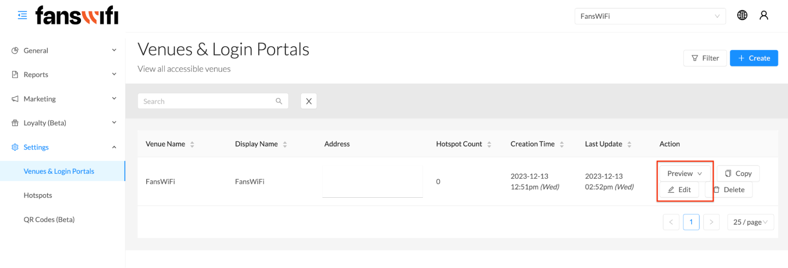

# 6.1 Settings - Venue & Login portal - Basic Information

To customize and adjust the settings and appearance of the Captive Portal, follow these steps:

1. Click on the ‘Settings’ option located on the menu bar
2. From there, navigate to the ‘Venues & Login Portals’ section
3. Access the settings related to Captive Portal's configuration and appearance
​
By following these steps, you will be able to update and personalize the Captive Portal according to preferences and requirements via ‘Edit’ and can check out the outcome by ‘Preview’.

When navigating through the system, one will encounter the Venue Settings menu, which consists of the following options - Venue: Basic Information, Look & Feel, Terms of Use, Advanced, Limits, Controllers, and Login Methods.

## Basic Information:

The information provided during the profile creation process will be automatically populated in your basic information. If necessary, you can make adjustments to the information as needed.

[Check out the demo video](../Demo-Videos/step-10-portal-settings-terms-of-use-advanced-limits-controllers.md)