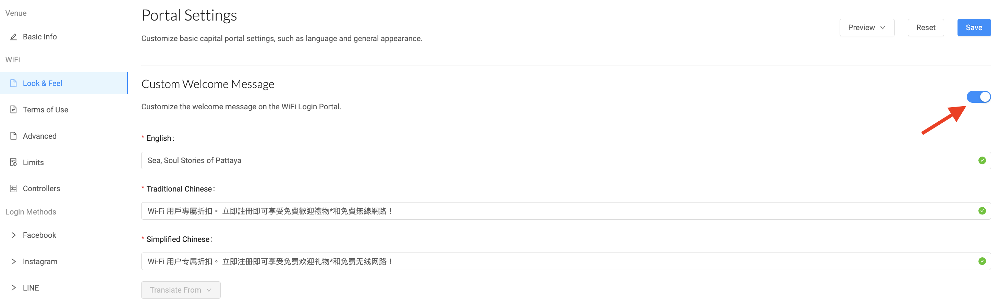
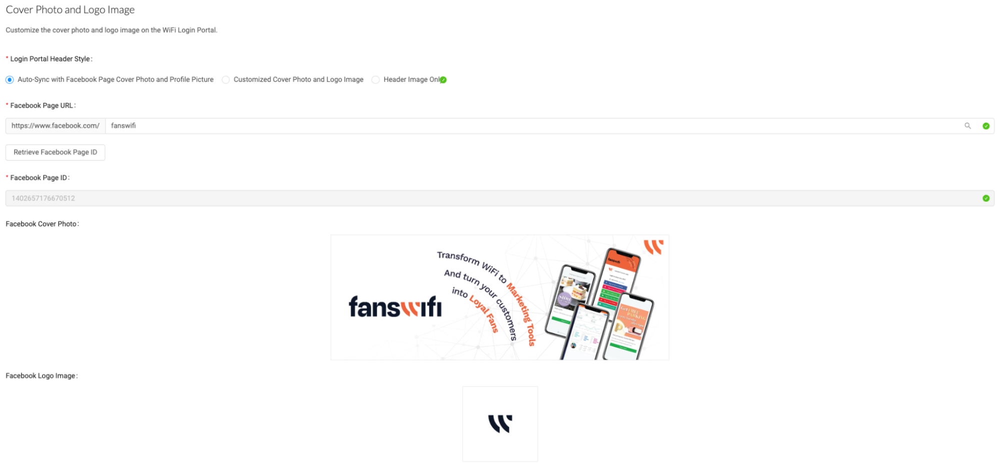
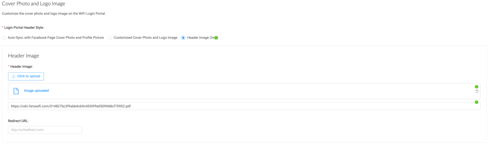

# 6.2 Settings - Venue & Login portal- Look & Feel

**Language:**

Within the Venue Settings menu, companies have the option to configure the language settings for their Captive Portal. You can choose one of the following options:

- **Default Language**: Can select a default language (English, Traditional Chinese, and Simplified Chinese), ensuring that all users can view the Portal's content in their desired language. Moreover, users have the flexibility to manually change the language on the Captive Portal using the provided language selection feature.
- **Automatic Language Detection**: Alternatively, the admin can enable the feature that automatically detects the language of the user's device. With this option, the Captive Portal will adjust its language accordingly, providing a personalized experience for each user.
- **Enabled Languages**: Have the ability to select specific languages that you want to cater to within the Captive Portal. This allows to offer multiple language options to the users.

`By configuring the language settings, a company can ensure that the Captive Portal is accessible and user-friendly for individuals who speak different languages.`

​**Custom Welcome Message:**

**Activate Customize feature**

Once the customization feature is activated, the admin can input the desired Welcome Message, which can include a warm greeting, instructions, important information, or any content they wish to convey to users upon their entry to the Portal.

Enabling and customizing the Welcome Message enhances the user experience by creating a more engaging and informative interaction with the Captive Portal.

## Cover Photo and Logo Image:

Within the options provided to customize the login portal, there are three choices:

1. Auto-Sync with Facebook Page Cover Poto and Profile Picture
2. Customized Cover Photo and Logo Image
3. Header Image Only

These options offer the ability to customize the login portal according to preferences, such as automatically syncing with the Facebook page, uploading custom images, or utilizing a header image. The choice can be made based on branding and design requirements to ensure the desired outcome.

Auto-Sync with Facebook Page Cover Poto and Profile Picture

By linking the Captive Portal to the Facebook page using the Facebook Page URL, it can automate the connection between the Captive Portal and the Facebook Cover Photo and Logo Image.

Once the Facebook URL is provided in the appropriate settings within the Captive Portal configuration, the system will automatically fetch and display the Facebook Cover Photo from the Facebook Page as the Cover Image for Captive Portal. Similarly, the system will also retrieve the Logo Image from the Facebook Display Picture associated and use it as the logo for the Captive Portal.

This automation helps streamline the process of setting up Captive Portal by leveraging the existing branding assets from the company’s Facebook Page. It ensures consistency and familiarity for users who are already familiar with the Facebook presence. By linking the Captive Portal to the Facebook Page in this way, the company can maintain a cohesive brand identity and provide a seamless experience for users transitioning from Facebook Page to Captive Portal.

## Customized Cover Photo and Logo Image

If the company wishes to create a distinct ambiance for current events or festive seasons, they can utilize this option to customize the Captive Portal separately from the company’s Facebook Page. This allows the admin to give the Captive Portal a unique look and feel that aligns with the specific theme or atmosphere desired for events or seasonal celebrations.

For optimal results, please ensure that the custom images meet the following size and file format requirements:

Logo Image: PDF, JPEG, and PNG (Recommended size: 170px x 170px)

Cover Photo: PDF, JPEG, PNG, and GIF (Recommended size: 820px x 312px)

Ensuring compliance with these size and file format specifications carries the proper display and visual integrity of your custom images within the Captive Portal. Take advantage of this option to customize the appearance of the Captive Portal and provide a distinct and celebratory experience for your users during special events or seasonal occasions.

## Header Image Only

If the company wishes to exclude the Logo Image from display, they have the option to solely showcase the Header Image. This choice enables emphasis on a visually captivating image at the top of the Portal, without incorporating the Logo Image into the design.

*Remarks: The Redirect URL feature in the 'Login Portal Header Style' options is currently in its alpha stage and is exclusively available to selected customers. By utilizing this feature, users gain the ability to direct visitors to a specific website upon clicking on the cover photo. If you are interested in accessing this feature, we kindly ask to reach out to our customer service for more information and assistance.*

**Overview**

[For more information, check out our demo video](https://intercom.help/fanswifi/en/articles/9177810-step-10-portal-settings-terms-of-use-advanced-limits-controllers)
