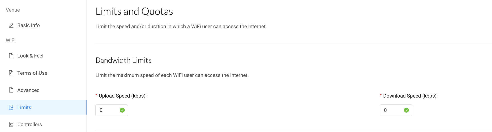
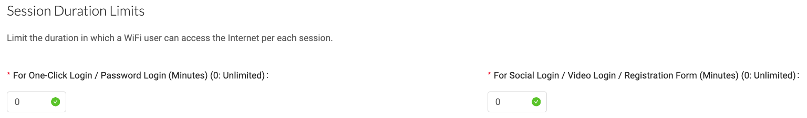

# 6.5 Settings - Venue & Login portal - Limits

FansWiFi offers the ability to limit the speed, duration, and number of daily sessions for WiFi users. These limitations facilitate the following aspects:

## Bandwidth Limits

Admin can set maximum upload and download speeds for each WiFi user, restricting their access to the internet within specific speed limits. This ensures fair distribution of bandwidth resources and prevents any individual user from monopolizing the available network capacity.

## Session Duration Limits

Admin can define the duration of each internet session for WiFi users. This limit is set within a range of minutes, allowing users to connect for a specified period before automatically disconnecting. By setting session duration limits, the admin can manage user access time and prevent prolonged connections that may unnecessarily occupy network resources.

## Daily Login Quota

This enables the business to limit the number of daily login sessions for WiFi users. Admin can set a maximum quota for the number of times a user can access the internet within a single day. This encourages users to choose between different login options and helps generate accurate data by distinguishing unique users based on their login sessions.

Through Session Duration Limits and Daily Login Qouta, the differentiation between login methods encourages the company to allow users to opt for these different login methods, for example basing it on the duration and quotas given for certain login methods, to not only help generate accurate data but to its fullest potential.

*Remarks: Inputting 0 means no limit*


[Check out the demo video](../Demo-Videos/step-10-portal-settings-terms-of-use-advanced-limits-controllers.md)
