# 6.7 Settings - Venue & Login portal - Login Methods

Our platform offers support for a diverse selection of social media and social networking applications. Each login method provides the flexibility to choose the desired color for the account button associated with the respective application on the Captive Portal.

In case the desired colors are not available in the provided palette, you can utilize the Pantone color code and enter it into the "color picker" or "color search bar" provided below.

`This feature enables the administration to fully customize the button's color, ensuring it aligns precisely with the specific preferences or branding requirements.`

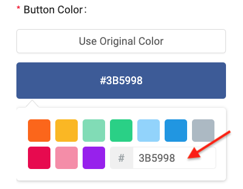

Below, you will find valuable information on effectively utilizing each application after it has been enabled on the Captive Portal:

## Facebook

Our platform offers the Facebook Like Button feature, allowing the company to provide its WiFi users with the option to follow a dedicated Facebook Fan Page.

- When the Like Button is enabled, it will be visible to users on the Captive Portal, allowing them to easily click and follow the company’s Facebook Fan Page.
- If the decision is made to disable the Like Button, it will no longer be visible on the Captive Portal, thereby removing the option for users to follow the company's Facebook Fan Page through the Portal.

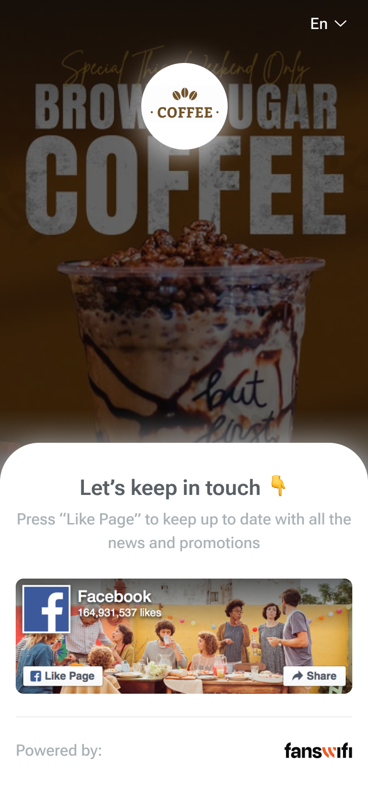

This feature provides flexibility in promoting and growing the company’s Facebook presence, giving control over whether to show or hide the Like Button on the Captive Portal interface.

To enhance the control over social media logins, the company has to input the company's Facebook Page URL. The platform will retrieve the Facebook Page ID associated with the company’s account. To ensure successful linking to the configuration, please make sure to click on the 'Retrieve Facebook ID' button provided. This streamlines the process, ensuring accurate and efficient integration of the Facebook Page with the login system.

The Facebook Check-In Option feature grants flexibility in determining whether WiFi users have the ability to check in to the location via Facebook. When this feature is enabled as a requirement, WiFi users have to check into the location on Facebook, sharing their visit with their social network.

This can enhance visibility and engagement for your business. Alternatively, if choose to enable this feature as optional, users will have the choice to check in or not. This provides them with the freedom to decide whether they want to share their visit on Facebook. Additionally, by disabling this feature entirely, WiFi users will not be prompted to check in to your location via Facebook. This feature allows you to control how users interact with your business on social media platforms, ensuring alignment with the company’s business goals and preferences.

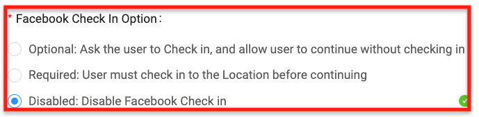

To configure the account for WiFi user check-ins, the administration needs to add the company’s Facebook location URL to the settings. Make sure to include the URL and then click on the 'Retrieve Facebook ID' button to retrieve and link the Facebook ID to the configuration.

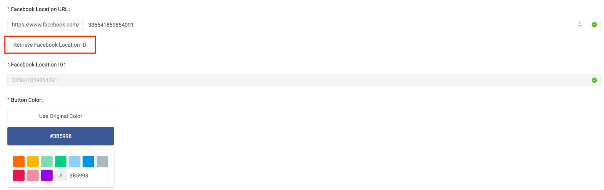


**For demo videos of 'Facebook Login', kindly visit [here](https://fanswifi-onmicrosoftakan.gitbook.io/df3/~/revisions/buPaWNqGQ6m7zTwpZYJq/guide/demo-videos/step-11-portal-settings-login-method-facebook)**


## Google

Enable WiFi users to log in using Google account.

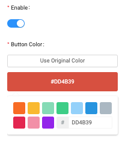


**For demo videos of 'Google Login', kindly visit [here](https://fanswifi-onmicrosoftakan.gitbook.io/df3/~/revisions/buPaWNqGQ6m7zTwpZYJq/guide/demo-videos/step-12-portal-settings-login-method-instagram).**


## Instagram

Setting up an Instagram social media login on the Captive Portal shares similarities with Facebook login configuration:

1. Instagram Follow Option

> Optional: Users can follow based on their preference

> Required: Users are required to follow

> Disabled: Users do not have to follow
2. Instagram Page ID

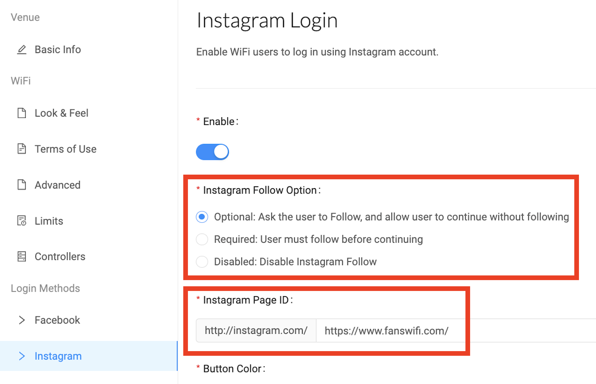


**For demo videos of 'Instagram Login', kindly visit [here](https://fanswifi-onmicrosoftakan.gitbook.io/df3/~/revisions/buPaWNqGQ6m7zTwpZYJq/guide/demo-videos/step-12-portal-settings-login-method-instagram).**


## LINE

To set up the LINE social network login on the Captive Portal, it is needed to input a valid LINE ID associated with the company. This LINE ID serves as a unique identifier for the company's LINE account and is used to establish the connection between FansWiFi and the LINE social network. It enables seamless integration with LINE and allows users to authenticate themselves with their LINE accounts.

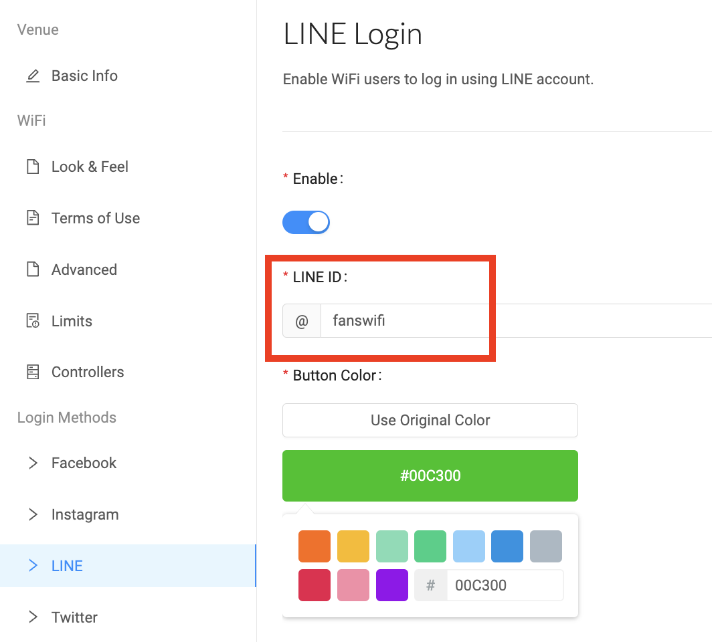


**For demo videos of 'Line Login', kindly visit [here](https://fanswifi-onmicrosoftakan.gitbook.io/df3/~/revisions/buPaWNqGQ6m7zTwpZYJq/guide/demo-videos/step-13-portal-settings-login-method-line).**


## X (formerly known as Twitter)

To promote the company's Twitter account, one can provide WiFi users with the option to log in via their Twitter accounts (now referred to as 'X') on the Captive Portal. Users have two choices:

- Login Only: Users can choose to use their Twitter accounts solely to log in to the Captive Portal. They will not be required to take any additional action, such as following the company's Twitter account.
- Follow Company's Account: In addition to ‘follow’, the admin can require users to follow the company's Twitter account as well. By adding the company's Twitter ID to the configuration, users will be required to follow as part of the login process.

## WeChat (Weixin)

To configure WeChat login on the Captive Portal, administrators should select the "WeChat V2 via 3rd-party Platforms" option as the Login Type. This option will authorize and link the WeChat account with the FansWiFi platform, ensuring a seamless integration.

After selecting the Login Type, click on "WeChat WiFi Authorisation." This will open a new tab displaying a QR code. To initiate the authorization process, the administrator should scan the QR code using their WeChat account on a separate device.

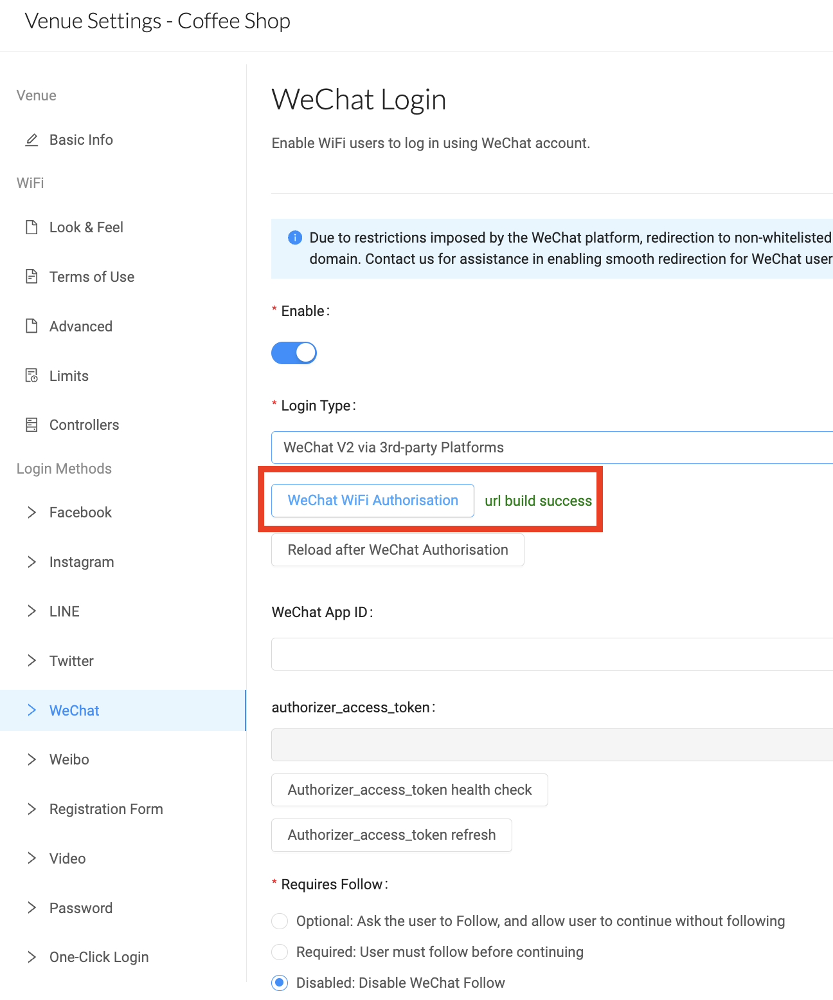

Once the QR code is scanned using the WeChat app, the user will be redirected to a new page. On this page, the administrator should select the WeChat account they wish to link to the platform.

The administrator will need to grant permission for FansWiFi to integrate with WeChat. This involves reviewing and agreeing to the terms and conditions, and then clicking the authorization button.

Following this action, FansWiFi will be authorized to operate with the WeChat account. The administrator should then return to the FansWiFi admin portal and click on "Reload after WeChat Authorization." This will automatically fill the WeChat App ID field in the portal, confirming the successful completion of the authorization process.

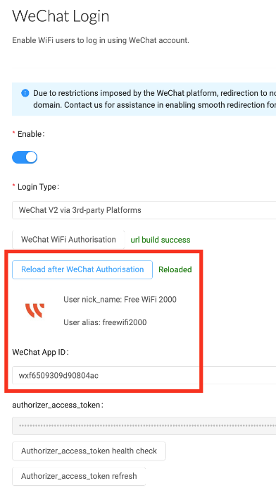

Similar to the Facebook and Instagram login configurations, administrators have the flexibility to decide whether visitors should be required to follow their WeChat account. The "WeChat Follow Allowance" setting specifies the amount of time visitors have access to the WiFi before they follow the administrator's WeChat account. This time period is adjustable.

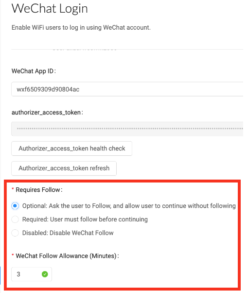

## Whatsapp

To integrate the WhatsApp login method into the captive portal, administrators will need to provide their business's mobile number. This will link the WhatsApp account to the FansWiFi platform.

When customers log in to the Wi-Fi through WhatsApp, they will be prompted to send a message to your business's WhatsApp account. To guide customers through this process, make sure to provide clear instructions on the captive portal's login page. This should include a pre-written message that customers can simply send to initiate the authentication flow. Customize this message under the “Login Message” section.

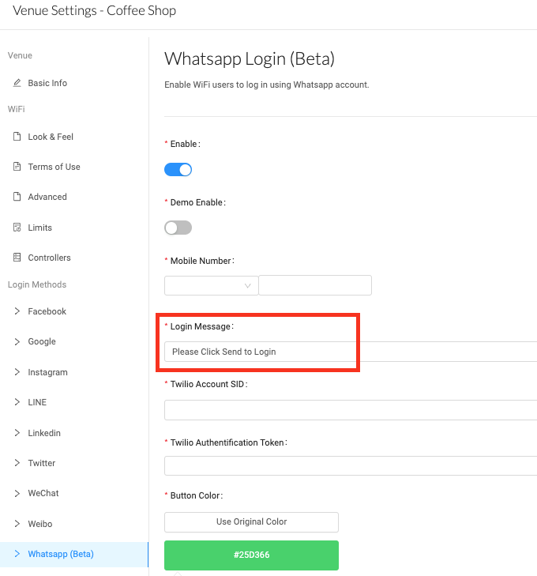

Next, administrators should visit their Twilio account dashboard to retrieve the Account SID and Authorization Token. These credentials are required to leverage Twilio's API, which allows for sending and receiving messages with customers through the WhatsApp channel on the FansWiFi platform. Once the credentials are retrieved, enter the information into the “Twilio Account SID” and “Twilio Authentication Token” section.

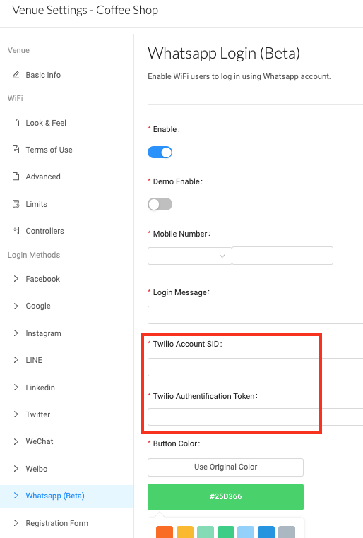

## Registration Form

Administrators can tailor the form according to the marketing needs by marking certain information as ‘required’ and specifying the importance of each field. Additionally, administrators can choose to ‘disable’ fields that are unnecessary or designate them as ‘optional’, allowing users to decide whether to provide the particular information. This enables the collection of relevant data while minimizing less significant details.

By tailoring the Registration Form, companies can ensure gathering the necessary information from users that will assist them in executing targeted and effective marketing campaigns. This customization allows us to focus on collecting data that aligns with specific marketing objectives and optimizes the campaign's success.

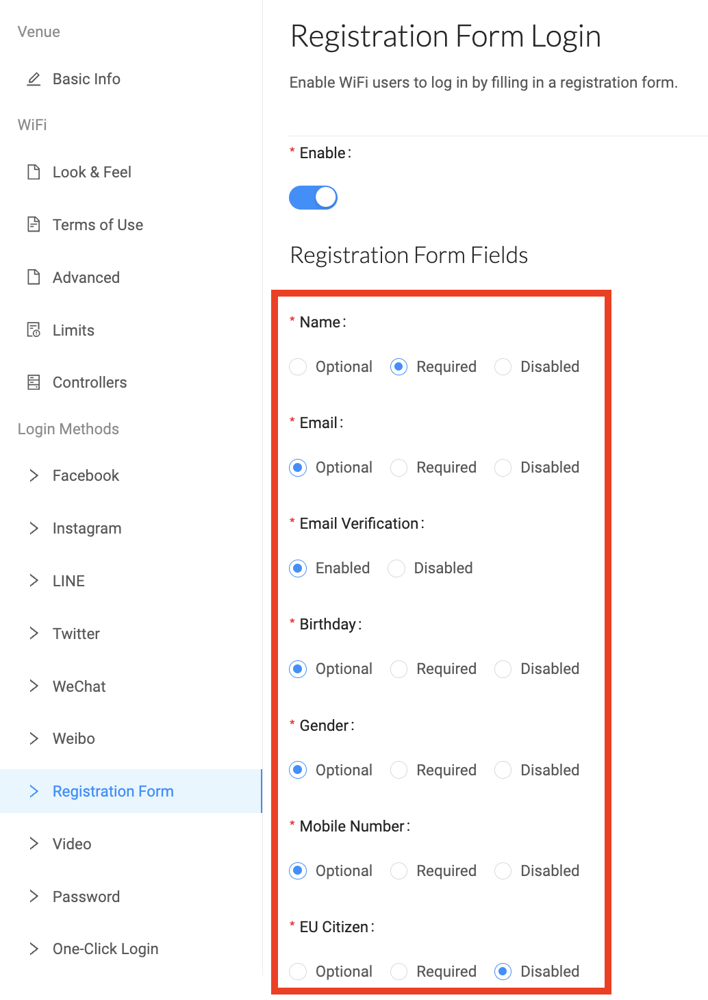

The Registration Form also provides the capability to personalize the login button on the Captive Portal. This functionality allows customizing the appearance and design of the login button to align with specific preferences and branding requirements.


**For demo videos of 'Registration Form Login', kindly visit [here](https://fanswifi-onmicrosoftakan.gitbook.io/df3/~/revisions/buPaWNqGQ6m7zTwpZYJq/guide/demo-videos/step-14-portal-settings-login-method-registration-form).**


## Video

To configure a pre-set video for the login method on the Captive Portal, an active Vimeo account is necessary. The integration between Vimeo and the FansWiFi platform allows seamless incorporation of videos into the login experience.

To successfully configure videos from Vimeo to the FansWiFi platform, it is required to have a Vimeo Plus or above account. Vimeo offers different tiers/plans for its accounts, and Vimeo Plus or a higher-level account ensures compatibility with the FansWiFi platform and the ability to leverage the desired video functionality.

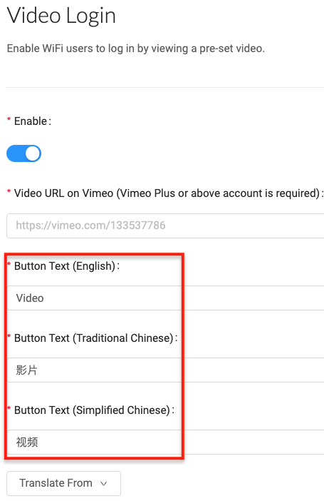

With the video login feature of Vimeo, the admin can customize the login button on the Captive Portal. This functionality empowers to personalize the appearance and design of the login button specifically for video login using Vimeo. By leveraging this feature, the admin can ensure that the login button aligns seamlessly with the branding requirements and reflects unique preferences, creating a cohesive and visually appealing video login experience for users on the Captive Portal.


**For demo videos of 'Video Login', kindly visit [here](https://fanswifi-onmicrosoftakan.gitbook.io/df3/~/revisions/buPaWNqGQ6m7zTwpZYJq/guide/demo-videos/step-15-portal-settings-login-method-video).**


## Password

Implementing the Password feature provides an added layer of security. Administrators have the flexibility to set the password according to their preferences. This allows the company to establish specific rules regarding the distribution of passwords and determine which types of customers are granted access to the internet. This approach ensures that only authorized users with the designated password can gain access to the internet through the Captive Portal. It allows the company to maintain control over who can connect to their network and ensures a more secure and tailored internet access experience.

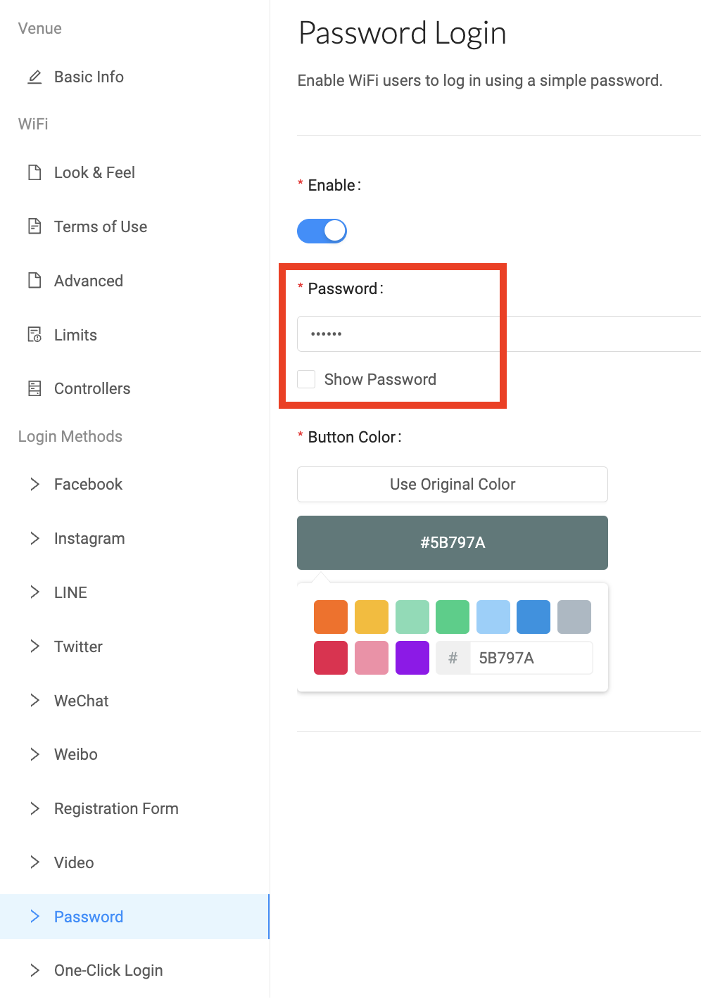


**For demo videos of 'Password Login', kindly visit [here](https://fanswifi-onmicrosoftakan.gitbook.io/df3/~/revisions/buPaWNqGQ6m7zTwpZYJq/guide/demo-videos/step-16-portal-settings-login-method-password).**


## One-Click Login

By enabling One-Click Login, users will be able to quickly and easily connect to the WiFi network without the need for entering a password, social media, or social network. This streamlined process enhances user convenience and simplifies the WiFi access experience.


**For demo videos of 'One-Click Login', kindly visit [here](https://fanswifi-onmicrosoftakan.gitbook.io/df3/~/revisions/buPaWNqGQ6m7zTwpZYJq/guide/demo-videos/step-17-portal-settings-login-method-one-click-login).**



*Remark: Facebook enables WiFi users to like the company's Fan Page and check in at its location. Instagram, Twitter, and WeChat allow WiFi users to follow the company's profile.*

