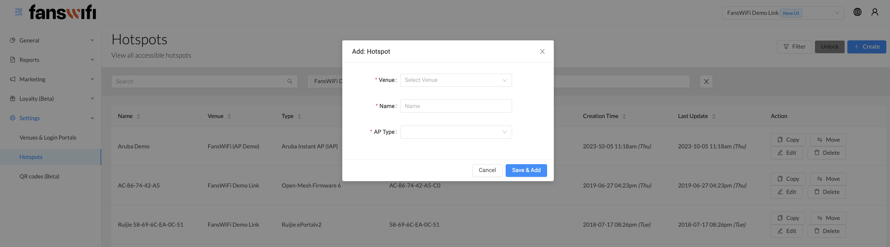
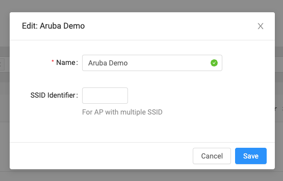

# 6.8 Settings - Hotspots

Companies can add their Access Point details to the FansWifi page. Add AP to the hotspot page. This helps keep track of all the hotspots the company uses.

## Step 1: Go to hotspot page

## Step 2: Create hotspot

`To add a new hotspot for your business choose the venue, name and AP type:`

## Step 3: Edit hotspot

`Edit existing hotspots:`

[Check out the demo video](../Demo-Videos/step-18-portal-settings-hotspots.md)