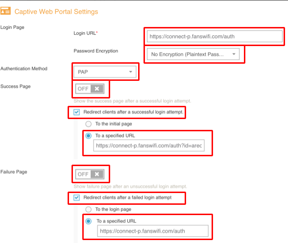
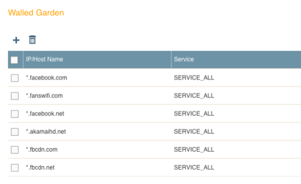
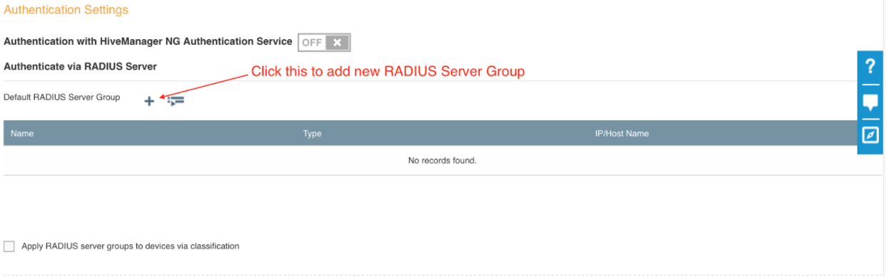
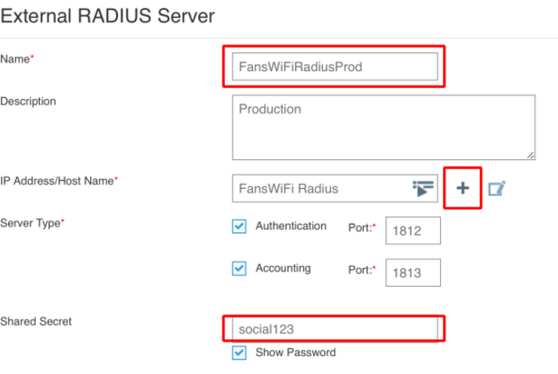
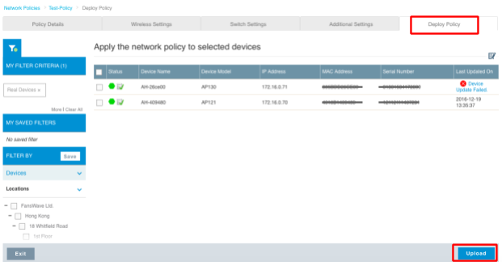
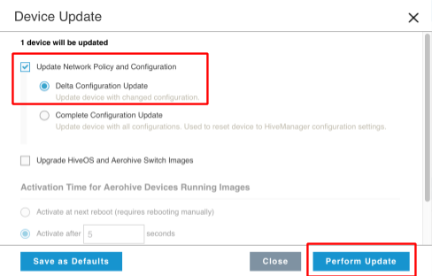

# Information required for FansWiFi Manager

# Information required for FansWiFi Manager

- Mac Addresses of the APs

## Tested HiveOS Version

- Version:**8.1r1**

# Setting on AeroHive HiveManager NG

## Step 1: Configure the Network Policies

- a. Click “Add Network Policy” to create a new Policy Profile
- b. or Click “Add Guest SSID” to add new SSID to existing Network Policy
- c. Name the policy
​

## Step 2: Configure the Wireless Settings

- a. Add a new “All other SSIDs (standard)”

- b. Name the SSID and SSID Broadcast Name
- c. SSID Usage:**Open**
- d. Check**Enable Captive Web Portal**
- e. Select features for this captive web portal:**User Auth on Captive Web Portal**
- f. Choose Authentication Type:**Redirect to External URL**
- g. Add a new**Default Captive Web Portal**(if first time setup)

## Step 3: Configure Captive Web Portal

- a. Name the Captive Web Portal
- b. Select feature for this captive web portal: Click**ON**for**User Auth on Captive Web Portal**
​

- c. Login Page

- **Login URL:** [https://connect-p.fanswifi.com/auth](https://connect-p.fanswifi.com/auth)
- **Password Encryption:** No Encryption
- d.**Authentication Method:** PAP
- e.**Success Page:** OFF

- Check**Redirect clients after a successful login attempt**

- Select**To a specified URL:** [https://connect-p.fanswifi.com/auth?id=aerohive-ng&res=success](https://connect-p.fanswifi.com/auth?id=aerohive&res=success)
- f.**Failure Page:** OFF

- Check**Redirect client after a failed login attempt**

- Select**To a specified URL:** [https://connect-p.fanswifi.com/auth](https://connect-p.fanswifi.com/auth)

- g. Walled Garden
Add new Walled Garden Rules

- Add the following list of Hostname based on your need
- Set**All**Service on each hostname record
- FansWiFi Server (required)

- *.[fanswifi.com](http://fanswifi.com/)

- Facebook Login (Optional, you may skip this if there is no Facebook Login Enabled)

- *.facebook.com
- *.facebook.[net](http://facebook.net/)
- *.fbcdn.[net](http://fbcdn.net/)
- *.fbcdn.com
- *.akamaihd.net
- fbsbx.com
- *.fbsbx.com

- Weibo Login (Optional, you may skip this if there is no Weibo Login Enabled)

- *.[weibo.com](http://weibo.com/)
- *.[weibo.cn](http://weibo.cn/)
- *.[sinaapp.com](http://sinaapp.com/)
- *.[sina.com.cn](http://sina.com.cn/)
- *.[sinajs.cn](http://sinajs.cn/)
- Instagram Login (Optional, you may skip this if there is no Instagram Login Enabled)

- *.[instagram.com](http://instagram.com/)
- *.[cdninstagram.com](http://cdninstagram.com/)
- *.[akamaihd.net](http://akamaihd.net/)
- Twitter Login (Optional, you may skip this if there is no Twitter Login Enabled)

- *.[twitter.com](http://twitter.com/)
- *.[twimg.com](http://twimg.com/)
- Video Login (Optional, you may skip this if there is no Video Login Enabled)

- *.[akamaized.net](http://akamaized.net/)
- *.[akamaihd.net](http://akamaihd.net/)
- [ssl.google-analytics.com](http://ssl.google-analytics.com/)
- *.[scorecardresearch.com](http://scorecardresearch.com/)
- *.[vimeocdn.com](http://vimeocdn.com/)
- *.[vimeo.com](http://vimeo.com/)

Example Result after setting rules for Facebook Login

## Step 4: Configure Authentication Setting

- a. Add a new**Radius Server Group**

- b. Add New Radius Server Group

- 1. Name the RADIUS Server Group
- 2. Add a New**External RADIUS Server**
​
- 3. Name the External RADIUS Server
- 4. Add a new**Hostname**

- **Name:** FansWiFi Radius
- **Host Name:** [radius.fanswifi.com](http://radius.fanswifi.com/)
- 5.**Check Authentication Port:** 1812
- 6.**Check Accounting Port:** 1813
- 7.**Shared Secret:** social123

- c. Click Save to Save the Wireless Setting

## Step 5: Save the SSID Setting

- Click Save to save the SSID Setting

## Step 6: Deployment: Deploy Policy

- a. Select the AP you want to Deploy and then click upload

< >

Select**Delta Configuration Update**
- b. Check**Update Network Policy and Configuration**

- Click**Perform Update**

## Step 7: Setup in FansWiFi Admin Panel

1. Log in to FansWiFi Admin Panel

1. [https://admin-p.fanswifi.com/login](https://admin-p.fanswifi.com/login)
2. Click “Settings” -> “Hotspots” -> “Add Hotspot”

1. **Venue:** Select the venue of where your Access Point locates
2. **Hotspot Name:** Name each Access Point to make it identifiable
3. **AP Type:** Select “Aerohive”
4. **Mac Address:** Input unique MAC Address of each Access Point in your venue
3. Click “Save”

# FAQ

## 1. How to deauthorize wifi user to bring user back to the login page after login?

- During testing, you may want to try different login methods.
- But after user authorized in any login method, captive portal will not be shown again before the expiry of session time.
- If you may want to bring the user back to the captive portal page for testing different login methods, you will need to unauthorize the WiFi user.

WiFi User Logout trigger by:

WiFi User's Device

(usually, access a logout url on browser)

Controller Web Admin Interface

Not Available

Last Testing: 11-9-2017
HiveOS: 8.1r1

Not Available in HiveManager

Last Testing: 11-9-2017
HiveOS: 8.1r1

If you want to logout WiFi users during testing, we suggest you to set a shorter (i.e. 1-2 min) session duration in FansWiFi admin panel configuration.

​
