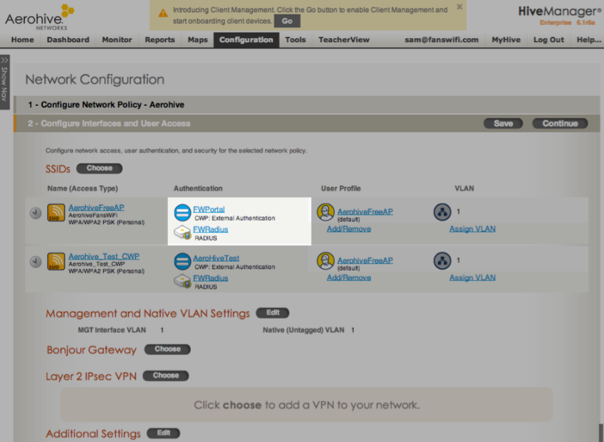
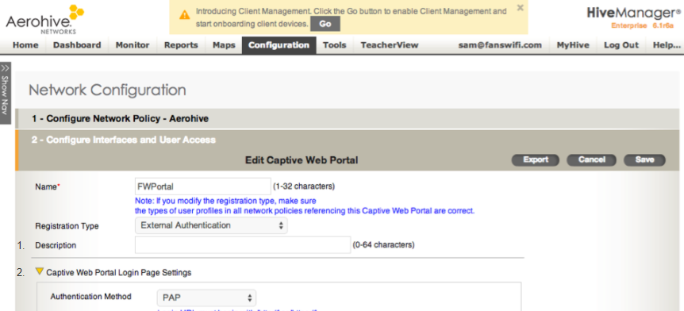
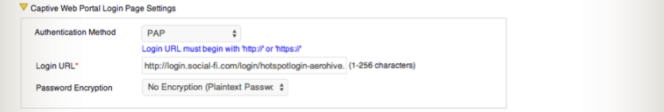

# Information required for FansWiFi Manager (AeroHive Cloud-Manager)

## What you need

- **MAC addresses** of the access points (APs)

---

# Configuration in AeroHive Cloud-Manager

## Step 1: Configure Interfaces and User Access

Configure:
- **Captive Web Portal**
- **RADIUS Server**

---

## Step 2: RADIUS settings

Set:

- **RADIUS Server:** `radius.fanswifi.com`
- **Shared Secret:** `social123`
- **Authentication Port:** `1812`
- **Accounting Port:** `1813`

---

## Step 3: Captive Web Portal

### Login page settings

- **Authentication Method:** PAP
- **Login URL:** https://connect-p.fanswifi.com/auth
- **Password Encryption:** No Encryption (Plaintext)

### Success page settings

- **Show the success page after a successful login:** Disabled
- **After a successful login:** Redirect to an external page
- **Redirect URL:** https://connect-p.fanswifi.com/auth?res=success

### Failure page settings

- **Show the failure page after a failed login:** Disabled
- **After a failed login:** Redirect to an external page
- **Redirect URL:** https://connect-p.fanswifi.com/auth?res=failure

> Note: Your original failure URL had a mismatched target (`.../auth?id=aerohive&res=failure`). Use the URL above unless you *specifically* need an `id=` parameter for a different model.

---

## Step 4: Optional advanced configuration (Walled Garden)

---

## Step 5: Walled Garden list

### Required (FansWiFi)

- `fanswifi.com`

### Optional (only if Facebook Login is enabled)

- `facebook.com`
- `facebook.net`
- `fbcdn.net`
- `fbcdn.com`
- `akamaihd.net`
- `www.google.com`
- `doubleclick.net`
- `www.google.us` *(use the local Google domain for your country/region)*

**Examples (local Google domains)**

- EU: `www.google.eu`
- UK: `www.google.co.uk`
- Hong Kong: `www.google.com.hk`
- Japan: `www.google.co.jp`
- Taiwan: `www.google.com.tw`
- Thailand: `www.google.co.th`
- Malaysia: `www.google.com.my`
- Myanmar: `www.google.com.mm`

### Optional (only if Weibo Login is enabled)

- `weibo.com`
- `weibo.cn`
- `sinaapp.com`
- `sina.com.cn`
- `sinajs.cn`

### Optional (only if Instagram Login is enabled)

- `instagram.com`
- `cdninstagram.com`
- `akamaihd.net`

### Optional (only if Twitter/X Login is enabled)

- `twitter.com`
- `twimg.com`

### Optional (only if Video Login is enabled)

- `akamaized.net`
- `akamaihd.net`
- `ssl.google-analytics.com`
- `scorecardresearch.com`
- `vimeocdn.com`
- `vimeo.com`

---

## Step 6: Enable DNS ALG service

Enable **DNS ALG Service** in:

**Additional Settings → Service Settings → ALG Services**

1. Click **Edit** for **Additional Service**
2. Expand **Service Settings**
3. Click **Edit** for **ALG Services**
4. Check **Enable** for **DNS ALG Service**

---

# Setup in FansWiFi Admin Panel

## Step 7: Add Hotspot

1. Log in:
   - https://admin-p.fanswifi.com

2. Go to:
   - **Settings → Hotspots → Add Hotspot**

3. Configure:
   - **Venue:** Select the venue where the AP is located
   - **Hotspot Name:** A name to identify the AP
   - **AP Type:** **Aerohive**
   - **MAC Address:** Enter the AP MAC address

4. Click **Save**

