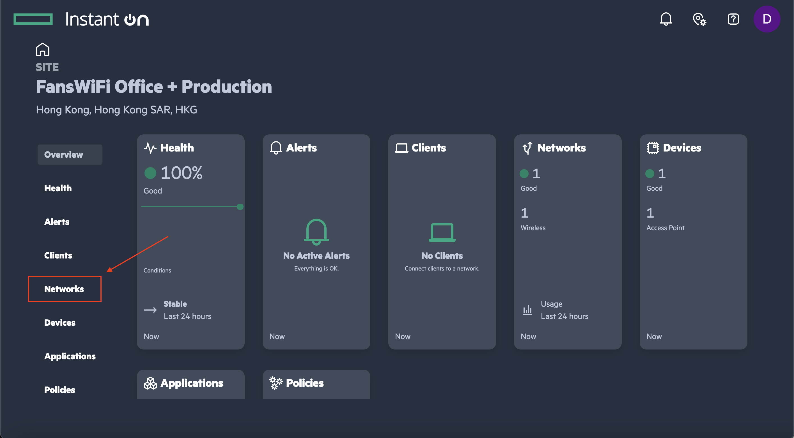
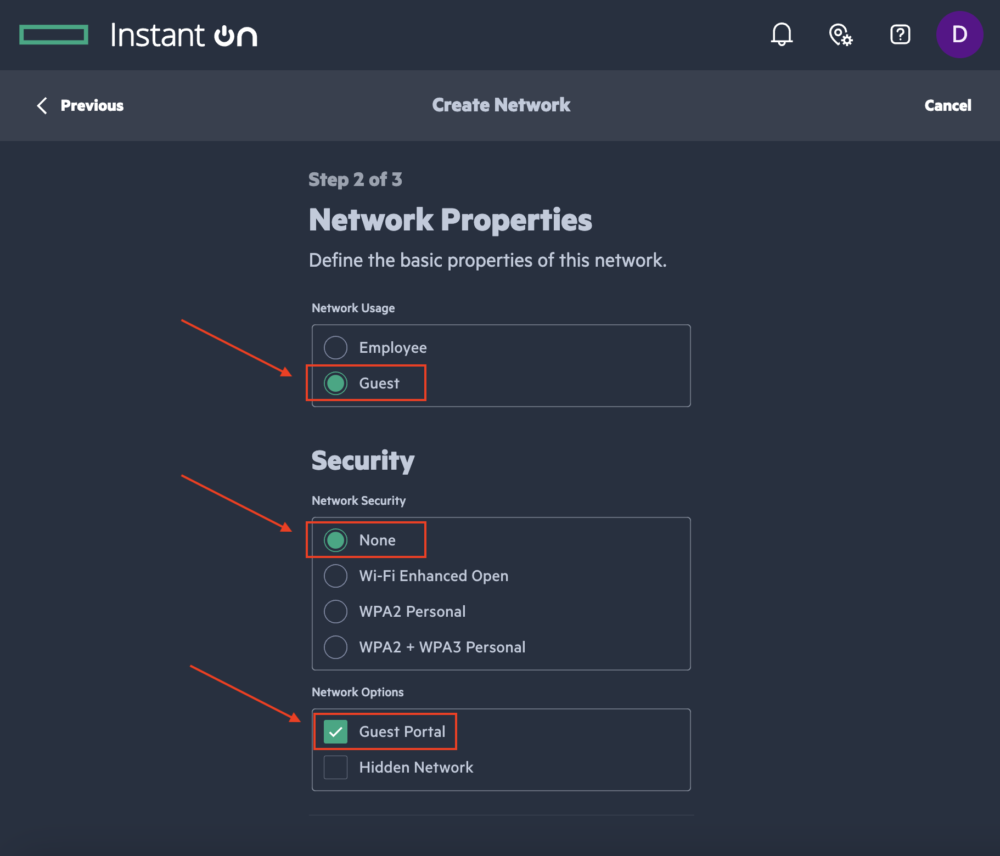
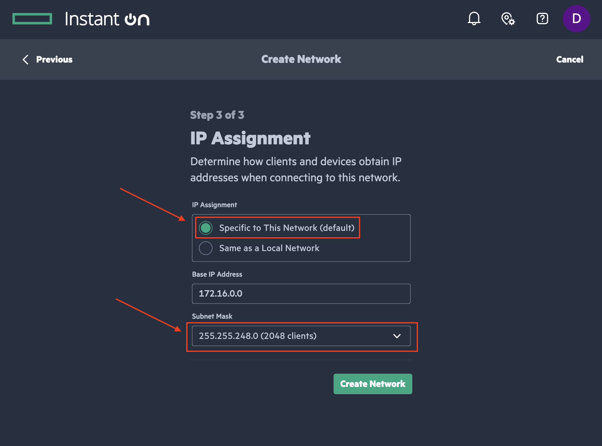
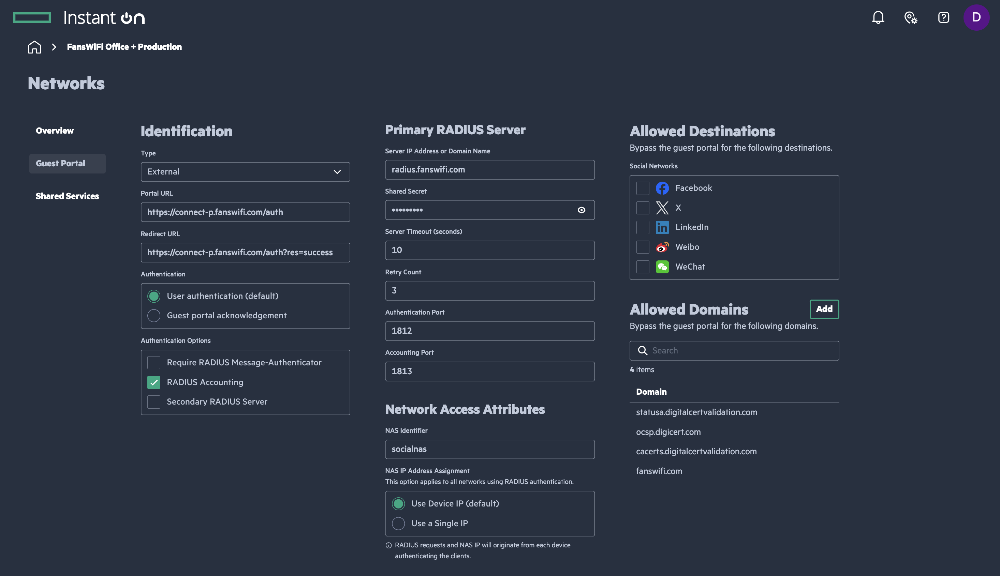
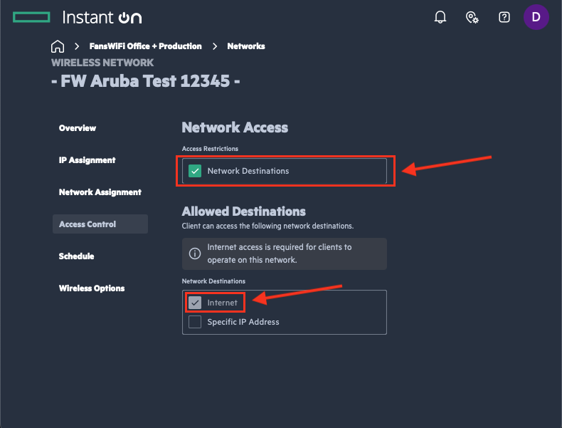

# Information required for FansWiFi Manager (Aruba Instant-On)

## What you need

- **AP MAC address** (usually on the back of the access point)

## Tested model and firmware

- **Model:** Aruba Instant-On AP11
- **Firmware:** 2.8.0

## Official documentation

- Portal setup: https://www.arubainstanton.com/techdocs/en/content/intro/desktop/set-portal-des.htm
- Setup guide: https://www.arubainstanton.com/techdocs/en/content/get-started/prov-oc.htm
- Deployment guide (PDF): https://www.arubainstanton.com/files/Aruba_Instant_On_Deployment_Guide.pdf

---

# Accessing Aruba Instant-On Cloud Portal

1. Ensure the AP is on the **same network** as your PC/mobile/laptop for initial onboarding (per Aruba’s setup guide).
2. Open:
   - https://portal.arubainstanton.com/ **or**
   - https://portal.instant-on.hpe.com
3. Log in with your email/password. If you don’t have an account, register via:
   - https://www.arubainstanton.com/techdocs/en/content/get-started/prov-oc.htm

---

# Setting FansWiFi on Aruba Instant-On Cloud Portal

## Step 1: Open Networks

1. Click **Networks / Active networks**

---

## Step 2: Create or select a network

1. Click **Create Network** (top-right) to add a new network, or select an existing one.

---

## Step 3: Configure network basics

Configure the network (you can choose your own name), then click **Save**.

### Identification

- **Network Usage:** Guest
- **Security:** None or Wi-Fi Enhanced Open
- **Network Option:** Guest Portal (enabled)

### IP Assignment (suggested)

- **IP Assignment:** Specific to This Network
- **Base IP Address:** 172.16.0.0 *(or change if needed)*
- **Subnet Mask:** 255.255.248.0 *(~2048 clients)*

---

## Step 4: Open Guest Portal settings

1. After SSID/network settings, go to the **Guest Portal** section.

---

## Step 5: Configure Guest Portal (External + RADIUS)

Set the following:

- **Type:** External
- **Portal URL:** https://connect-p.fanswifi.com/auth
- **Redirect URL:** https://connect-p.fanswifi.com/auth?res=success
- **Authentication:** User authentication (default)

### Authentication options

- **Require RADIUS Message-Authenticator:** Disabled
- **RADIUS Accounting:** Enabled

### Primary RADIUS server

- **Server IP / domain:** `radius.fanswifi.com`
- **Shared Secret:** `social123`

### Network access attributes

- **NAS Identifier:** `socialnas`
- **NAS IP Address:** Use device IP (default)

---

## Step 6: Allowed domains (Walled Garden)

### Required (FansWiFi + certificate checks)

Add these domains:

- `fanswifi.com`
- `cacerts.digitalcertvalidation.com`
- `statusa.digitalcertvalidation.com`
- `ocsp.digicert.com`

### Social login domains

1. If your desired social media login is already available in Aruba’s list, select it.
2. If it is **not** available, add the domains below as needed.

#### Optional: Weibo

- `weibo.com`
- `weibo.cn`
- `sinaapp.com`
- `sina.com.cn`
- `sinajs.cn`

#### Optional: Instagram

- `instagram.com`
- `akamaihd.net`
- `cdninstagram.com`

#### Optional: Twitter/X

- `twitter.com`
- `twimg.com`

#### Optional: LINE

- `line.me`
- `line-scdn.net`

#### Optional: PayPal

- `paypal.com`
- `paypalobjects.com`
- `www.google-analytics.com`

#### Optional: Video login

- `akamaized.net`
- `akamaihd.net`
- `ssl.google-analytics.com`
- `scorecardresearch.com`
- `vimeocdn.com`
- `vimeo.com`

---

## Step 7: Suggested access control (security)

1. Enable **Access Restrictions**
2. Select **Network Destinations**
3. Allow guests to access **Internet only**

This helps prevent guests from accessing devices on your internal network (router, POS, cameras, internal PCs, etc.).

---

# Setup in FansWiFi Admin Panel

## Step 8: Add AP to FansWiFi

1. Log in to FansWiFi Admin Panel
2. Go to **Settings → Hotspots → Add Hotspot**
3. Configure:
   - **Venue:** Where the AP is located
   - **Hotspot Name:** Friendly name for the AP
   - **AP Type:** Aruba
   - **MAC Address:** AP MAC address *(not controller)*

4. Click **Save**

