# Information required for FansWiFi Manager

# Information required for FansWiFi Manager

- Mac Addresses of the APs

# Tested Model and Firmware Version

- Model:**IAP-105**
- Firmware Version:**6.4.4.4-4.2.3.2_54910**

# Setting on Aruba IAP

## Step 1: Configure the Aruba Instant (IAP)

- Access the Aruba Instant (IAP) by opening a Web Browser
- Under**Networks**, click**New**to start the configuration in a popup window

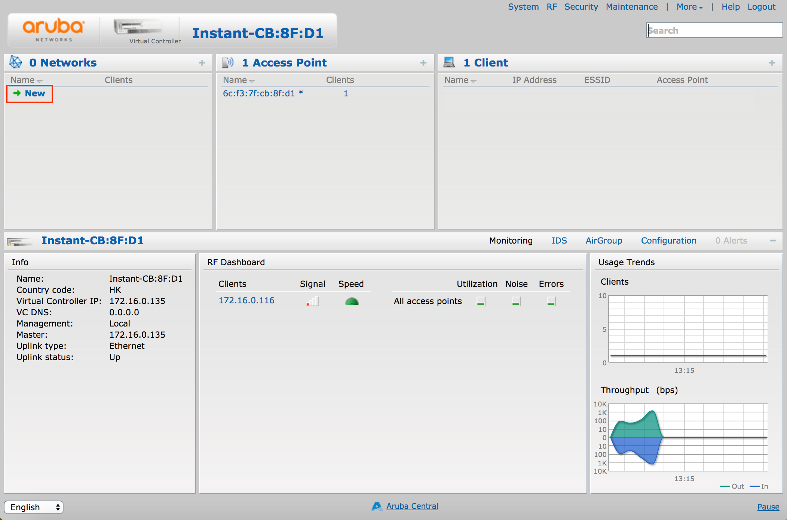

- Under**WLAN Settings**, configure with below settings

- i. Name:**FansWiFi Free WiFi (or whatever SSID you want)**
- ii. Primary usage:**Guest**
- Click**Next**to save configuration and proceed to the next step

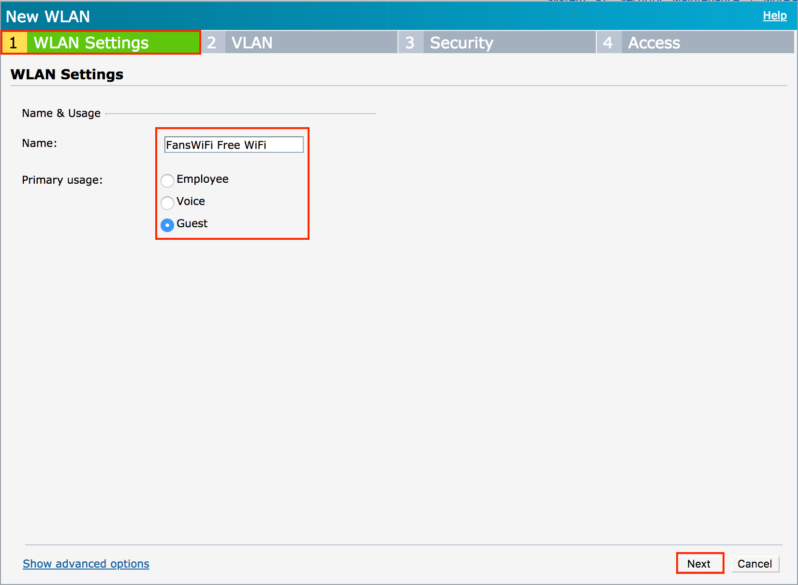

- Under**VLAN**, configure with below settings:

- i. Client IP assignment:**Network assigned**
- ii. Client VLAN assignment:**Static**
- iii. VLAN ID:**1**
- Click**Next**to save configuration and proceed to the next step

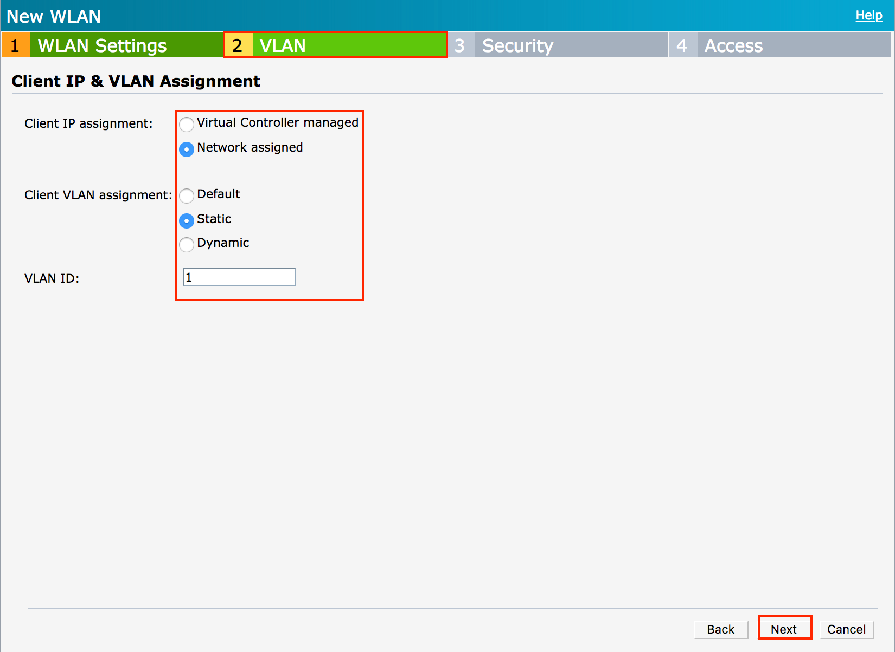

- Under**Security**, configure Splash page type as**External**

- Under**Captive portal profile**, click**New**to set up the captive portal

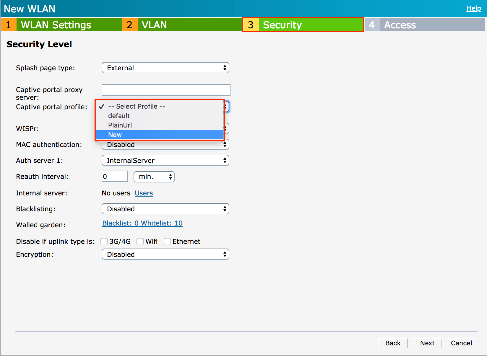

- A setup box will appear, then configure with the below settings

- i. Name:**FansWiFi_cp**
- ii. Type:**RADIUS Authentication**
- iii. IP or hostname:**connect-p.fanswifi.com**
- iv. URL:**/auth**
- v. Port:**443**
- vi. Use https:**Enabled**
- vii. Captive Portal failure:**Deny Internet**
- viii. Redirect URL:

- For redirect method:**https://connect-p.fanswifi.com/auth/?res=success&id=aruba-iap**
- For xml api method:**https://connect-p.fanswifi.com/auth/?res=success&id=aruba-xml-api**
- Click**OK**to save configuration

- Then, under**Auth server 1**, click**New**to set up radius server

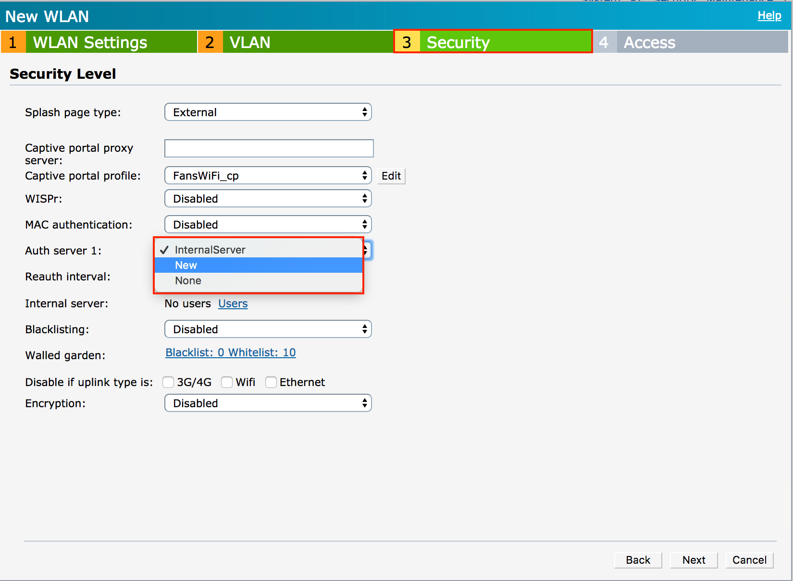

- A setup box will appear, then configure with the below settings

- First Server

- i. Server type:**RADIUS**
- ii. Name:**FansWiFi-rad1**
- iii. IP address:**103.6.85.240**
- iv. Auth port:**1812**
- v. Acct port:**1813**
- vi. Shared key:**social123**
- vii. Retype key:**social123**
- Click**OK**to save configuration

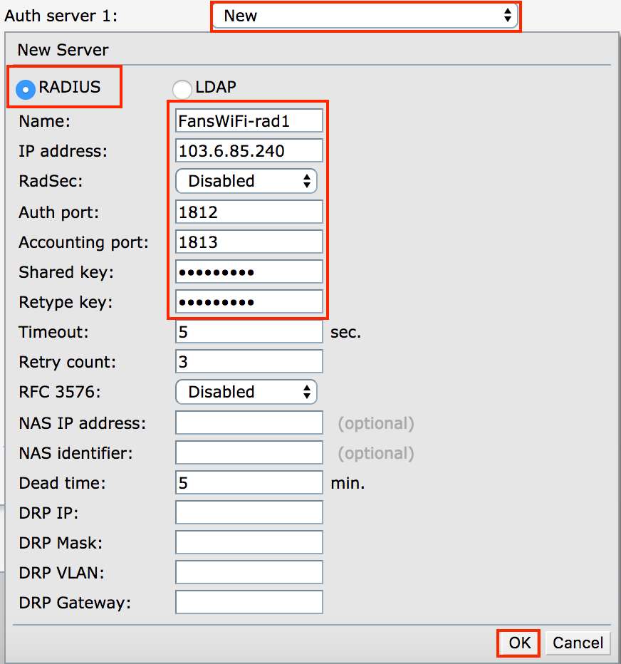

- After configuring the radius server, configure the remaining security configurations with below settings

- i. Accounting:**Use authentication servers**
- ii. Accounting mode:**Authentication**
- iii. Accounting interval:**3 min.**
- iv. Blacklisting:**Disabled**
- Click**Next**to save configuration and proceed to the next step

- Under**Access**, Select**Role-based**and click**New**under roles to create a new role
- Enter**FansWiFi_Preauth**as the name of the pre-authentication role

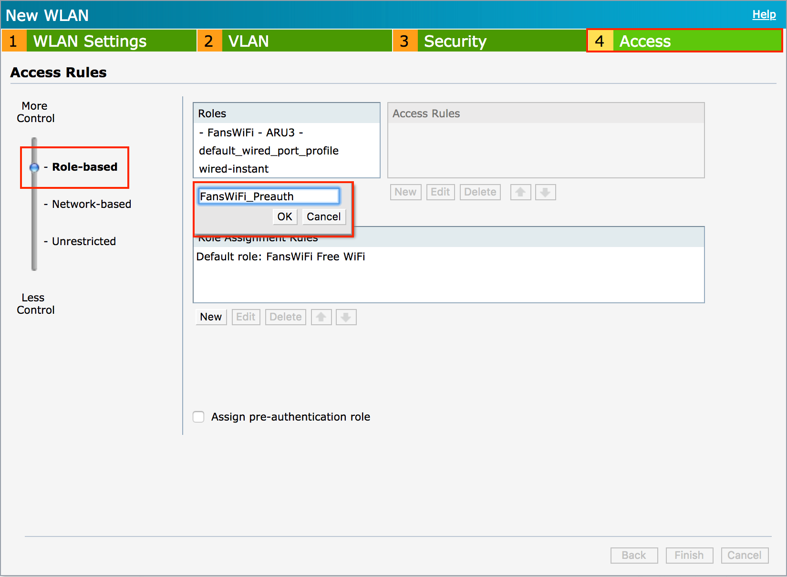

- Click**New**under**Access Rules**to create new access controls and a popup setup box will appear
- Configure with below settings

- i. Rule type:**Access control**
- ii. Service:**Network - any**
- iii. Action:**Allow**
- iv. Destination:**to domain name**
- v. Domain name:**(Insert domain name here)**
- Click**OK**to save configuration for each domain name

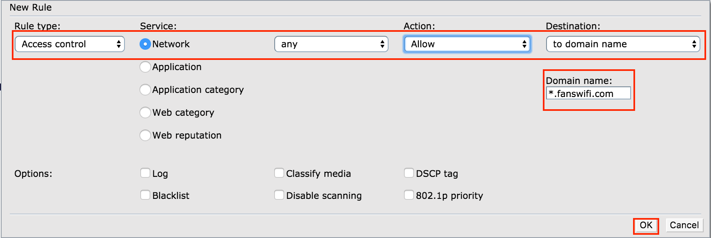

### Walled Garden List (required)

- 1. *.[fanswifi.com](http://fanswifi.com/)

- i.**Walled Garden List (Optional, you may skip this if there is no Facebook Login Enabled)**

1. *.[facebook.com](http://facebook.com/)
2. *.[facebook.net](http://facebook.net/)
3. *.[fbcdn.net](http://fbcdn.net/)
4. *.[fbcdn.com](http://fbcdn.com/)
5. *.[akamaihd.net](http://akamaihd.net/)
6. [www.google.com](http://www.google.com/)
7. *.[doubleclick.net](http://doubleclick.net/)
8. [www.google.com.hk](http://www.google.com.hk/)(Local Google URL of your Country / Region)

1. Example:

1. EU:[www.google.eu](http://www.google.eu)
2. UK:[www.google.co.uk](http://www.google.co.uk/)
3. Hong Kong:[www.google.com.hk](http://www.google.com.hk/)
4. Japan:[www.google.co.jp](http://www.google.co.jp/)
5. Taiwan:[www.google.com.tw](http://www.google.com.tw/)
6. Thailand:[www.google.co.th](http://www.google.co.th/)
7. Malaysia:[www.google.com.my](http://www.google.com.my/)
8. Myanmar:[www.google.com.mm](http://www.google.com.mm/)
- ii.**Walled Garden List (Optional, you may skip this if there is no Weibo Login Enabled)**

1. *.[weibo.com](http://weibo.com/)
2. *.[weibo.cn](http://weibo.cn/)
3. *.[sinaapp.com](http://sinaapp.com/)
4. *.[sina.com.cn](http://sina.com.cn/)
5. *.[sinajs.cn](http://sinajs.cn/)
- iii.**Walled Garden List (Optional, you may skip this if there is no Instagram Login Enabled)**

1. *.[instagram.com](http://instagram.com/)
2. *.[akamaihd.net](http://akamaihd.net/)
3. *.[cdninstagram.com](http://cdninstagram.com/)
- iv.**Twitter Login (Optional, you may skip this if there is no Twitter Login Enabled)**

1. *.[twitter.com](http://twitter.com/)
2. *.[twimg.com](http://twimg.com/)

- v.**LINE Login (Optional, you may skip this if there is no LINE Login Enabled)**

1. *.[line.me](http://line.me/)
2. *.[line-scdn.net](http://line-scdn.net/)
​
- vi.**PayPal Login (Optional, you may skip this if there is no PayPal Login Enabled)**

1. *.[paypal.com](http://paypal.com/)
2. *.[paypalobjects.com](http://paypalobjects.com/)
3. [www.google-analytics.com](http://www.google-analytics.com/)

- vii.**Video Login (Optional, you may skip this if there is no Video Login Enabled)**

1. *.[akamaized.net](http://akamaized.net/)
2. *.[akamaihd.net](http://akamaihd.net/)
3. [ssl.google-analytics.com](http://ssl.google-analytics.com/)
4. *.[scorecardresearch.com](http://scorecardresearch.com/)
5. *.[vimeocdn.com](http://vimeocdn.com/)
6. *.[vimeo.com](http://vimeo.com/)

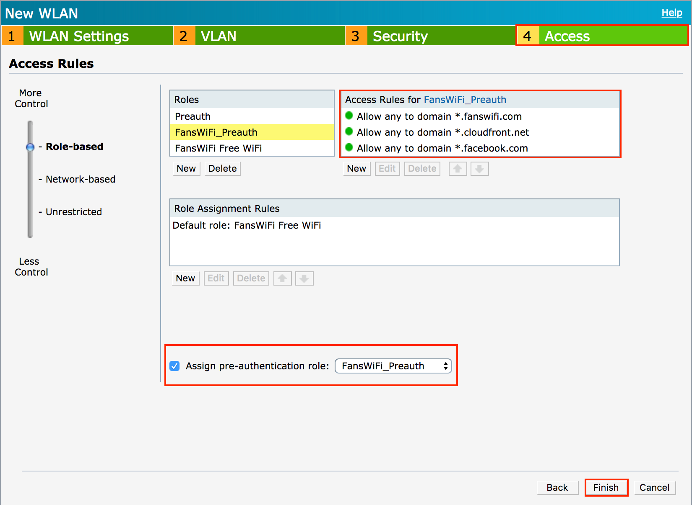

- Finally, set**Assign pre-authentication role**as**FansWiFi_Preauth**and click**Finish**to save all configurations

## Step 2: Add XML API Server (Optional, for XML API method ONLY)

- a. Navigate to**More**>**Services**

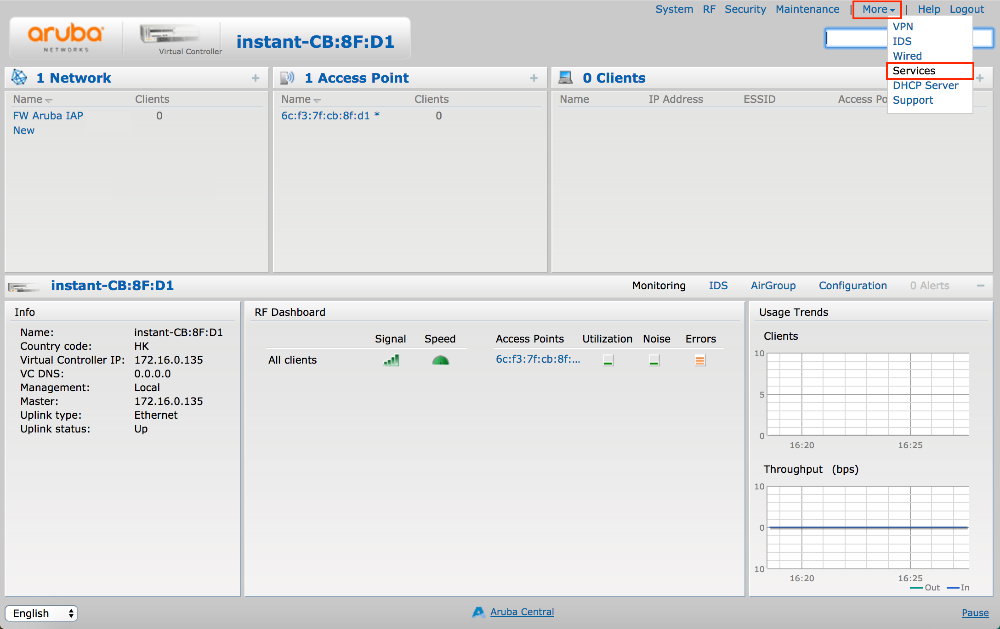

- b. In Services, navigate to**Network Integration**
- c. Under**XML API Server**, click N**ew**and configure with below settings:

- Name:**(Configure with either of the following IP Address)**

- i.**52.220.226.90**
- ii.**52.220.206.125**
- iii.**52.77.30.253**
- iv.**52.220.219.128**
- v.**52.220.215.219**
- vi.**52.220.208.185**
- Subnet:**(Same as Name)**
- Mask:**255.255.255.0**
- Passphrase:**aruba123**
- Retype:**aruba123**
- d. Click**OK**to add new XML API Server

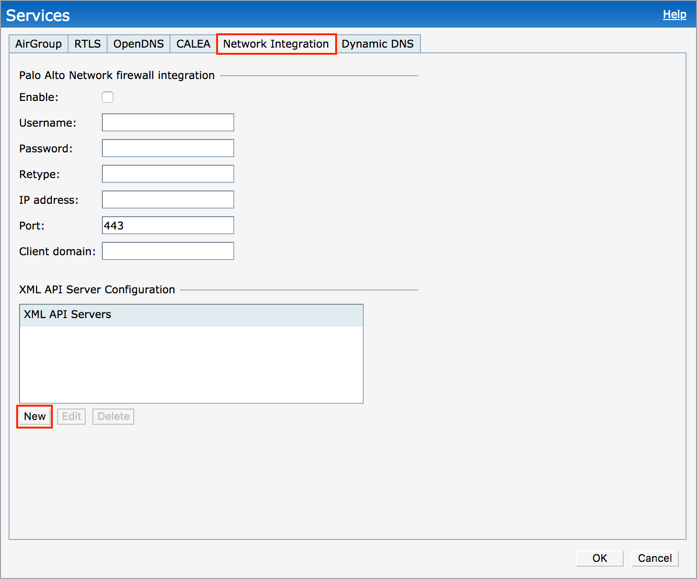

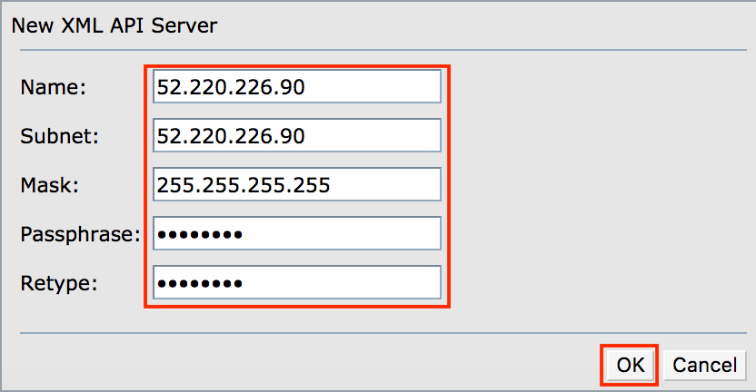

- e. Click**OK**to save configuration

## Step 3: Configure Aruba IAP Address to FansWiFi Admin Panel (Optional, for XML API method ONLY)

**** Please send this information to your FansWiFi account manager*

**(required for Advanced Login Method (e.g. WeChat or WhatsApp), you may skip this step if there is no Advanced Login Method Enabled)**

**FansWiFi Admin Panel (Setting > Venue Setting)**

1. Send below information to FansWiFi

- Public IP Addresses / Domain Name of Mobility Controller
- Radius CoA Port: 3799

**Exceptional Case: Controller behinds Router / Firewall**

If the Controller is behind Router / Firewall, it is not directly accessible via FansWiFi Radius Server via Internet. In this case, you need to configure port forwarding on your Router / Firewall to forward the port to the Controller.

Please see below example:

Assume the Public IP of the Router is 1.1.1.1 in this example

1. Configure Port Forwarding to forward Router’s 50000 Port to Controller’s CoA Port (Default: 3799)

- - Inbound port: 50000 (You can replace any port you want in your setup)
- Destination IP: 192.168.1.100 (Controller's IP in your network)
- Destination Port: 3799

2. Send below information to FansWiFi

- - Public IP Addresses of Router: 1.1.1.1 or Domain Name (URL)
- Radius CoA Port: 50000 (You can replace any port you want in your setup)

Setting in FansWiFi Admin Panel

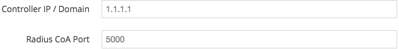

## Step 4: Add AP to FansWiFi Admin Panel

- Login to FansWiFi Admin Panel
- Click**Settings -> Hotspots -> Create**
- Configure with following settings:

- **Venue:** Select the venue of where your Access Point locates
- **Hotspot Name:** Name each Access Point to make it identifiable
- **AP Type:** Select “Aruba Instant AP (IAP)”
- **Mac Address:** Input unique MAC Address of each Access Point in your venue
- Click**Create**

# FAQ

## 1. How to deauthorize wifi user to bring user back to the login page after login?

- During testing, you may want to try different login methods.
- But after user authorized in any login method, captive portal will not be shown again before the expiry of session time.
- If you may want to bring the user back to the captive portal page for testing different login methods, you will need to unauthorize the WiFi user.

WiFi User Logout trigger by:

WiFi User's Device

(usually, access a logout url on browser)

Controller Web Admin Interface

Logout URL for redirect method:[https://securelogin.arubanetworks.com/auth/logout.html](https://securelogin.arubanetworks.com/auth/logout.html)

Or API

Available

Last Testing: 10-12-2018

Available

Last Testing: 10-12-2018

**WiFi User Logout trigger by:**

**WiFi User's device**

- Open any browser and type in the logout url:[https://securelogin.arubanetworks.com/auth/logout.html](https://securelogin.arubanetworks.com/auth/logout.html)

**WiFi User Logout trigger by:**

**Controller**

- Click on the wifi user device you want to logout

- Click on the**'x'**button on the right hand side of the access point

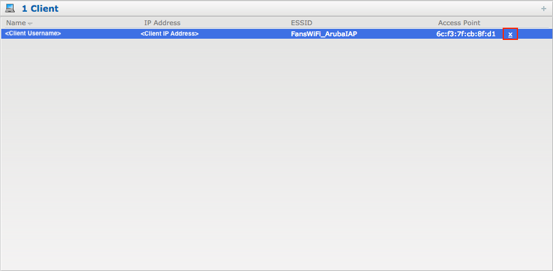

- Confirm by clicking on**Disconnect Now**

