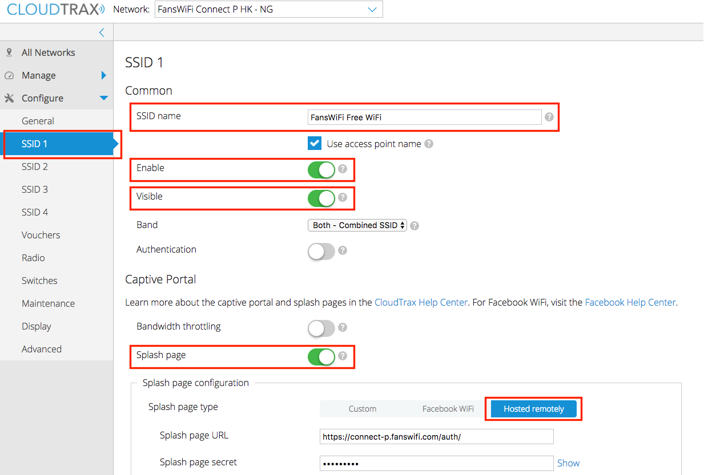
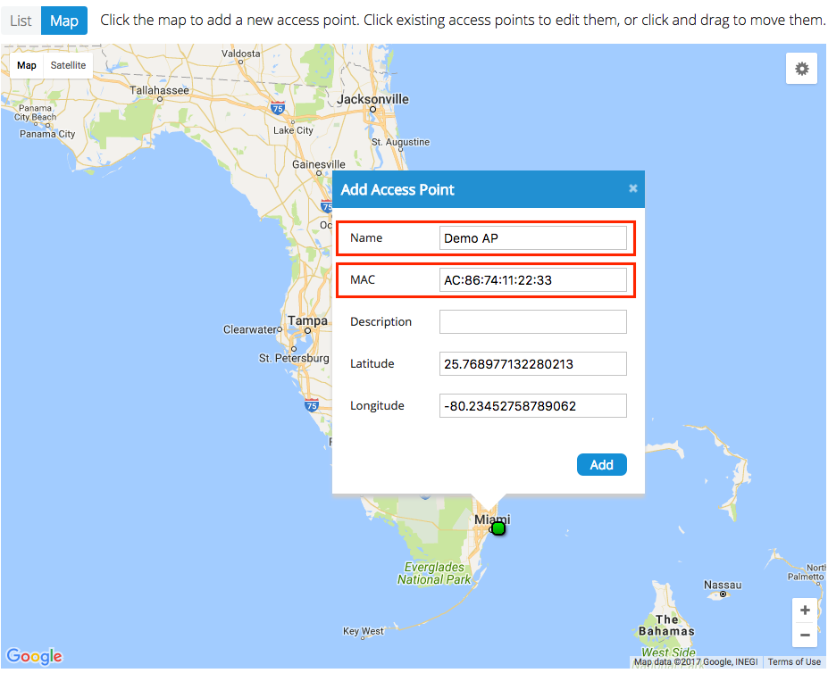

# Information required for FansWiFi Manager

# Information required for FansWiFi Manager

- Mac Addresses of the APs

## Firmware Requirement

- ng6xx Firmware or above

# Setting on OpenMesh

## Step 1:  Configure the OpenMesh

- a. Access the[cloudtrax.com](https://support.fanswifi.com/hotspot-setup-guide/openmesh/openmesh-setup-guide-ng6xx-series#)by opening a Web Browser
- b. Click “Configure” to enter the configuration Page

## Step 2:  Configuration: SSID

- To enable FansWiFi, you will need to set the Splash Page of the SSID

- i.**SSID Name:** <Any WiFi SSID name your want>
- ii.**Enable:** On
- iii.**Visible:** On
- iv.**Splash page:** On
- v.**Splash page type:** Hosted Remotely

- Splash Page Configuration

- i.**Splash page URL:** [https://connect-p.fanswifi.com/auth/](https://support.fanswifi.com/hotspot-setup-guide/openmesh/openmesh-setup-guide-ng6xx-series#)
- ii.**Splash page secret:** social123
- iii.**Splash Page Authentication Type:** RADIUS
- iv.**Server address 1:** [radius.fanswifi.com](https://support.fanswifi.com/hotspot-setup-guide/openmesh/openmesh-setup-guide-ng6xx-series#)
- v.**Server address 2:** [radius2.fanswifi.com](https://support.fanswifi.com/hotspot-setup-guide/openmesh/openmesh-setup-guide-ng6xx-series#)
- vi.**Server secret:** social123
- vii.**NAS ID:** socialnas
- viii.**Use MAC addr for password:** On
- ix.**Enable Failsafe Mode:** On
- x.**Block unauthenticated users:** On
- xi.**Walled Garden List (required)**

- 1.[fanswifi.com](https://support.fanswifi.com/hotspot-setup-guide/openmesh/openmesh-setup-guide-ng6xx-series#)
- xii.**Walled Garden List**(Optional, you may skip this if there is no Facebook Login Enabled)

- 1.[facebook.com](https://support.fanswifi.com/hotspot-setup-guide/openmesh/openmesh-setup-guide-ng6xx-series#)
- 2.[facebook.net](https://support.fanswifi.com/hotspot-setup-guide/openmesh/openmesh-setup-guide-ng6xx-series#)
- 3.[fbcdn.net](https://support.fanswifi.com/hotspot-setup-guide/openmesh/openmesh-setup-guide-ng6xx-series#)
- 4.[fbcdn.com](https://support.fanswifi.com/hotspot-setup-guide/openmesh/openmesh-setup-guide-ng6xx-series#)
- 5.[Akamaihd.net](https://support.fanswifi.com/hotspot-setup-guide/openmesh/openmesh-setup-guide-ng6xx-series#)
- 6.[www.google.com](https://support.fanswifi.com/hotspot-setup-guide/openmesh/openmesh-setup-guide-ng6xx-series#)
- 7.[doubleclick.net](https://support.fanswifi.com/hotspot-setup-guide/openmesh/openmesh-setup-guide-ng6xx-series#)
- 8.[www.google.us](https://support.fanswifi.com/hotspot-setup-guide/openmesh/openmesh-setup-guide-ng6xx-series#)(Local Google URL of your Country / Region)

- Example:

- i. EU:[www.google.eu](http://www.google.eu)
- ii. UK:[www.google.co.uk](https://support.fanswifi.com/hotspot-setup-guide/openmesh/openmesh-setup-guide-ng6xx-series#)
- iii. Hong Kong:[www.google.com.hk](https://support.fanswifi.com/hotspot-setup-guide/openmesh/openmesh-setup-guide-ng6xx-series#)
- iv. Japan:[www.google.co.jp](https://support.fanswifi.com/hotspot-setup-guide/openmesh/openmesh-setup-guide-ng6xx-series#)
- v. Taiwan:[www.google.com.tw](https://support.fanswifi.com/hotspot-setup-guide/openmesh/openmesh-setup-guide-ng6xx-series#)
- vi. Thailand:[www.google.co.th](https://support.fanswifi.com/hotspot-setup-guide/openmesh/openmesh-setup-guide-ng6xx-series#)
- vi. Malaysia:[www.google.com.my](https://support.fanswifi.com/hotspot-setup-guide/openmesh/openmesh-setup-guide-ng6xx-series#)
- viii. Myanmar:[www.google.com.mm](https://support.fanswifi.com/hotspot-setup-guide/openmesh/openmesh-setup-guide-ng6xx-series#)
- xiii.**Walled Garden List**(Optional, you may skip this if there is no Weibo Login Enabled)

- 1.[weibo.com](https://support.fanswifi.com/hotspot-setup-guide/openmesh/openmesh-setup-guide-ng6xx-series#)
- 2.[weibo.cn](https://support.fanswifi.com/hotspot-setup-guide/openmesh/openmesh-setup-guide-ng6xx-series#)
- 3.[sinaapp.com](https://support.fanswifi.com/hotspot-setup-guide/openmesh/openmesh-setup-guide-ng6xx-series#)
- 4.[sina.com.cn](https://support.fanswifi.com/hotspot-setup-guide/openmesh/openmesh-setup-guide-ng6xx-series#)
- 5.[sinajs.cn](https://support.fanswifi.com/hotspot-setup-guide/openmesh/openmesh-setup-guide-ng6xx-series#)
- xiv.**Walled Garden List**(Optional, you may skip this if there is no Instagram Login Enabled))

- 1.[instagram.com](https://support.fanswifi.com/hotspot-setup-guide/openmesh/openmesh-setup-guide-ng6xx-series#)
- 2.[akamaihd.net](https://support.fanswifi.com/hotspot-setup-guide/openmesh/openmesh-setup-guide-ng6xx-series#)
- 3.[cdninstagram.com](https://support.fanswifi.com/hotspot-setup-guide/openmesh/openmesh-setup-guide-ng6xx-series#)
- xv.**Walled Garden List**(Optional, you may skip this if there is no Twitter Login Enabled)

- 1.[twitter.com](https://support.fanswifi.com/hotspot-setup-guide/openmesh/openmesh-setup-guide-ng6xx-series#)
- 2.[twimg.com](https://support.fanswifi.com/hotspot-setup-guide/openmesh/openmesh-setup-guide-ng6xx-series#)
- xvi.**Walled Garden List**(Optional, you may skip this if there is no Video Login Enabled)

- 1.[akamaized.net](https://support.fanswifi.com/hotspot-setup-guide/openmesh/openmesh-setup-guide-ng6xx-series#)
- 2.[akamaihd.net](https://support.fanswifi.com/hotspot-setup-guide/openmesh/openmesh-setup-guide-ng6xx-series#)
- 3.[ssl.google-analytics.com](https://support.fanswifi.com/hotspot-setup-guide/openmesh/openmesh-setup-guide-ng6xx-series#)
- 4.[scorecardresearch.com](https://support.fanswifi.com/hotspot-setup-guide/openmesh/openmesh-setup-guide-ng6xx-series#)
- 5.[vimeocdn.com](https://support.fanswifi.com/hotspot-setup-guide/openmesh/openmesh-setup-guide-ng6xx-series#)
- 6.[vimeo.com](https://support.fanswifi.com/hotspot-setup-guide/openmesh/openmesh-setup-guide-ng6xx-series#)

- Click “OK” to Save the configuration

​

## Step 5: Add AP to Cloudtrax

- **Manage > Access Points**
- Click “**+ Add New**” with below settings

- Enter AP Details to Add Access Point

- **Name:** Name each Access Point to make it identifiable
- **MAC:** Mac Address of your AP (You can check the Mac Address on the label)
- Click “**Add**” to add the AP

## Step 7: Add AP to FansWiFi Admin Panel

- Login to FansWiFi Admin Panel
- Click**Settings -> Hotspots -> Add Hotspot**

1. 1. **Organization:** Select the organization of where your Access Point locates
2. **Venue:** Select the venue of where your Access Point locates
3. **Hotspot Name:** Name each Access Point to make it identifiable
4. **AP Type:** Select “Open Mesh Firmware 6”
5. **Mac Address:** Input unique MAC Address of each Access Point in your venue
2. Click**Save**

