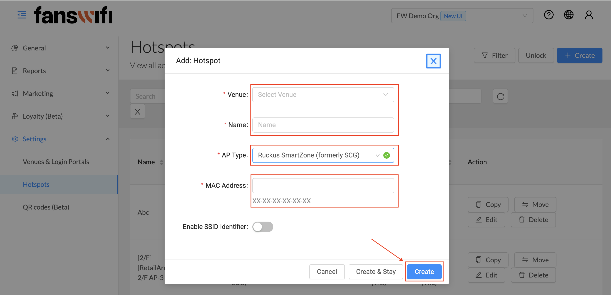

# Information required for FansWiFi Manager

# Information required for FansWiFi Manager

- Mac Addresses of the APs

# Setting on Ruckus One Cloud

## Step 1: Configure with Ruckus One Cloud

1. Access the Portal by opening a Web Browser
2. Click**Wi-Fi**on the left menu, then select**Wi-Fi Networks List**

## Step 2: Create SSID

1. Select**Networks List**on the top menu
2. Click**Add Wi-Fi Network**on the top right conner
3. For**Networks Details**session, configure with following settings:

1. **Network Name:** <SSID-name-you-prefer> (e.g. - FansWiFi Free WiFi -)
2. **Network Type:** Captive Portal
3. Click**Next**

## Step 3: Captive Portal Configuration

1. In*Portal Type*session, configure with following settings:

1. **Portal Type:** 3rd Party Captive Portal (WISPr)
2. Click**Next**
2. In Settings session, configure with following settings:

1. **Portal Provider:** Custom Provider
2. **Provider Name:** FansWiFi
3. **Captive Portal:** [https://connect-p.fanswifi.com/auth](https://connect-p.fanswifi.com/auth)
4. **Redirect users to:** Enable
5. **Redirect users to:** [https://connect-p.fanswifi.com/auth?res=success](https://connect-p.fanswifi.com/auth?res=success)
6. **Secure your network:** None
7. **Enable MAC auth bypass:** Enable
8. **Enable the encryption for users’ MAC and IP addresses:** Enable
9. **Enable RUCKUS DHCP service:** Enable
10. **Use Bypass Captive Network Assistant:** Disable
11. **Walled Garden:** Refer to the Walled Garden List (below)

## Walled Garden List (required)

1. *.[fanswifi.com](http://fanswifi.com/)

i.**Walled Garden List (Optional, you may skip this if there is no Facebook Login Enabled)**

1. *.[facebook.com](http://facebook.com/)
2. *.[facebook.net](http://facebook.net/)
3. *.[fbcdn.net](http://fbcdn.net/)
4. *.[fbcdn.com](http://fbcdn.com/)
5. *.[akamaihd.net](http://akamaihd.net/)
6. [www.google.com](http://www.google.com/)
7. *.[doubleclick.net](http://doubleclick.net/)
8. [www.google.com.hk](http://www.google.com.hk/)(Local Google URL of your Country / Region)

1. Example:

1. EU:[www.google.eu](http://www.google.eu/)
2. UK:[www.google.co.uk](http://www.google.co.uk/)
3. Hong Kong:[www.google.com.hk](http://www.google.com.hk/)
4. Japan:[www.google.co.jp](http://www.google.co.jp/)
5. Taiwan:[www.google.com.tw](http://www.google.com.tw/)
6. Thailand:[www.google.co.th](http://www.google.co.th/)
7. Malaysia:[www.google.com.my](http://www.google.com.my/)
8. Myanmar:[www.google.com.mm](http://www.google.com.mm/)

ii.**Walled Garden List (Optional, you may skip this if there is no Weibo Login Enabled)**

1. *.[weibo.com](http://weibo.com/)
2. *.[weibo.cn](http://weibo.cn/)
3. *.[sinaapp.com](http://sinaapp.com/)
4. *.[sina.com.cn](http://sina.com.cn/)
5. *.[sinajs.cn](http://sinajs.cn/)

iii.**Walled Garden List (Optional, you may skip this if there is no Instagram Login Enabled)**

1. *.[instagram.com](http://instagram.com/)
2. *.[akamaihd.net](http://akamaihd.net/)
3. *.[cdninstagram.com](http://cdninstagram.com/)

vi.**Twitter Login (Optional, you may skip this if there is no Twitter Login Enabled)**

1. *.[twitter.com](http://twitter.com/)
2. *.[twimg.com](http://twimg.com/)

vi.**LINE Login (Optional, you may skip this if there is no LINE Login Enabled)**

1. *.[line.me](http://line.me/)
2. *.[line-scdn.net](http://line-scdn.net/)

vi.**PayPal Login (Optional, you may skip this if there is no PayPal Login Enabled)**

1. *.[paypal.com](http://paypal.com/)
2. *.[paypalobjects.com](http://paypalobjects.com/)
3. [www.google-analytics.com](http://www.google-analytics.com/)

v.**Video Login (Optional, you may skip this if there is no Video Login Enabled)**

1. *.[akamaized.net](http://akamaized.net/)
2. *.[akamaihd.net](http://akamaihd.net/)
3. [ssl.google-analytics.com](http://ssl.google-analytics.com/)

1. *.[scorecardresearch.com](http://scorecardresearch.com/)
2. *.[vimeocdn.com](http://vimeocdn.com/)
3. *.[vimeo.com](http://vimeo.com/)

## Step 4: Radius Configuration

1. From**Authentication Service**, select**Authenticate Connections**
2. From the row**Authentication Server**, click**Add Server**to create a new server

1. **Authentication Server:** *<server-name-you-prefer>*(e.g. FansWiFi Radius)
2. **IP Address:** 103.6.85.240
3. **Port:** 1812
4. **Shared Key:** social123
5. Click**Add**
3. Configure with following settings:

1. **Authentication Server:** *Name of server that you created*(e.g. FansWiFi Radius)

​
4. Enable**Accounting Service**
5. From the row**Accounting Server**, click**Add Server**to create a new server

1. **Authentication Server:** *<server-name-you-prefer>*(e.g. FansWiFi Accounting)
2. **IP Address:** 103.6.85.240
3. **Port:** 1813
4. **Shared Key:** social123
5. Click**Add**
6. Configure with following settings:

1. **Accounting Server:** *Name of server that you created*(e.g. FansWiFi Accounting)
7. Click**Next**

​
8. In**Venue**Session, select a venue that you want to put in (e.g. My-Venue)

1. Then click**Next**
9. In**Summary**session, click**Add**to create network

## Step 5: Add AP to FansWiFi Admin Panel

- Login to FansWiFi Admin Panel
- Click**Settings -> Hotspots -> Create**
- Configure with following settings:

- **Venue:** Select the venue of where your Access Point locates
- **Hotspot Name:** Name each Access Point to make it identifiable
- **AP Type:** Select “Ruckus SmartZone (formerly SCG)”
- **Mac Address:** Input unique MAC Address of each Access Point in your venue
- Click**Create**

