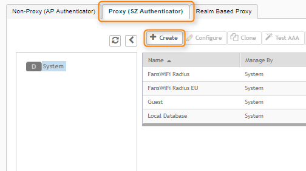
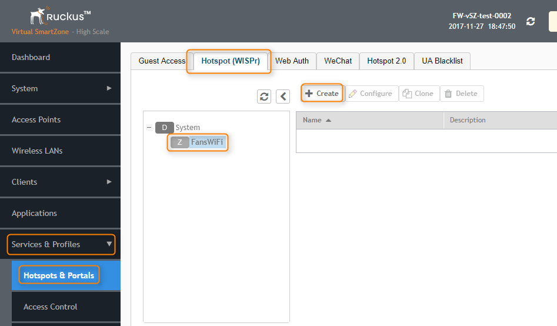
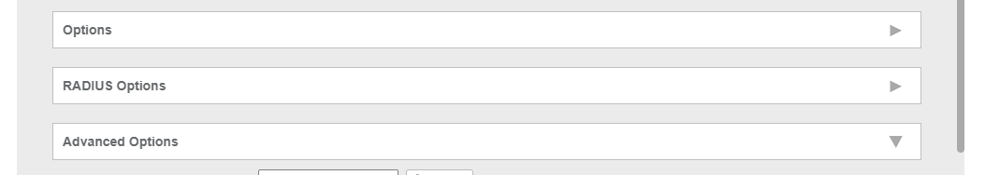
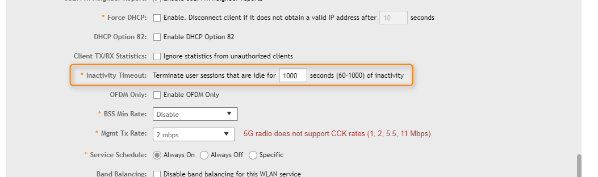
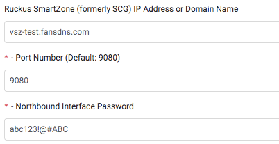

# Information required for FansWiFi Manager

# Information required for FansWiFi Manager

- Mac Addresses of the APs

### FansWiFi Server / Controller Communication

The table below listed the ports that must be opened on the network firewall to ensure that the hotspot system, FansWiFi servers (including RADIUS server) can communicate with each other successfully.

**Port Number**

**Protocol**

**Source**

**Destination**

**Traffic Direction**

**Purpose**

**Required by Login Method**

1812 / 1813

UDP & TCP

Controller

FansWiFi RADIUS Server (103.6.85.240)

outbound

AAA Authentication and Accounting

All

1700 / 3799

UDP & TCP

FansWiFi Radius Server IP

(103.6.85.240)

Controller

inbound

(port forwarding may needed by your firewall / router. Depends on your network setup.)

RADIUS CoA Messages

WeChat Login / Video Login / Advanced Facebook Login...etc.

8443 / 9443

(Depends on Setting)

TCP

FansWiFi

Northbound Interface of Ruckus SmartZone Controller

inbound

(port forwarding may needed by your firewall / router. Depends on your network setup.)

Ruckus Northbound API Access for WiFi Client Online / Offline Control

All

# Network Topology

# Setting on Ruckus SmartZone / SCG

## Step 1:  Configure the SmartZone

1. Access the SmartZone by opening a Web Browser
2. Click**Configure -> Service & Profiles -> Authentication**to enter the Authentication configuration Page

## Step 2:  Configuration: Authentication Servers

**Radius Authentication Server**

1. Click “Create New” under "Proxy (SZ Authenticator)" tab

1. **Name:** FansWiFi Radius
2. **Primary Server**

1. **Service Protocol:** RADIUS
2. **IP Address:** 103.6.85.240
3. **Port:** 1812
4. **Shared Secret:** social123
5. **Confirm Secret:** social123
2. Click “**OK**” to Save the configuration

## Step 3: Configuration: Accounting Servers

**Radius Accounting Server**

1. Click "Accounting" on the left menu
2. Click “Create New” under the "Proxy" tab

1. **Name:** FansWiFi Acct
2. **Service Protocol:** RADIUS Accounting
3. **Primary Server**

1. **IP Address:** 103.6.85.240
2. **Port:** 1813
3. **Shared Secret:** social123
4. **Confirm Secret:** social123
3. Click “**OK**” to Save the configuration

## Step 4: Configuration: Create AP Zone

- a. Select**Access Points**from the left menu

- b. Click “+” icon to create AP zone with below settings

- i.**Zone Name:** FansWiFi
- ii.**AP Admin Logon (Logon ID):** admin
- iii.**AP Admin Logon (Password):** [AP Admin Password]
- c. Click “**OK**” to Save the configuration

### 4.1. Configuration: Hotspot

- a. Click "Hotspots & Portals" under "Services & Profiles"
- b. Click "Hotspot (WISPr)" tab
- c. Select AP Zone you created from the AP Zone List
- d. Click “+ Create” with below settings

- i.**Portal Name:** FansWiFi Portal
- ii.**Smart Client Support:** None
- iii.**Logon URL:** External
- iv.**Logon URL (Redirect URL):** [https://connect-p.fanswifi.com/auth](https://support.fanswifi.com/hotspot-setup-guide/ruckus/ruckus-smartzone-or-scg-version-3-5-setup-guide#)
- v.**Redirected MAC Format:** AA-BB-CC-DD-EE-FF
- vi.**Start Page (redirect to the following URL):** [https://connect-p.fanswifi.com/auth/?res=success](https://support.fanswifi.com/hotspot-setup-guide/ruckus/ruckus-smartzone-or-scg-version-3-5-setup-guide#)
- vii.**Session Timeout:** 1440
- viii.**Grace Period:** 60

- ix.**Walled Garden List**

1. You may download the walled garden list .csv files on[https://cdn.fanswifi.com/assets/ruckus/fanswifi_ruckus_smartzone_walled_garden.zip](https://support.fanswifi.com/hotspot-setup-guide/ruckus/ruckus-smartzone-or-scg-version-3-5-setup-guide#)

2. Import the walled garden list corresponding to your enabled login methods
​
3. Input the local Google URL of your Country / Region

- Example:

- EU:[www.google.eu](http://www.google.eu)
- UK:[www.google.co.uk](https://support.fanswifi.com/hotspot-setup-guide/ruckus/ruckus-smartzone-or-scg-version-3-5-setup-guide#)
- Hong Kong:[www.google.com.hk](https://support.fanswifi.com/hotspot-setup-guide/ruckus/ruckus-smartzone-or-scg-version-3-5-setup-guide#)
- Japan:[www.google.co.jp](https://support.fanswifi.com/hotspot-setup-guide/ruckus/ruckus-smartzone-or-scg-version-3-5-setup-guide#)
- Taiwan:[www.google.com.tw](https://support.fanswifi.com/hotspot-setup-guide/ruckus/ruckus-smartzone-or-scg-version-3-5-setup-guide#)
- Thailand:[www.google.co.th](https://support.fanswifi.com/hotspot-setup-guide/ruckus/ruckus-smartzone-or-scg-version-3-5-setup-guide#)
- Malaysia:[www.google.com.my](https://support.fanswifi.com/hotspot-setup-guide/ruckus/ruckus-smartzone-or-scg-version-3-5-setup-guide#)
- Myanmar:[www.google.com.mm](https://support.fanswifi.com/hotspot-setup-guide/ruckus/ruckus-smartzone-or-scg-version-3-5-setup-guide#)

- **Required:**

- *.[fanswifi.com](https://support.fanswifi.com/hotspot-setup-guide/ruckus/ruckus-smartzone-or-scg-version-3-5-setup-guide#)
- [*.cloudfront.net](https://support.fanswifi.com/hotspot-setup-guide/ruckus/ruckus-smartzone-or-scg-version-3-5-setup-guide#)
- **Optional:**

- **Facebook Login:**

- *.[facebook.com](https://support.fanswifi.com/hotspot-setup-guide/ruckus/ruckus-smartzone-or-scg-version-3-5-setup-guide#)
- *.[facebook.net](https://support.fanswifi.com/hotspot-setup-guide/ruckus/ruckus-smartzone-or-scg-version-3-5-setup-guide#)
- *.[fbcdn.net](https://support.fanswifi.com/hotspot-setup-guide/ruckus/ruckus-smartzone-or-scg-version-3-5-setup-guide#)
- *.[fbcdn.com](https://support.fanswifi.com/hotspot-setup-guide/ruckus/ruckus-smartzone-or-scg-version-3-5-setup-guide#)
- *.[akamaihd.net](https://support.fanswifi.com/hotspot-setup-guide/ruckus/ruckus-smartzone-or-scg-version-3-5-setup-guide#)
- *.fbsbx.com
- **Weibo Login:**

- *.[weibo.com](https://support.fanswifi.com/hotspot-setup-guide/ruckus/ruckus-smartzone-or-scg-version-3-5-setup-guide#)
- *.[weibo.cn](https://support.fanswifi.com/hotspot-setup-guide/ruckus/ruckus-smartzone-or-scg-version-3-5-setup-guide#)
- [*.sinaapp.com](https://support.fanswifi.com/hotspot-setup-guide/ruckus/ruckus-smartzone-or-scg-version-3-5-setup-guide#)
- [*.sina.com.cn](https://support.fanswifi.com/hotspot-setup-guide/ruckus/ruckus-smartzone-or-scg-version-3-5-setup-guide#)
- [*.sinajs.cn](https://support.fanswifi.com/hotspot-setup-guide/ruckus/ruckus-smartzone-or-scg-version-3-5-setup-guide#)
- **Instagram Login:**

- *.[instagram.com](https://support.fanswifi.com/hotspot-setup-guide/ruckus/ruckus-smartzone-or-scg-version-3-5-setup-guide#)
- *.[akamaihd.net](https://support.fanswifi.com/hotspot-setup-guide/ruckus/ruckus-smartzone-or-scg-version-3-5-setup-guide#)
- *.[cdninstagram.com](https://support.fanswifi.com/hotspot-setup-guide/ruckus/ruckus-smartzone-or-scg-version-3-5-setup-guide#)
- **Twitter Login:**

- *.[twitter.com](https://support.fanswifi.com/hotspot-setup-guide/ruckus/ruckus-smartzone-or-scg-version-3-5-setup-guide#)
- *.[twimg.com](https://support.fanswifi.com/hotspot-setup-guide/ruckus/ruckus-smartzone-or-scg-version-3-5-setup-guide#)
- **Video Login:**

- *.[akamaized.net](https://support.fanswifi.com/hotspot-setup-guide/ruckus/ruckus-smartzone-or-scg-version-3-5-setup-guide#)
- *.[akamaihd.net](https://support.fanswifi.com/hotspot-setup-guide/ruckus/ruckus-smartzone-or-scg-version-3-5-setup-guide#)
- [ssl.google-analytics.com](https://support.fanswifi.com/hotspot-setup-guide/ruckus/ruckus-smartzone-or-scg-version-3-5-setup-guide#)
- *.[scorecardresearch.com](https://support.fanswifi.com/hotspot-setup-guide/ruckus/ruckus-smartzone-or-scg-version-3-5-setup-guide#)
- *.[vimeocdn.com](https://support.fanswifi.com/hotspot-setup-guide/ruckus/ruckus-smartzone-or-scg-version-3-5-setup-guide#)
- *.[vimeo.com](https://support.fanswifi.com/hotspot-setup-guide/ruckus/ruckus-smartzone-or-scg-version-3-5-setup-guide#)
​
- e. Click “OK” to Save the configuration

## Step 5: Create WLAN and SSID for customer access

- Select “Wireless LANs” from the left menu
- Click “+ Create” with below settings

- **Name:** - FansWiFi Free WiFi -
- **SSID:** - FansWiFi Free WiFi -
- **Zone:** FansWiFi
- **WLAN Group:** default
- **WLAN Usage Type:** Hotspot (WISPr)
- **Authentication Method:** Open
- **Encryption Method:** None
- **Hotspot (WISPr) Portal:** FansWiFi Portal
- **Bypass CNA:** Disable
- **Authentication Service:** FansWiFi Radius
- **Accounting Service:** FansWiFi Acct
- **Under Avanced Options:**

- **Inactivity Timeout (Under Advanced Options):** 1000 seconds

## Step 6: Set Northbound Portal Interface (NBI) Password

- Click "System" --> "General Settings" --> "Northbound Interface"
- If you have previously set a NBI password, you may skip this step. If not, please enter a new password now and click**Apply**.
- This password will be used in the controller setting later on.

## Step 7: Configure SmartZone / SCG Domain or IP Address to FansWiFi Admin Panel

- Access FansWiFi Admin Panel:[https://admin-p.fanswifi.com](https://support.fanswifi.com/hotspot-setup-guide/ruckus/ruckus-smartzone-or-scg-version-3-5-setup-guide#)
- Login Using your own username / password
- Select “Setting” from the top menu
- Select “Venues & Login Portals” from the left menu
- Click “Edit” in your target Venue

- Select “WiFi -> Controller” from the left menu
- **Ruckus SmartZone (formerly SCG) IP Address or Domain Name:** <your-controller-domain-or-ip>

- **Port Number (Default: 9080):** <your-controller-northbound-port-number>
- **Northbound Interface Password:** <your-northbound-password>

**Exceptional Case: SmartZone / vSCG behinds Router / Firewall**
If the SmartZone / vSCG is behind Router / Firewall, it is not directly accessible by FansWiFi Server. In this case, you need to configure port forwarding on your Router / Firewall to forward the port to the SmartZone / vSCG.

## Step 8: Add AP to FansWiFi Admin Panel

- Login to FansWiFi Admin Panel
- Click**Settings -> Hotspots -> Add Hotspot**

1. 1. **Organization:** Select the organization of where your Access Point locates
2. **Venue:** Select the venue of where your Access Point locates
3. **Hotspot Name:** Name each Access Point to make it identifiable
4. **AP Type:** Select “Ruckus SmartZone (formerly SCG)”
5. **Mac Address:** Input unique MAC Address of each Access Point in your venue (Not controller)
2. Click**Save**

​
​
​
​
