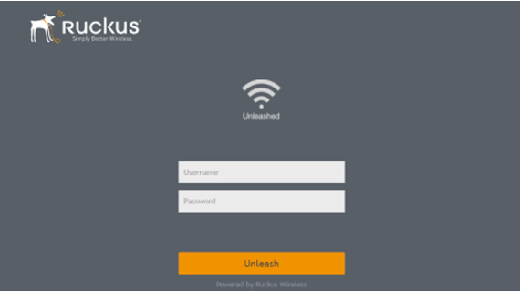
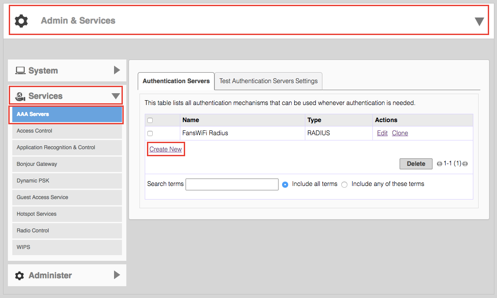
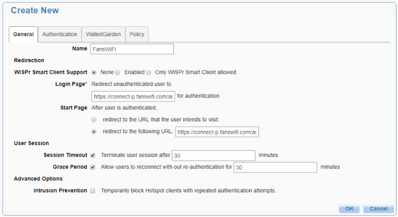
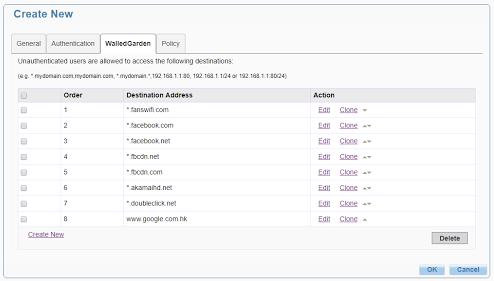
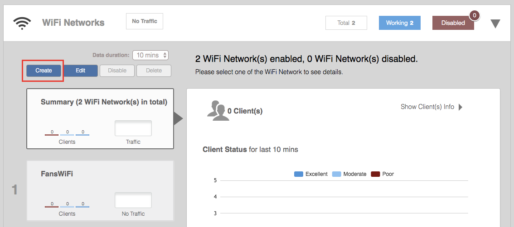
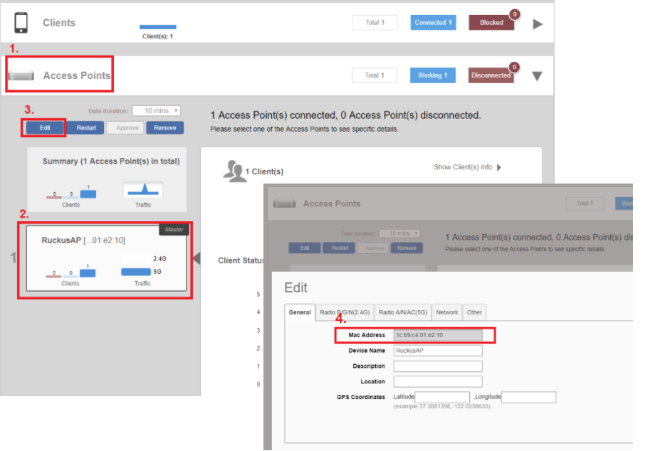

# Information required for FansWiFi Manager

# Information required for FansWiFi Manager

- Mac Addresses of the APs

## Tested Firmware Version

- Version: **200.3.9.13.228**

# Setting on Ruckus Unleashed

## Step 1: Configure the Unleashed

- a. Access the Unleashed Admin Panel by opening a Web Browser

## Step 2: Configuration: Authentication Servers (AAA Servers)

**Radius Server**

- a. Click “Admin & Services” header

- b. Select “Services” then “AAA Servers” on the left menu
- c. Click “Create New” under “Authentication Servers” with below settings

- i. **Name:** FansWiFi Radius
- ii. **Type:** RADIUS
- iii. **Auth Method:** PAP
- iv. **Backup RADIUS:** Enabled

- First Server:

- **IP Address:** 103.6.85.240
- **Port:** 1812
- **Shared Secret:** social123
- **Confirm Secret:** social123

- Second Server:

- **IP Address:** 52.221.175.51
- **Port:** 1812
- **Shared Secret:** social123
- **Confirm Secret:** social123

- d. Click “OK” to save the configuration

## Step 4: Configuration: Hotspot Services

1. Select **Hotspot Services** from the left menu.

   

2. Click **Create New** and configure the following.

   ### General tab

   - **Name:** FansWiFi
   - **WISPr Smart Client Support:** None
   - **Login Page:** https://connect-p.fanswifi.com/auth
   - **Start Page (redirect URL):** https://connect-p.fanswifi.com/auth
   - **User Session:** Configure only if your FansWiFi Admin Panel has **Session timeout** and/or **Daily quota** enabled.
     - **Example (Session Timeout / Daily Quota):** 60 minutes
     - **Session Timeout:** 60 Minutes
     - **Grace Period:** 60 Minutes
   - **Intrusion Prevention:** Disabled

   

   ### Authentication tab

   - **Authentication Server:** FansWiFi Radius
   - **Isolate wireless client traffic from other clients on the same AP:** Enabled

   

   ### Walled Garden tab

   **Walled Garden List (required)**

   - `fanswifi.com`

   **Walled Garden List (optional — only if Facebook Login is enabled)**

   - `facebook.com`
   - `facebook.net`
   - `fbcdn.net`
   - `fbcdn.com`
   - `akamaihd.net`
   - `www.google.com`
   - `doubleclick.net`
   - `www.google.com.hk` *(use the local Google domain for your country/region)*

   **Examples (local Google domains)**

   - EU: `www.google.eu`
   - UK: `www.google.co.uk`
   - Hong Kong: `www.google.com.hk`
   - Japan: `www.google.co.jp`
   - Taiwan: `www.google.com.tw`
   - Thailand: `www.google.co.th`
   - Malaysia: `www.google.com.my`
   - Myanmar: `www.google.com.mm`

   **Walled Garden List (optional — only if Weibo Login is enabled)**

   - `weibo.com`
   - `weibo.cn`
   - `sinaapp.com`
   - `sina.com.cn`
   - `sinajs.cn`

   **Walled Garden List (optional — only if Instagram Login is enabled)**

   - `instagram.com`
   - `akamaihd.net`
   - `cdninstagram.com`

   **Walled Garden List (optional — only if Twitter/X Login is enabled)**

   - `twitter.com`
   - `twimg.com`

   **Walled Garden List (optional — only if Video Login is enabled)**

   - `akamaized.net`
   - `akamaihd.net`
   - `ssl.google-analytics.com`
   - `scorecardresearch.com`
   - `vimeocdn.com`
   - `vimeo.com`

3. Click **OK** to save the configuration.

   

## Step 5: Create WLAN and SSID for customer access

- Select “WiFi Networks” header

- Click “Create” with below settings

- **Name:** FansWiFi
- **Usage Type:** Hotspot Service
- **Hotspot Service:** FansWiFi
- Click “Show advanced configuration” and click “Others” tab with below settings

- **Inactivity Timeout:** 60 minutes

## Step 6: Get MAC Address of AP

- a. Access the Unleashed Admin Panel

- 1. Click “Access Points” header
- 2. Click on the AP which you want to register on FansWiFi
- 3. Click “Edit” to view the MAC Address
- 4. Copy the MAC Address for FansWiFi Hotspot Setting

## Step 7: Add AP to FansWiFi Admin Panel

- Login to FansWiFi Admin Panel
- Click **Settings -> Hotspots -> Add Hotspot**

1. **Venue:** Select the venue of where your Access Point locates
2. **Hotspot Name:** Name each Access Point to make it identifiable
3. **AP Type:** Select “Ruckus Unleashed”
4. **Mac Address:** Input unique MAC Address of each Access Point in your venue
5. Click **Save**

# FAQ

## 1. How to deauthorize wifi user to bring user back to the login page after login?

- During testing, you may want to try different login methods.
- But after user authorized in any login method, captive portal will not be shown again before the expiry of session time.
- If you may want to bring the user back to the captive portal page for testing different login methods, you will need to unauthorize the WiFi user.

WiFi User Logout trigger by:

WiFi User's Device

(usually, access a logout url on browser)

Controller Web Admin Interface

Not Available

Last Testing: 11-9-2017

Available

Last Testing: 11-9-2017

**WiFi User Logout trigger by:**

**Controller**

- Click on **Client** header
- Select the device you want to logout
- Click "**Delete**"

