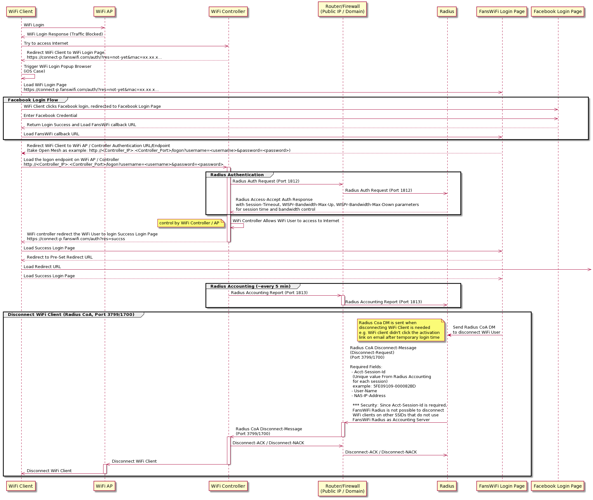
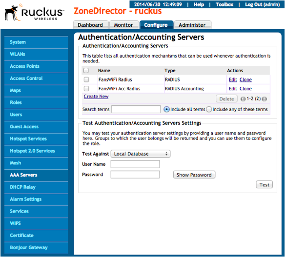
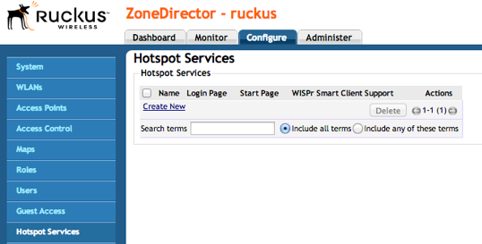
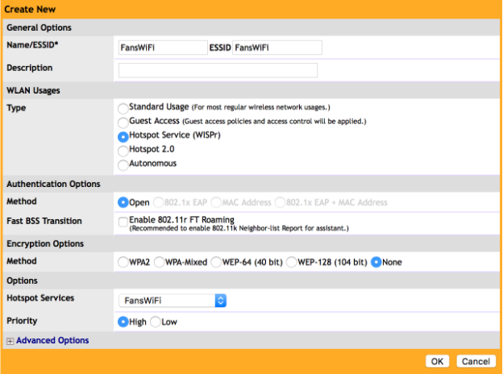
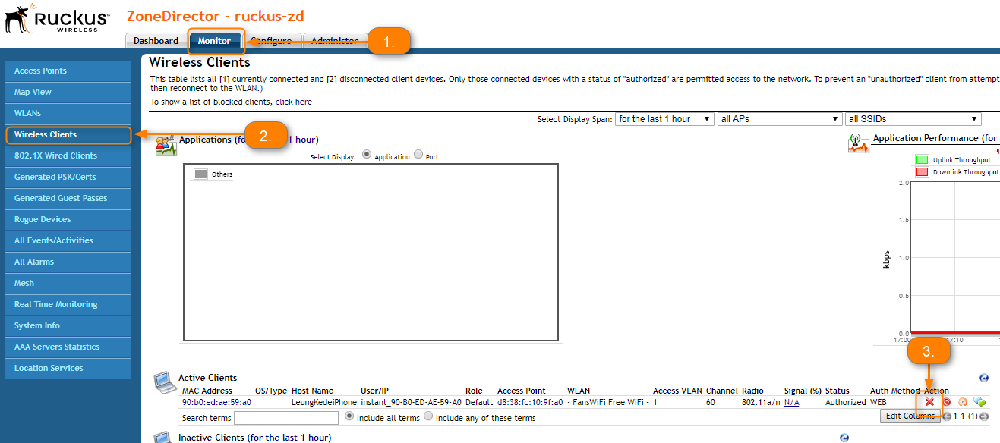

# Information required for FansWiFi Manager


# Information required for FansWiFi Manager

- Mac Addresses of the APs

## Tested Firmware Version

- Version: **9.8**
- NOT Supported Version: **9.7 or below**
- **Warning: Firmware 9.7 or below is confirmed NOT working with Social Login. Please do not use firmware 9.7 or below.**

## FansWiFi Server / Controller Communication

The table below listed the ports that must be opened on the network firewall to ensure that the hotspot system, FansWiFi servers (including RADIUS server) can communicate with each other successfully.

**Port Number**

**Protocol**

**Source**

**Destination**

**Traffic Direction**

**Purpose**

**Required by Login Method**

1812 / 1813

UDP & TCP

Controller

FansWiFi RADIUS Server (103.6.85.240)

outbound

AAA Authentication and Accounting

All

1700 / 3799

UDP & TCP

FansWiFi Radius Server IP

(103.6.85.240)

Controller

inbound

(port forwarding may needed by your firewall / router. Depends on your network setup.)

* RADIUS CoA Disconnect-Messages

(Required to use FansWiFi Radius Server as Radius Accounting Server of the SSID)

WeChat Login / Video Login / Advanced Facebook Login...etc.

## * Flow Diagram for Radius CoA DM (Disconnect Message) (Optional, for login method that require Temporary Internet Access only)


Security

- Radius CoA Disconnect-Message requires Acct-Session-Id of the connection session

- Acct-Session-Id is reported from WiFi Controller via Radius Accounting Messages for each session, it is unique for each WiFi user session

- FansWiFi Radius do not possible to disconnect WiFi client on other SSID that do not configure FansWiFi Radius as Accounting Server

Example Disconnect-Message Packet Format:

```
Acct-Session-Id = "D91FE8E51802097" User-Name = "somebody" NAS-IP-Address = 10.0.0.1
```

Reference:

- freeradius - Disconnect Message:[https://wiki.freeradius.org/protocol/Disconnect-Messages](https://support.fanswifi.com/hotspot-setup-guide/ruckus/ruckus-zonedirector-setup-guide#)

- RFC:[https://wiki.freeradius.org/protocol/Disconnect-Messages](https://support.fanswifi.com/hotspot-setup-guide/ruckus/ruckus-zonedirector-setup-guide#)

# Topology


Example Flow Diagram for whole Authentication Process



# Setting on Ruckus ZoneDirector

## Step 1: Configure the ZoneDirector

- a. Access the ZoneDirector by opening a Web Browser
- b. Click “Configure” to enter the configuration Page



## Step 2: Configuration: Authentication Servers

**Radius Server**

- a. Select “AAA Servers” from the left menu
- b. Click “Create New” again with below settings

- **Name:** FansWiFi Radius
- **Type:** RADIUS
- **Backup Radius:** Off
- **IP Address:** 103.6.85.240
- **Port:** 1812
- **Shared Secret:** social123
- **Confirm Secret:** social123
- c. Click “OK” to Save the configuration


**Step 3: Configuration: Accounting Servers**

**Radius Accounting Server**

- a. Select “AAA Servers” again from the left menu
- b. Click “Create New” again with below settings

- **Name:** FansWiFi Acct Radius
- **Type:** RADIUS Accounting
- **Backup Radius:** Off
- **IP Address:** 103.6.85.240
- **Port:** 1813
- **Shared Secret:** social123
- **Confirm Secret:** social123
- c. Click “OK” to Save the configuration


## Step 4: Configuration: Hotspot Services

a. Select “Hotspot Services” from the left menu



b. Click “Create New” with below settings

- **Name:** FansWiFi
- **Login Page:** [https://connect-p.fanswifi.com/auth](https://support.fanswifi.com/hotspot-setup-guide/ruckus/ruckus-unleashed-setup-guide#)
- **Start Page (redirect to the following URL):** [https://connect-p.fanswifi.com/auth](https://support.fanswifi.com/hotspot-setup-guide/ruckus/ruckus-unleashed-setup-guide#)
- **User Session:** (set it if your FansWiFi Admin Panel has session timeout & daily quota enabled)

- **Example:** Session Timeout / Daily Quota: 60 minute
- **Setting:**

- **Session Timeout:** 60 Minutes
- **Grace Period:** 60 Minutes

- **Authentication Server:** FansWiFi Radius
- **Accounting Server:** FansWiFi Acct Radius
- **Encryption Method:** None
- **Advanced Option**

- **Inactive Timeout:** 60 minutes
​
- **Walled Garden List (required)**

1. *.[fanswifi.com](https://support.fanswifi.com/hotspot-setup-guide/ruckus/ruckus-zonedirector-setup-guide#)
- **Walled Garden List (Optional, you may skip this if there is no Facebook Login Enabled)**

1. *.[facebook.com](https://support.fanswifi.com/hotspot-setup-guide/ruckus/ruckus-zonedirector-setup-guide#)
2. *.[facebook.net](https://support.fanswifi.com/hotspot-setup-guide/ruckus/ruckus-zonedirector-setup-guide#)
3. *.[fbcdn.net](https://support.fanswifi.com/hotspot-setup-guide/ruckus/ruckus-zonedirector-setup-guide#)
4. *.[fbcdn.com](https://support.fanswifi.com/hotspot-setup-guide/ruckus/ruckus-zonedirector-setup-guide#)
5. *.[akamaihd.net](https://support.fanswifi.com/hotspot-setup-guide/ruckus/ruckus-zonedirector-setup-guide#)
6. *.fbsbx.com
- **Walled Garden List (Optional, you may skip this if there is no Weibo Login Enabled)**

1. *.[weibo.com](https://support.fanswifi.com/hotspot-setup-guide/ruckus/ruckus-zonedirector-setup-guide#)
2. *.[weibo.cn](https://support.fanswifi.com/hotspot-setup-guide/ruckus/ruckus-zonedirector-setup-guide#)
3. *.[sinaapp.com](https://support.fanswifi.com/hotspot-setup-guide/ruckus/ruckus-zonedirector-setup-guide#)
4. *.[sina.com.cn](https://support.fanswifi.com/hotspot-setup-guide/ruckus/ruckus-zonedirector-setup-guide#)
5. *.[sinajs.cn](https://support.fanswifi.com/hotspot-setup-guide/ruckus/ruckus-zonedirector-setup-guide#)
- **Walled Garden List (Optional, you may skip this if there is no Instagram Login Enabled)**

1. *.[instagram.com](https://support.fanswifi.com/hotspot-setup-guide/ruckus/ruckus-zonedirector-setup-guide#)
2. *.[akamaihd.net](https://support.fanswifi.com/hotspot-setup-guide/ruckus/ruckus-zonedirector-setup-guide#)
3. *.[cdninstagram.com](https://support.fanswifi.com/hotspot-setup-guide/ruckus/ruckus-zonedirector-setup-guide#)
- **Twitter Login (Optional, you may skip this if there is no Twitter Login Enabled)**

1. *.[twitter.com](https://support.fanswifi.com/hotspot-setup-guide/ruckus/ruckus-zonedirector-setup-guide#)
2. *.[twimg.com](https://support.fanswifi.com/hotspot-setup-guide/ruckus/ruckus-zonedirector-setup-guide#)
- **Video Login (Optional, you may skip this if there is no Video Login Enabled)**

1. *.[akamaized.net](https://support.fanswifi.com/hotspot-setup-guide/ruckus/ruckus-zonedirector-setup-guide#)
2. *.[akamaihd.net](https://support.fanswifi.com/hotspot-setup-guide/ruckus/ruckus-zonedirector-setup-guide#)
3. [ssl.google-analytics.com](https://support.fanswifi.com/hotspot-setup-guide/ruckus/ruckus-zonedirector-setup-guide#)
4. *.[scorecardresearch.com](https://support.fanswifi.com/hotspot-setup-guide/ruckus/ruckus-zonedirector-setup-guide#)
5. *.[vimeocdn.com](https://support.fanswifi.com/hotspot-setup-guide/ruckus/ruckus-zonedirector-setup-guide#)
6. *.[vimeo.com](https://support.fanswifi.com/hotspot-setup-guide/ruckus/ruckus-zonedirector-setup-guide#)

​c. Click “OK” to Save the configuration


## Step 5: Create WLAN and SSID for customer access

- Select “WLANs” from the left menu
- Click “Create New” with below settings

- **Name:** FansWiFi
- **ESSID:** FansWiFi
- **WLAN Usage Type:** Hotspot Service (WISPr)
- **Authentication Method:** Open
- **Encryption Method:** Open
- **Hotspot Service:** FansWiFi
- **Inactivity Timeout:** 60 minutes



## Step 6: [Optional] Configure ZoneDirector IP Address to FansWiFi Admin Panel (Advanced Login Method Only)

**** Please send this information to your FansWiFi account manager*

**(required for Advanced Login Method (e.g. WeChat or WhatsApp Login) ONLY, you may skip this step if there is no Advanced Login Method Enabled)**

**FansWiFi Admin Panel (Setting > Venue Setting)**


1. Send below information to FansWiFi

- Public IP Addresses / Domain Name of ZoneDirector
- Radius CoA Port: 3799


Exceptional Case: ZoneDirector behinds Router / Firewall

If the ZoneDirector is behind Router / Firewall, it is not directly accessible via FansWiFi Radius Server via Internet. In this case, you need to configure port forwarding on your Router / Firewall to forward the port to the ZoneDirector.


Please see below example:

Assume the Public IP of the Router is 1.1.1.1 in this example

1. Configure Port Forwarding to forward Router’s 50000 Port to ZoneDirector’s CoA Port (Default: 3799)

- - Inbound port: 50000 (You can replace any port you want in your setup)
- Destination IP: 192.168.1.100 (ZoneDirector’s IP in your network)
- Destination Port: 3799

2. Send below information to FansWiFi

- - Public IP Addresses of Router: 1.1.1.1 or Domain Name (URL)
- Radius CoA Port: 50000 (You can replace any port you want in your setup)

Setting in FansWiFi Admin Panel


## Step 7: Add AP to FansWiFi Admin Panel

- Login to FansWiFi Admin Panel
- Click **Settings -> Hotspots -> Add Hotspot**

1. **Venue:** Select the venue of where your Access Point locates
2. **Hotspot Name:** Name each Access Point to make it identifiable
3. **AP Type:** Select “Ruckus ZoneDirector”
4. **Mac Address:** Input unique MAC Address of each Access Point in your venue (Not controller)
2. Click Save


​

# FAQ

## 1. How to deauthorize wifi user to bring user back to the login page after login?

- During testing, you may want to try different login methods.
- But after user authorized in any login method, captive portal will not be shown again before the expiry of session time.
- If you may want to bring the user back to the captive portal page for testing different login methods, you will need to unauthorize the WiFi user.

WiFi User Logout trigger by:

WiFi User's Device

(usually, access a logout url on browser)

Controller Web Admin Interface

Not Available

Last Testing: 11-9-2017

Available

Last Testing: 11-9-2017

**WiFi User Logout trigger by:**

**Controller**

- Click on **Monitor** tab
- Click "**Wireless Clients**" on the left menu
- Under **Active Clients**, select the device you want to logout, click the **red cross** on the same row


