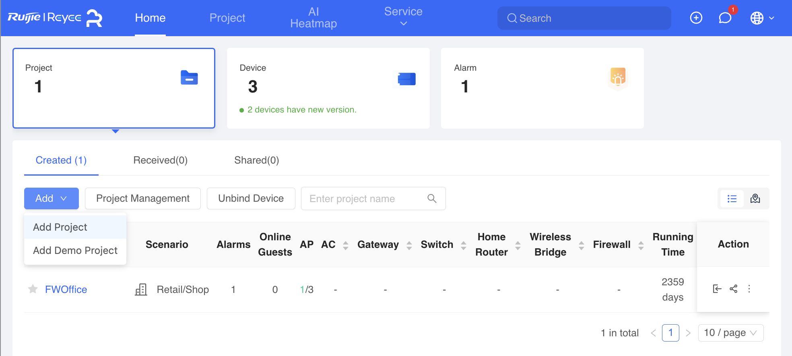
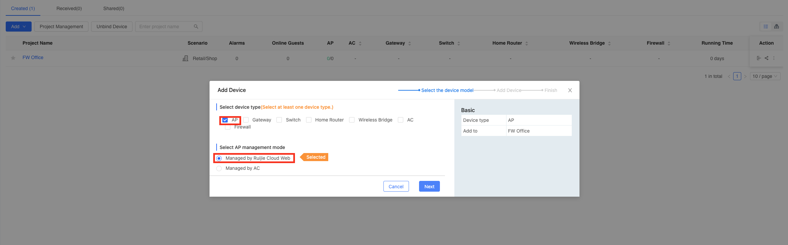
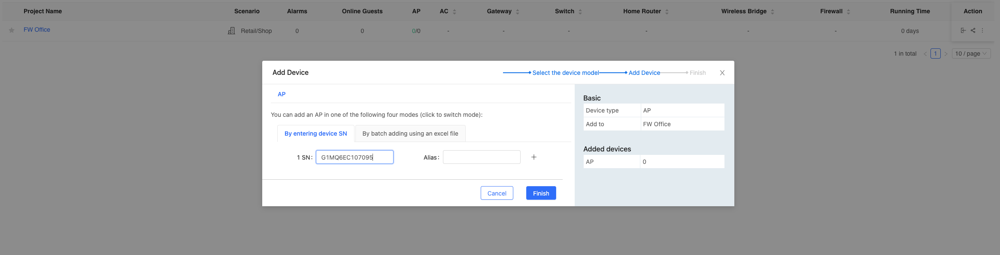
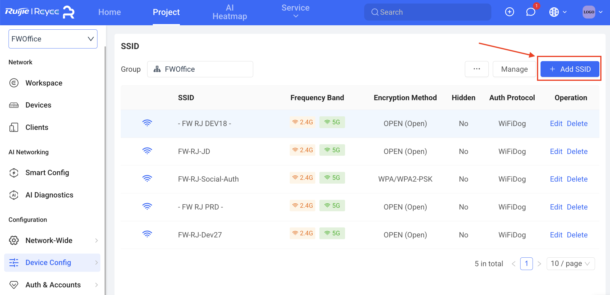
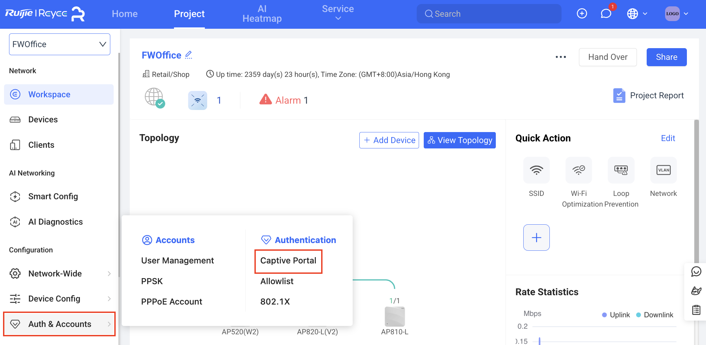
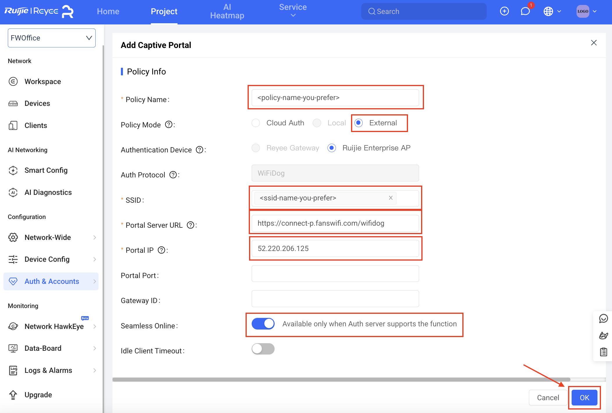
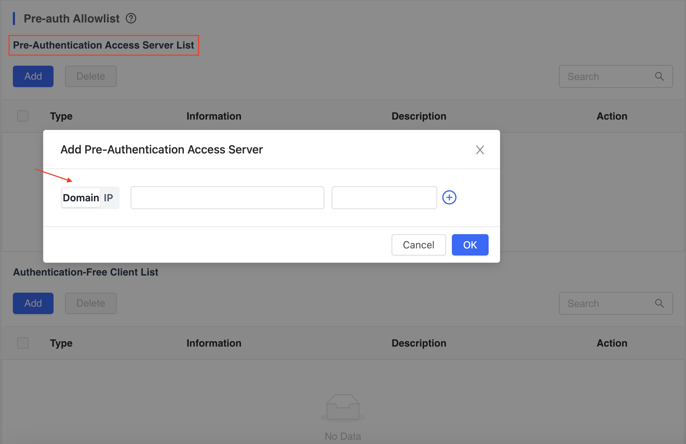
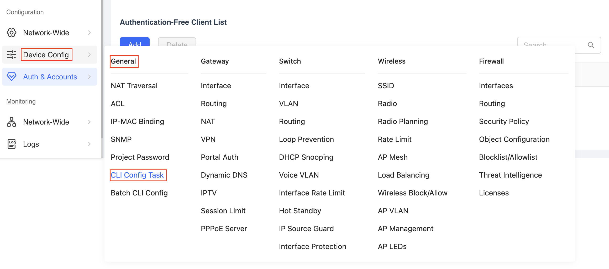
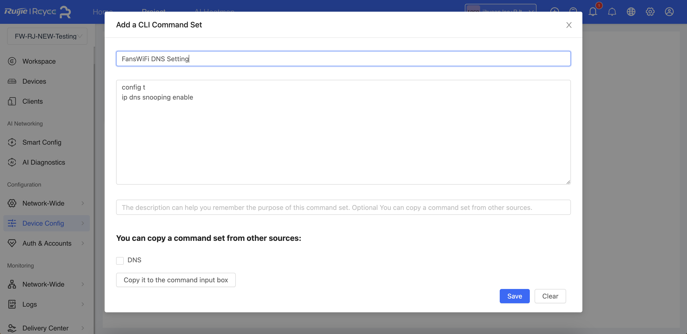

# Information required for the user

# Information required for the user

- Mac Address of the APs

# Tested Model and firmware Version

- Model: RG-AP720-L
- Firmware Version: AP_RGOS 11.1(9)B1P21, Release(06211815)

# Setting on Ruijie Cloud

## Step 1: Create a new project

- a. Access the Ruijie cloud network via this link:[https://cloud.ruijienetworks.com/](https://cloud.ruijienetworks.com/)
- b. Click "Add" and Select "Add Project"

- c. Configuring SSID and Add Device:

    - i. Select AP, Managed by Ruijie Cloud Web
    - ii. Type in SSID and select 'No encryption (Open)' mode
    - iii. Put serial number (SN) of the AP and click Finish

## Step 2: Create SSID

- **You can skip this part if you already create SSID**
- a. Click "Device Config" on the left menu
- b. Under "Wireless" section, select "SSID"

- c. Click "Add SSID"

- d. Configure with following setting:

- **SSID:** *<ssid-name-you-prefer>*
- **Encryption Option:** Do not Encrypt
- **Encryption Method:** OPEN (Open)
- e. Click "OK"

## Step 3: Create Captive Portal

- a. Click "Auth & Accounts" on the left menu
- b. Under "Authentication" section, select "Captive Portal"

- c. Click "Add Captive Portal"

- d. Configure the following settings:

- **Policy Name:** *<policy-name-you-prefer>*
- **Policy Mode:** External
- **SSID:** *Select the SSID you created inStep 2(e.g. <ssid-name-you-prefer>)*
- **Portal Server URL:** [https://connect-p.fanswifi.com/wifidog](https://connect-p.fanswifi.com/wifidog)
- **Portal IP:** 52.220.206.125
- **Seamless Online:** Enable
- e. Click "OK"

## Step 4: Configure Walled Garden Lists and CLI Command

1. Click **Auth & Accounts** on the left menu.
2. Under **Authentication**, select **Allowlist**.

   

3. Under **Pre-Authentication Access Server List**, click **Add** and choose **Domain**.

   

### Walled Garden List (required)

Add the following domain patterns:

- `*.fanswifi.com`

### Walled Garden List (optional — only if Facebook Login is enabled)

- `*.facebook.com`
- `*.facebook.net`
- `*.fbcdn.net`
- `*.fbcdn.com`
- `*.akamaihd.net`
- `www.google.com`
- `*.doubleclick.net`
- `www.google.com.hk` *(use the local Google domain for your country/region)*

**Examples (local Google domains)**

- EU: `www.google.eu`
- UK: `www.google.co.uk`
- Hong Kong: `www.google.com.hk`
- Japan: `www.google.co.jp`
- Taiwan: `www.google.com.tw`
- Thailand: `www.google.co.th`
- Malaysia: `www.google.com.my`
- Myanmar: `www.google.com.mm`

### Walled Garden List (optional — only if Weibo Login is enabled)

- `*.weibo.com`
- `*.weibo.cn`
- `*.sinaapp.com`
- `*.sina.com.cn`
- `*.sinajs.cn`

### Walled Garden List (optional — only if Instagram Login is enabled)

- `*.instagram.com`
- `*.akamaihd.net`
- `*.cdninstagram.com`

### Walled Garden List (optional — only if Twitter/X Login is enabled)

- `*.twitter.com`
- `*.twimg.com`

### Walled Garden List (optional — only if LINE Login is enabled)

- `*.line.me`
- `*.line-scdn.net`

### Walled Garden List (optional — only if PayPal Login is enabled)

- `*.paypal.com`
- `*.paypalobjects.com`
- `www.google-analytics.com`

### Walled Garden List (optional — only if Video Login is enabled)

- `*.akamaized.net`
- `*.akamaihd.net`
- `ssl.google-analytics.com`
- `*.scorecardresearch.com`
- `*.vimeocdn.com`
- `*.vimeo.com`

## Step 5: Enable DNS Snooping via CLI Command

- a. Click "Device Config" on the left menu
- b. Under "General" section, select "CLI Config Task"

- c. Click 'Add a CLI Command Set'

- **Name:** FansWiFi DNS Setting
- **Command:**

- config t
- ip dns snooping enable

## Step 6: Add AP to FansWiFi Admin Panel

- Login to FansWiFi Admin Panel
- Click **Settings -> Hotspots -> Create**
- Configure with following settings:

- **Venue:** Select the venue of where your Access Point locates
- **Hotspot Name:** Name each Access Point to make it identifiable
- **AP Type:** Select “Ruijie WiFiDog”
- **Mac Address:** Input unique MAC Address of each Access Point in your venue
- Click **Create**

