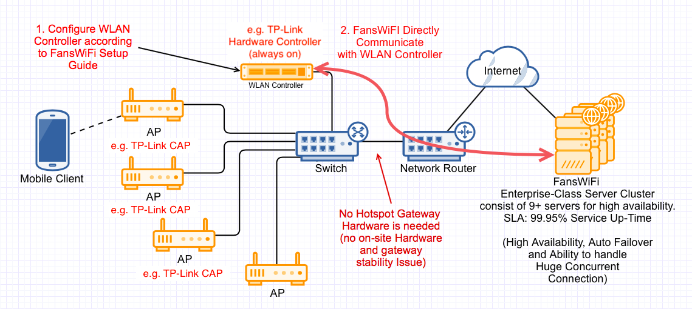

# Information required for FansWiFi Manager

# Information required for FansWiFi Manager

- Mac Addresses of the APs
- IP / Domain Name of Hardware Controller
- Admin username and password

# Tested Model and Firmware Version

- Access Controller (AC) Hardware:

- Hardware Version: TL-AC100 5.0
- Controller Firmware Version: 1.0.1 Build 240506 Rel.59699n

- AC Controller Hardware is required to be always on
-

- Access Point

- AP Model: TL-AP300C-PoE
- Hardware version: 5.0
- Firmware Version: 1.1.8
-

# Network Topology

# Setting on TP-Link Controller AC

## Step 1: Configure DNS Setting to the Core Router of the WiFi Network

- Optional [For specific setup only]

- Please contact FansWiFi support if needed.

## Step 2: Configure the TP-Link Controller AC

- Connect TP-Link Controller AC to the computer
- Login the management page in TP-Link Controller AC

- c. Configure with following settings:

- **SSID:** - FansWiFi Free WiFi -
- d. Click "确定"

![[3b] Create SSID copy.png](../../../_images/information-required-for-fanswifi-manager-248.png)

- e. Click "确定"

![[3c] Confirm message copy.png](../../../_images/information-required-for-fanswifi-manager-249.png)

## Step 4: Configuration: Radius

- a. Select "认证管理" > "认证服务器" on the left menu
- b. Select "Radius服务器" on the top menu
- c. Click "新增" to create a new Radius
- d. Configure with following settings for new RADIUS Profile:

- **服务器名称:** FansWiFi_Radius
- **服务器地址:** 103.6.85.240
- **认证端口:** 1812
- **计费端口:** 1813
- **共享密钥:** social123
- **NAS标识:** socialnas
- e. Click "确定"

![[4] Radius setup copy.png](../../../_images/information-required-for-fanswifi-manager-250.png)

- f. Select "认证服务器" on the top menu
- g. Click "新增" to create
- h. Configure with following settings:

- **组名称:** FansWiFi_Auth_Radius
- **主服务器:** FansWiFi_Radius
- i. Click "确定"

![[4fghi] Auth Radius Setup copy.png](../../../_images/information-required-for-fanswifi-manager-251.png)

## Step 5: Configuration: Portal

- a. Select "认证管理" > "Portal认证" on the left menu
- b. Select "远程Portal" on the top menu
- c. Click "新增" to create a new Portal

![[5abc] Portal setup copy.png](../../../_images/information-required-for-fanswifi-manager-252.png)

- d. Configure with following settings:

- **生效SSID:** - FansWiFi Free WiFi -
- **认证成功跳转链接:** [http://connect-p.fanswifi.com/auth?res=success&ap_type=tp-link-ac](http://connect-p.fanswifi.com/auth?res=success&ap_type=tp-link-ac)
- **认证失败跳转链接:** [http://connect-p.fanswifi.com/auth?res=failed&ap_type=tp-link-ac](http://connect-p.fanswifi.com/auth?res=failed&ap_type=tp-link-ac)
- **远程Portal地址:** [http://connect-p.fanswifi.com/auth](http://connect-p.fanswifi.com/auth)
- **认证服务器类型:** 远程服务器
- **认证服务器组:** FansWiFi_Auth_Radius
- e. Click "确定"

![[5de] Create Portal copy.png](../../../_images/information-required-for-fanswifi-manager-253.png)

## Step 6: Configuration: Access Control

- a. Select "认证管理" > "Portal认证" on the left menu
- b. Click "免认证策略" on the top menu
- c. Click "新增" to create policies

![[6abc] Access Control Setup copy.png](../../../_images/information-required-for-fanswifi-manager-254.png)

- d. Add all the following policies

- Configure the following settings based on the above policies:

- **策略名称:** "Policy Name"
- **源IP地址范围:** "IP Range"
- Click "确定"

![[6de] Create Access Control copy.png](../../../_images/information-required-for-fanswifi-manager-255.png)

- The following policies should be added**one-by-one**

Policy Name

IP Range

Production 1

52.220.206.125/32

Production 2

52.220.226.90/32

Cloudflare 1

103.21.244.0/22

Cloudflare 2

103.22.200.0/22

Cloudflare 3

103.31.4.0/22

Cloudflare 4

104.16.0.0/12

Cloudflare 5

108.162.192.0/18

Cloudflare 6

131.0.72.0/22

Cloudflare 7

141.101.64.0/18

Cloudflare 8

162.158.0.0/15

Cloudflare 9

172.64.0.0/13

Cloudflare 10

173.245.48.0/20

Cloudflare 11

188.114.96.0/20

Cloudflare 12

190.93.240.0/20

Cloudflare 13

197.234.240.0/22

Cloudflare 14

198.41.128.0/17

## Step 7: Get the MAC address of the AP

- You should see the MAC address at the bottom of the AP
- If you are not sure about the address, don’t worry.

- Click "AP管理" > "AP升级" on the left menu
- You can see the MAC address of the AP. Choose the one you want to put into FansWiFi Admin Panel.

![[7] Find MAC address of AP copy.png](../../../_images/information-required-for-fanswifi-manager-256.png)

## Step 8: Add AP to FansWiFi Admin Panel

- Login to FansWiFi Admin Panel

- Click**Settings -> Hotspots -> Create**

1. **Venue:** Select the venue of where your Access Point locates
2. **Hotspot Name:** Name each Access Point to make it identifiable
3. **AP Type:** Select “TP-Link EAP”
4. **Mac Address:** Input unique MAC Address of each Access Point in your venue (Not controller)
- Click**Save**

![[8] Add Hotspot copy.png](../../../_images/information-required-for-fanswifi-manager-258.png)
