# Information required for FansWiFi Manager

# Information required for FansWiFi Manager

- Mac Addresses of the APs
- IP / Domain Name of Omada server
- Hotspot Operator username and password

- Admin username and password is not required

# Tested Model and Firmware Version

- Access Point

- AP Model: EAP265 (Standalone Mode, managed by EAP Controller)

- Hardware version: 1.0
- Firmware Version: 5.0.6 Build 20220429 Rel. 44315
- Not Supported Access Point

- EAP115 Cluster Mode is NOT supported
- EAP110 and EAP120 are NOT supported
- Standalone EAP without managed by Omada EAP Controller is NOT supported
- Omada EAP Controller:

- Controller Firmware Version:

- Omada Network System: 5.15.16.40
- EAP Controller Software is required to be always on

Note that different models may have different interface

# Setting on TP-Link Omada Cloud-Based Controller

## Step 1: Configure DNS Setting to the Core Router of the WiFi Network

- Optional [For specific setup only]

- Please contact FansWiFi support if needed.

## Step 2: Configure the TP-Link Omada Cloud-Based Controller

- Start EAP Local Controller (Omada) software and login the management page

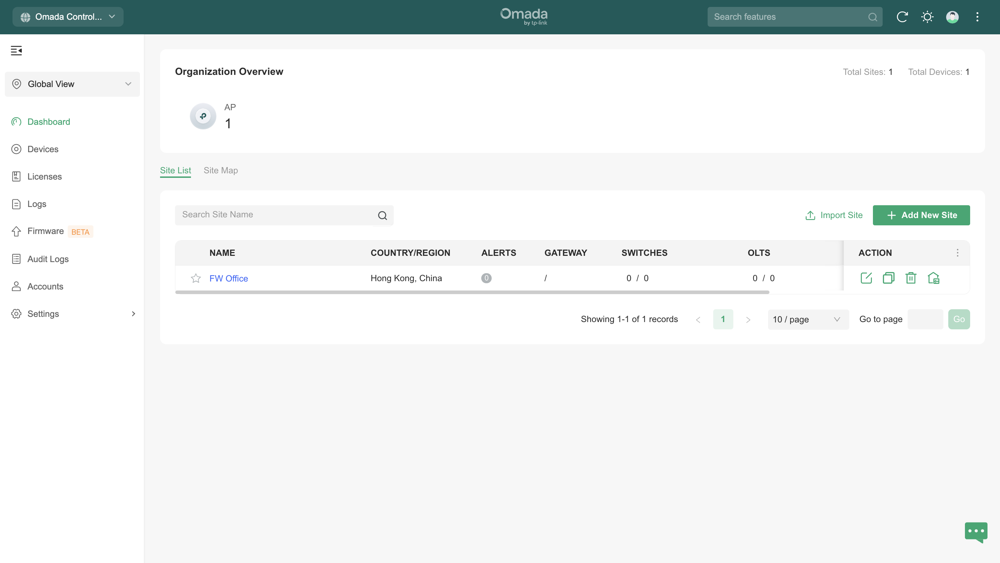

## Step 3: Configuration: SSID

- You can skip this part if you already create SSID
- a. Click "Dashboard" on the left menu
- b. Select "Site List" on the top menu
- c. Select a site from the list, and click "Launch"
- d. Click "Setting" on the left menu
- e. Under "Wired&Wireless Networks" section, select "WLAN"

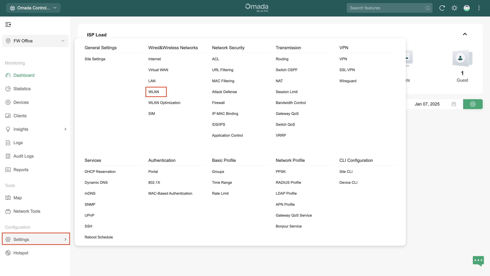

- f. Click "Create New Wireless Network"

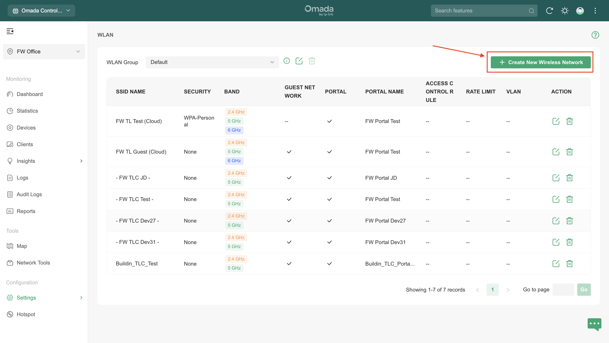

- g. Configure with following settings:

- **SSID Name:** <ssid-name-you-prefer>
- **Device Type:** EAP
- **Guest Network:** Enable
- **Security:** None
- h. Click "Apply"

## Step 4: Configuration: Portal

- a. Click "Setting" on the left menu
- b. Under "Authentication" section, Select "Portal"

- c. Click "Create new portal"​

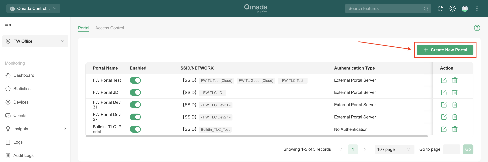

- d. Configure with following settings:

- **Portal Name:** FansWiFi Portal
- **Portal:** Enable
- **SSID & Network:** Select "Default [SSID]"

- After that, it would automatically select the SSID that already created
- **Authentication Type:** External Portal Server
- **External Portal Server:** URL

- **URL:** [https://connect-p.fanswifi.com/auth](https://connect-p.fanswifi.com/auth)
- **HTTPS Redirection:** Disable
- **Landing Page:** The Promotional URL

- URL:[https://connect-p.fanswifi.com/auth?res=success](https://connect-p.fanswifi.com/auth?res=success)
- d. Click "Apply"

## Step 5: Configuration: Access Control

- a. Click "Access Control" on the top menu

- b. Config with following settings

- **Pre-Authentication Access:** Enable
- c. Click "Add"
- d. Add policies with the following configurations:

- Click "IP Range" and enter the following IP Range
- Click "Add New Pre-Authentication Access Entry" to add more "IP Range"

Policy Name

IP Range

Production 1

52.220.206.125/32

Production 2

52.220.226.90/32

Cloudflare 1

103.21.244.0/22

Cloudflare 2

103.22.200.0/22

Cloudflare 3

103.31.4.0/22

Cloudflare 4

104.16.0.0/12

Cloudflare 5

108.162.192.0/18

Cloudflare 6

131.0.72.0/22

Cloudflare 7

141.101.64.0/18

Cloudflare 8

162.158.0.0/15

Cloudflare 9

172.64.0.0/13

Cloudflare 10

173.245.48.0/20

Cloudflare 11

188.114.96.0/20

Cloudflare 12

190.93.240.0/20

Cloudflare 13

197.234.240.0/22

Cloudflare 14

198.41.128.0/17

- e. Click "Save"

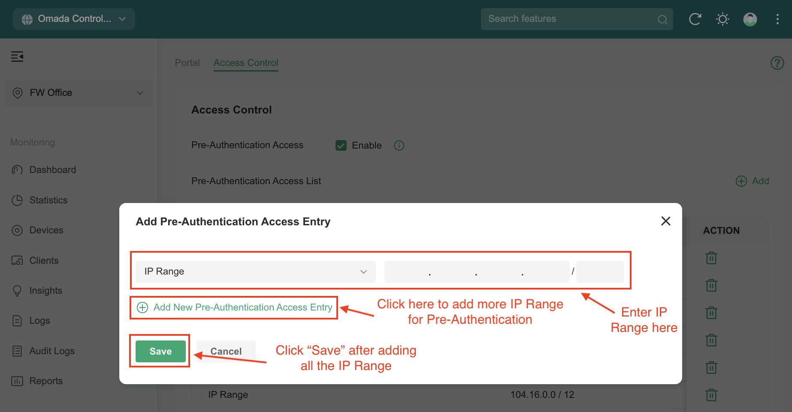

## Step 6: Configuration: Radius

- a. Click "Setting" on the left menu
- b. Under "Authentication" section, Select "Mac-Based Authentication"

- c. **Mac-Based Authentication:** Enable
- d. **RADIUS Profile:** Click "Create New RADIUS Profile"

- e. Configure with following settings for new RADIUS Profile:

- **Portal Name:** FansWiFi Radius
- **Authentication Server 1**

- **Authentication Server IP/URL:** 103.6.85.240
- **Authentication Port:** 1812
- **Authentication Password:** social123
- **RADIUS Accounting:** Enable
- **Interim Update:** Enable
- **Interim Update Interval:** 300 Seconds
- **Accounting Server 1**

- **Authentication Server IP/URL:** 103.6.85.240
- **Authentication Port:** 1813
- **Authentication Password:** social123
- Click "Save"

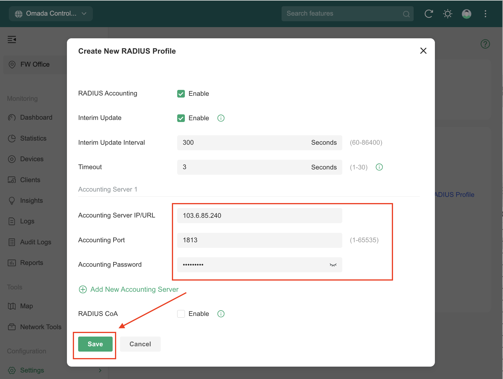

- f. Config the following settings for MAC-Based Authentication:

- **SSID:** Select "Select All"

- After that, it would automatically select all the SSID that already created
- **RADIUS Profile:** FansWiFi Radius
- g. Click "Apply"

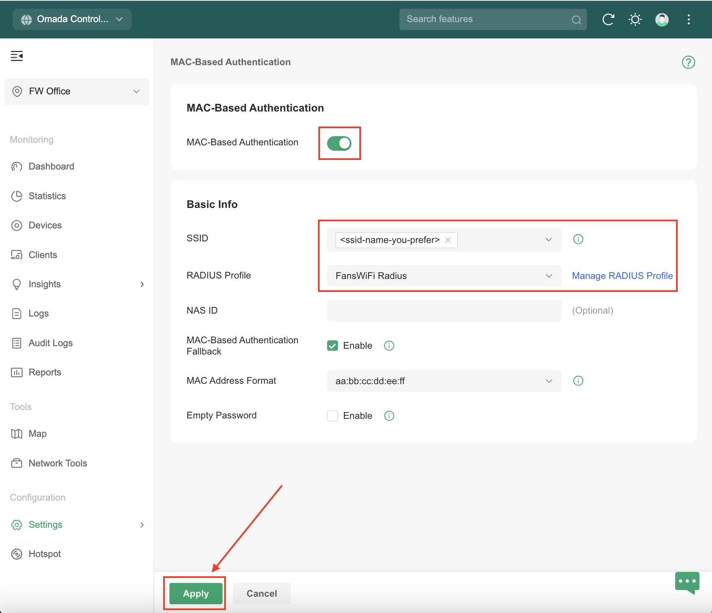

## Step 7: Get the MAC address of the AP (Will be used inStep 10)

- You should see the MAC address at the bottom of AP
- If you are not sure about the address, don’t worry.

- Click "Devices" on the left menu
- Click "Access Points" on the top menu.
- You can see the MAC address of the AP. Choose the one you want to put into FansWiFi Admin Panel.

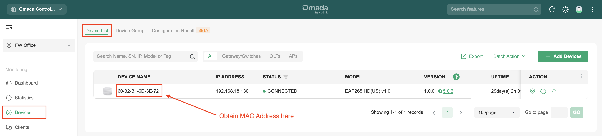

## Step 8: Add FansWiFiAPI Admin account for API call by FansWiFi Portal Server (Will be used inStep 11)

- a. Click "Hotspot" on the left menu

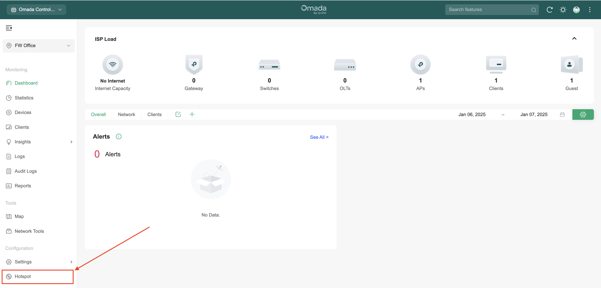

- b. Select "Operators" on the left menu, then click "Create Operator"

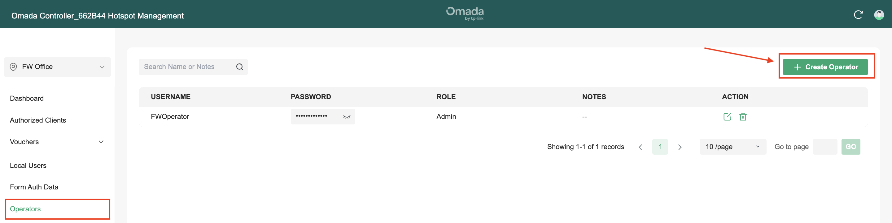

- c. Configure with the following settings:

- **Administrator Type:** Local User
- **Username:** <admin-id-you-prefer> (e.g. FansWiFiAPI)
- **Password:** <password-you-set>
- **Role:** Admin
- **Site Privileges:** *Select the site that you want to manage*
- d. Click "Create"

## Step 9: Get the Domain and ID of controller (Will be used onStep 11)

- You can obtain the domain and controller ID through the website URL on Hotspot section

## Step 10: Add AP to FansWiFi Admin Panel

- Login to FansWiFi Admin Panel
- 
- Click **Settings -> Hotspots -> Create**

1. **Venue:** Select the venue of where your Access Point locates
2. **Hotspot Name:** Name each Access Point to make it identifiable
3. **AP Type:** Select “TP-Link EAP”
4. **Mac Address:** Input unique MAC Address of each Access Point in your venue (Not controller)
- Click **Save**

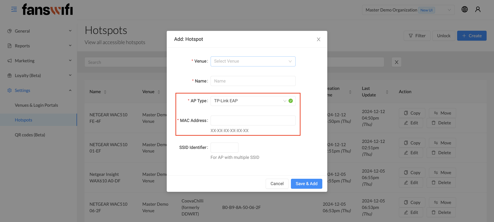

## Step 11: Add API Profile in FansWiFi Admin Panel

- a. Click "Venues & Login Portals" on the left menu
- b. Click "Edit" on the venue where your TP-Link EAP would be put under
- c. Click "Controllers"
- d. Configure with the following settings:

- **TP-Link Omada Controller IP Address or URL:** https://<your-controller-ip-address-or-url>
- **Port Number (Default: 8043):** 443
- **Admin Username:** <your-admin-id> (Hotspot Operator Username configured in[Step 8]([#h_1c5a88be6b](https://www.facebook.com/hashtag/h_1c5a88be6b)), i.e. FWOperator)
- **Admin Password:** <your-admin-password> (Hotspot Operator Password configured in[Step 8]([#h_1c5a88be6b](https://www.facebook.com/hashtag/h_1c5a88be6b)))
- e. Click "Save"

