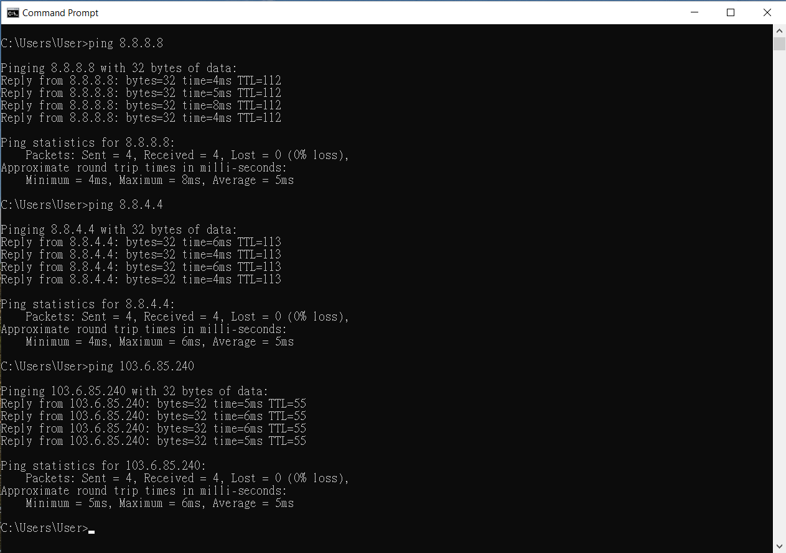
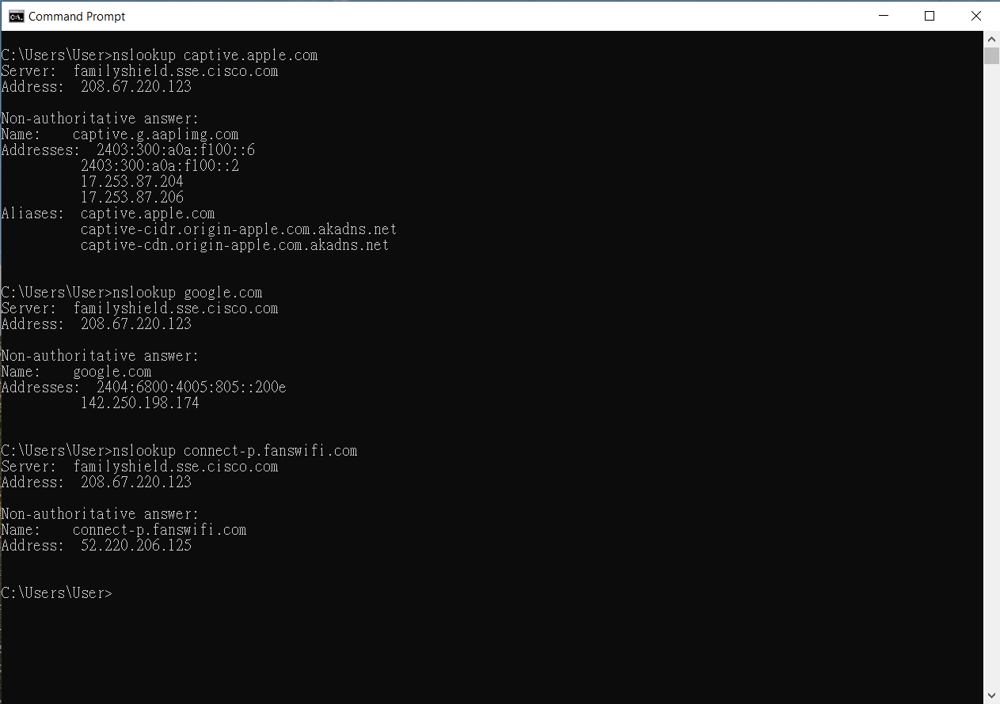
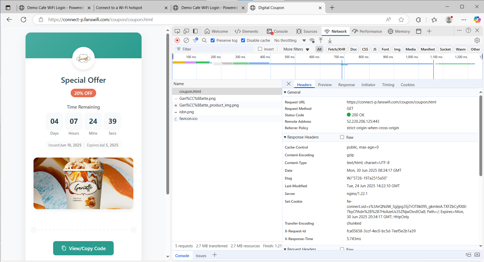

# 1) Test if the WiFi User able to access the Internet

After configuring the WiFi Captive portal, but the AP does not redirect WiFi user to the captive portal.

WiFi user didn't redirect to the captive portal could be caused by different reasons. Such as captive portal redirection configuration, network setting, DHCP, DNS, gateway, Internet access, Walled garden setting...etc.

To sort out the issue, it's recommended to confirm the access ability from the WiFi user side.

Below tests are recommended to be performed on a laptop computer (Windows / MacOS) instead of mobile phone.

### Please record your screen while performing the tests and share the recording with our support team for further troubleshooting. Screen recordings are invaluable in helping us observe and understand the issue more effectively.

### If the screen recording file is too large, we suggest uploading it to YouTube as an unlisted video. Unlisted videos are private and will not be visible to others unless they have the link. You can then share the link with us, and we’ll review it. Thank you for your cooperation.

# 1) Test if the WiFi User able to access the Internet

Even before login via Captive Portal, the WiFi user should need to be able to contact the Internet and also our sites in order to reach the captive portal.

Please perform ping test to verify the access

- Execute below commands on the WiFi User's machine after connecting to the SSID.

- ping 8.8.8.8
- ping 8.8.4.4

- 8.8.8.8 and 8.8.4.4 are Google DNS server. Its always up and WiFi client should able to reach these IPs
- ping 103.6.85.240

- this is FansWiFi Radius Server
- Expected Result

- WiFi client should able to ping these addresses

If the WiFi user cannot reach the above IPs, it shows that the network setting of the network might have some problems, for example:

- The vlan / network does not provide a correct Internet Gateway to the WiFi Client
- The WiFi Client might not get correct IP Addresses and network accessing information from the DHCP Server
- The Gateway might not be reachable from the client
- The Gateway might not be able to route the traffic to the Internet

# 2) Test if the WiFi User able to resolve DNS

Double check if the WiFi user can resolve DNS of Internet domains.

- Event when the WiFi user not yet authorised via the Captive Portal, the WiFi user must be able to access to DNS in order to load the captive portal page.

On Windows machine command prompt, please type below commands

- nslookup command

- nslookup captive.apple.com
- nslookup google.com
- nslookup connect-p.fanswifi.com
- nslookup radius.fanswifi.com
- ping command

- ping captive.apple.com
- ping google.com
- ping connect-p.fanswifi.com

- its expected that connect-p.fanswifi.com does not response to ping
- but the ping command should still able to resolve the IP Address
- ping radius.fanswifi.com
- Expected result

- The WiFi user should able to lookup all the above domains's IP Address and get the IP Addresses of the domains.
-

If WiFi user cannot ping the domain or there is any DNS resolve issue. Please check the network's DNS server or NAT related settings.

Further troubleshooting

- make sure the DHCP server of the network provide correct DNS server address to the WiFi client
- Try to ping the DNS Server IP Address from the WiFi client

# 3) Verify Walled Garden setting by accessing FansWiFi URL directly

Walled Garden Setting on the captive portal

- *.fanswifi.com

If the "Walled Garden" setting is correct on the AP or on the WiFi Controller, the WiFi user should able to reach FansWiFi's captive portal domain without any redirection.

Please test below URL

[https://connect-p.fanswifi.com/coupon/coupon.html](https://connect-p.fanswifi.com/coupon/coupon.html)

You should see the page like this

- you may also enable the browser's debugger to access more details, such as "Network"

# 4) Test captive portal redirection by accessing "http://" website to trigger the redirection, use browser (e.g. Chrome)'s developer tools to help checking the page loading results

On Chrome, please

1. Enable the Developer Tools and Debug
2. Switch the debugger's tab to "Network
3. Make sure "Preserve log" and "Disable cache" are selected
4. Enter and access below URL

1. [http://captive.apple.com](http://captive.apple.com)
2. [http://neverssl.com](http://neverssl.com)

1. Please make sure http:// instead of https:// is used
3. If redirection works, the WiFi AP should redirect the user to FansWiFi captive portal page

If the redirection does not work, please collect below information and send them to FansWiFi Support

1. Take screenshots of this page
2. Take screen recording of the whole process (from visiting the[http://captive.apple.com](http://captive.apple.com))
3. Download the log of this page by exporting the HAR file
4. Send the HAR file to FansWiFi Support or your FansWiFi contact

# Reference Article

HPE Aruba

- Airheads Community: Captive Portal not Pop-up

- [https://community.arubanetworks.com/discussion/captive-portal-not-pop-up](https://community.arubanetworks.com/discussion/captive-portal-not-pop-up)

