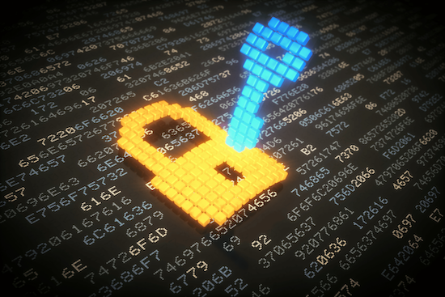
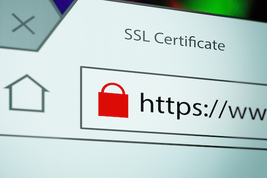

# Secure Data Protection with AES-256 and SSL

At FansWiFi, we take your data security and privacy seriously. To ensure that your sensitive information is protected from unauthorized access, we have implemented robust encryption measures and SSL security protocols. This guide will provide you with an overview of **AES-256 encryption**, **SSL security**, and the **comprehensive protection measures** we have in place.

## AES-256 Encryption

AES-256 (Advanced Encryption Standard with a key size of 256 bits) is a widely recognized and highly secure encryption algorithm. It transforms sensitive information into an unreadable format, **making it extremely difficult for unauthorized access** or decryption. By utilizing AES-256 encryption, we ensure that your data remains confidential and protected.

## SSL Security

Secure Sockets Layer (SSL) encryption is a protocol that establishes secure connections between devices and our servers. When you access our website or transmit data to our servers, SSL ensures that the information is encrypted and remains private. This **protects your data from interception or tampering by malicious actors**.

## Comprehensive Protection

We have implemented comprehensive security measures to safeguard your data from potential threats. These measures include:

- #### Protection against Unauthorized Access

We employ strict access controls, strong authentication mechanisms, and robust user management practices to prevent unauthorized access to your data.
- #### Data Breach Prevention

We have implemented advanced intrusion detection and prevention systems to monitor and detect any unauthorized attempts to access or compromise our systems. In the event of a potential data breach, we have protocols in place to respond swiftly and mitigate any impacts.
- #### Defense against Cyberattacks

Our systems undergo regular security audits, vulnerability assessments, and penetration testing to identify and address potential vulnerabilities. We continuously update our security infrastructure to stay ahead of emerging threats and protect your data from cyberattacks.


❗While we make every effort to protect your data, it's important to **remember that no security measure is completely foolproof**.

We recommend that you also take personal precautions, such as **using strong and unique passwords**, **enabling two-factor authentication**, and **keeping your devices and software up to date**.
  


[Contact us](Mailto:info@fanswifi.com)

