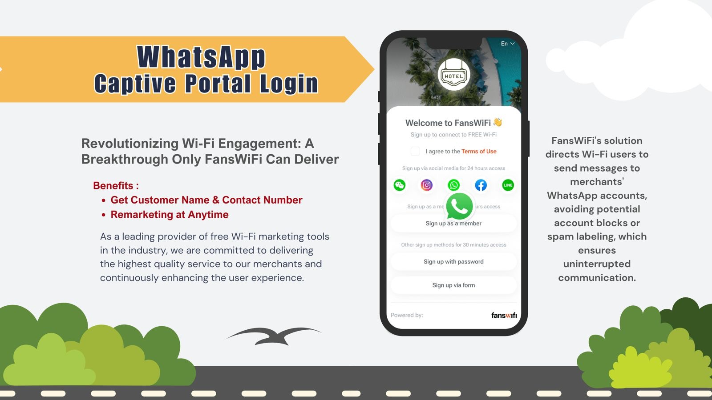

# Revolutionizing Wi-Fi Engagement: A Breakthrough Only FansWiFi Can Deliver

WhatsApp's Impact with FansWiFi

In today's digital landscape, effective customer engagement is crucial for businesses to thrive. FansWiFi, a pioneering social WiFi marketing platform, has been transforming how businesses interact with their customers through innovative WiFi solutions. Here's how FansWiFi's integration with WhatsApp is revolutionizing Wi-Fi engagement:

​**The Challenge of Traditional WhatsApp Marketing**

Traditional WhatsApp marketing often faces a significant hurdle: the risk of being blocked or labeled as spam when merchants initiate messages. This disrupts communication and negatively impacts customer relationships.

**FansWiFi's Breakthrough Solution**

FansWiFi addresses this challenge by directing WiFi users to initiate messages to merchants' WhatsApp accounts. By having users start the conversation, merchants avoid the risk of being blocked or marked as spam, ensuring uninterrupted communication. This approach enhances marketing effectiveness and fosters strong customer connections.

**FansWiFi Pro Benefits:**

* Collect: Customer Name & Contact number
* No Blocking Prompts: Avoids distrust from customers.
* Merchants can engage with customer in remarketing at any time

Say goodbye to clunky logins and hello to a smarter way to connect. With FansWiFi Pro, merchants can turn Wi-Fi into a powerful engagement tool. Try it today and elevate your business!

​ ​
