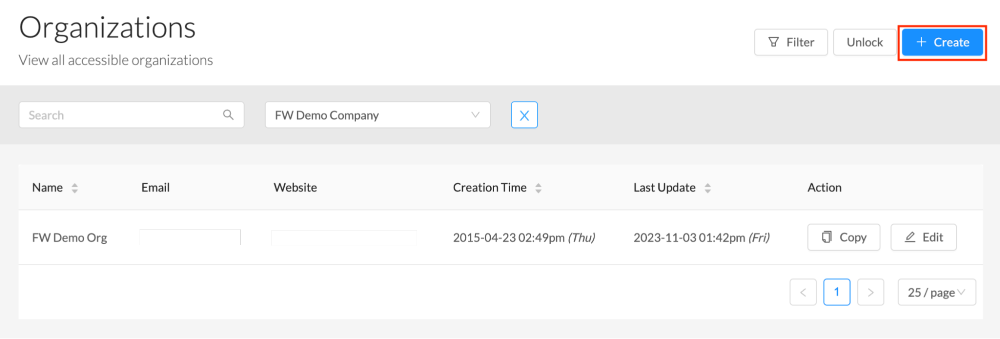

# 2.3 General - Additional Organizations

For companies with mother/sister organizations, the admin can add additional organizations to the FansWiFi platform. This creates easy monitorization for (add a reason) under one platform.

To create additional organizations, please select ‘Organisation’ and click on ‘Create’ on the right-hand side of the page :

## Step 1: Select ‘Organisation’

## Step 2: Click on ‘Create’

## Step 3: Fill out the information as needed


[Check out the demo video](../demo-videos/step-2-permissions-access-new-users-account.md)

