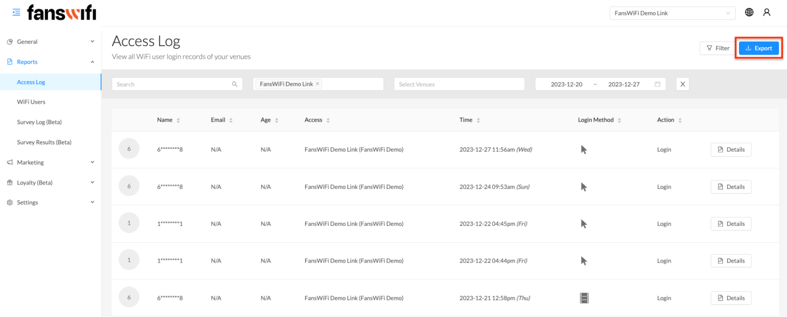

# 3. Reports

The Reports feature offers a wide range of advanced functionalities to enhance data analysis capabilities. It includes the ability to track social media engagement and provide detailed access logs for individual users. This enables comprehensive insights into their login activities, survey logs, and any collected data. Admins can gain a deeper understanding of user behavior and preferences by diving into the specifics.

The platform offers a unique advantage by allowing to set a **desired date range** for the login records to explore. This customizable timeframe allows zooming in on specific periods, conducting targeted analysis, and uncovering meaningful trends or patterns in user activity.

## Desired date range:

The system includes a **search bar** for conveniently finding specific items. This feature enables the organization of data, while the venue selection feature allows for targeted information. These tools significantly enhance the accessibility and analysis of the data.

## Search bar:

## CSV

The platform offers a CSV feature that conveniently allows the exporting of the collected data. By simply clicking on the ‘Export’ button (_available at the top right corner of data pages_), it will be downloaded in CSV format to gain the flexibility to perform further analysis using spreadsheet software, or third-party CRM integration. This opens up possibilities for generating insightful visualizations, conducting complex analyses, or integrating the data with other systems or tools.

## Export to CSV:


[Check out the demo video](../demo-videos/step-6-reports.md)

