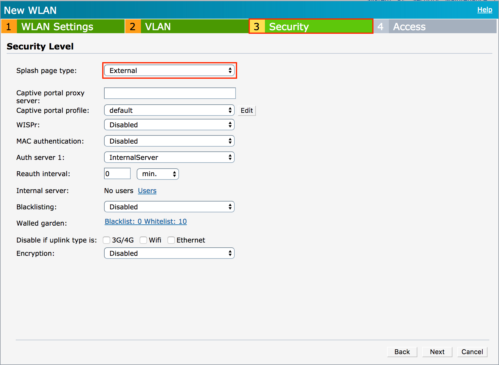
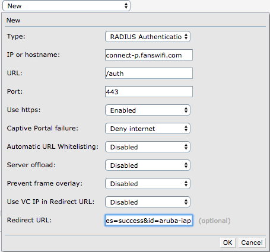
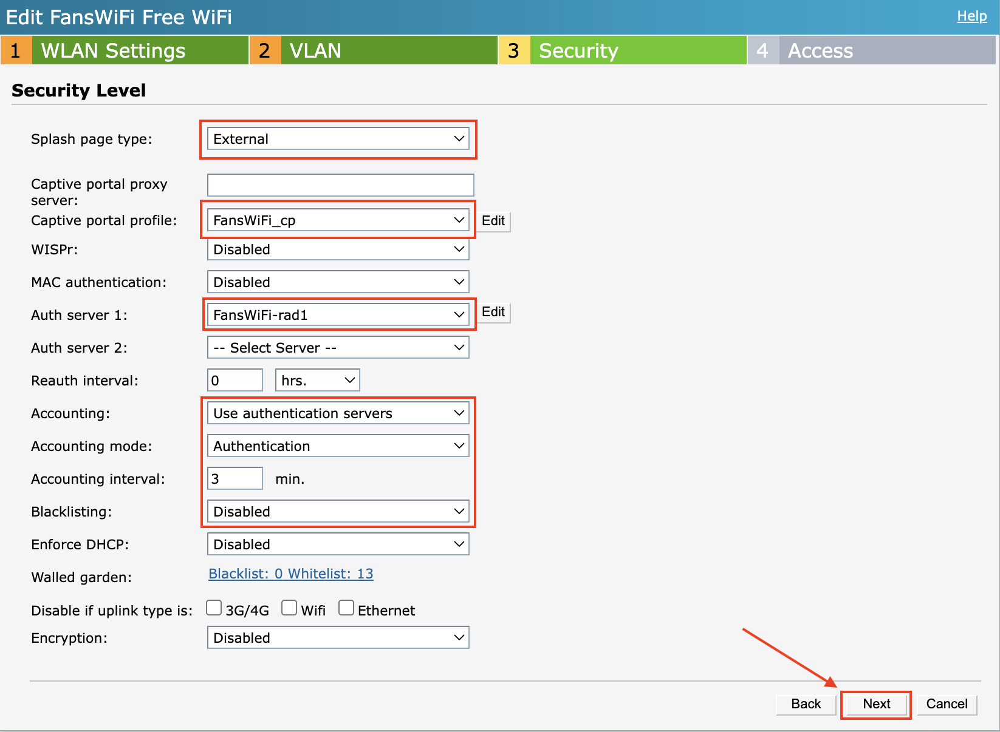
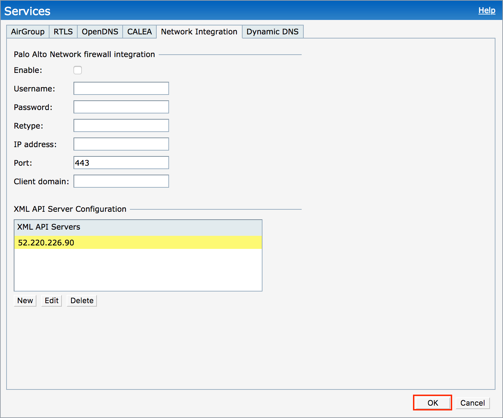
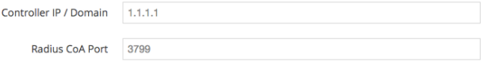
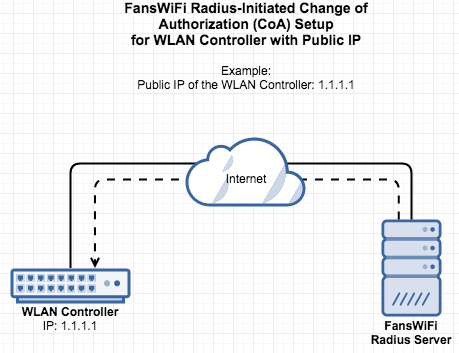
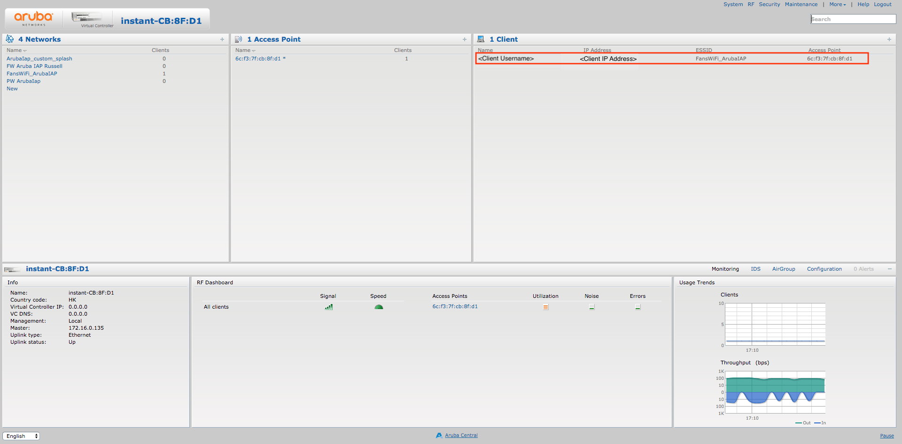

# Aruba Instant (IAP) Setup Guide

### Information Required for FansWiFi Manager

* MAC Addresses of the APs

### Tested Model and Firmware Version

* Model: **IAP-105**
* Firmware Version: **6.4.4.4-4.2.3.2\_54910**

### Settings on Aruba IAP

#### Step 1: Configure the Aruba Instant (IAP)

* Access the Aruba Instant (IAP) management interface via a Web Browser.
* Under **Networks**, click **New** to start the configuration.


* Under **WLAN Settings**, configure the following:
  * Name: **FansWiFi Free WiFi (or your preferred SSID)**
  * Primary usage: **Guest**
* Click **Next** to save configuration and proceed to the next step


* Under **VLAN**, configure with below settings:
  * Client IP assignment: **Network assigned**
  * Client VLAN assignment: **Static**
  * VLAN ID: **1**
* Click Next to save configuration and proceed to the next step


* Under **Security**, configure Splash page type as **External**



* Under **Captive portal profile**, click **New** to set up the portal.


* In the setup box, configure the following:
  * Name: **FansWiFi\_cp**
  * Type: **RADIUS Authentication**
  * IP or hostname: **connect-p.fanswifi.com**
  * URL: **/auth**
  * Port: **443**
  * Use https: **Enabled**
  * Captive Portal failure: **Deny Internet**
  * Redirect URL:
    * For redirect method: [https://connect-p.fanswifi.com/auth/?res=success\&id=aruba-iap](https://connect-p.fanswifi.com/auth/?res=success\&id=aruba-iap)
    * For XML API method: [https://connect-p.fanswifi.com/auth/?res=success\&id=aruba-xml-api](https://connect-p.fanswifi.com/auth/?res=success\&id=aruba-xml-api)
* Click **OK** to save configuration



* Under **Auth server 1**, click **New** to set up the RADIUS server.


* In the setup box, configure the First Server:
  * Server type: **RADIUS**
  * Name: **FansWiFi-rad1**
  * IP address: **103.6.85.240**
  * Auth port: **1812**
  * Acct port: **1813**
  * Shared key: **social123**
* Click **OK** to save.


* After configuring the radius server, configure the remaining security configurations with below settings:
  * Accounting: **Use authentication servers**
  * Accounting mode: **Authentication**
  * Accounting interval: **3 min.**
  * Blacklisting: **Disabled**
* Click **Next** to proceed.



* Under **Access**, select **Role-based** and click **New** under roles to create a new rol.
* Name the role: **FansWiFi\_Preauth** as the name of the pre-authentication role.


* Click **New** under **Access Rules** and configure:
  * Rule type: **Access control**
  * Service: **Network - any**
  * Action: **Allow**
  * Destination: **to domain name**
  * Domain name: **(Insert domain name from the Walled Garden list below)**
* Click **OK** to save each rule.


**Walled Garden List (required)**

1. \*.[fanswifi.com](http://fanswifi.com/)

i. **Walled Garden List (Optional, you may skip this if there is no Facebook Login Enabled)**

1. \*.[facebook.com](http://facebook.com/)
2. \*.[facebook.net](http://facebook.net/)
3. \*.[fbcdn.net](http://fbcdn.net/)
4. \*.[fbcdn.com](http://fbcdn.com/)
5. \*.[akamaihd.net](http://akamaihd.net/)
6. [www.google.com](http://www.google.com/)
7. \*.[doubleclick.net](http://doubleclick.net/)
8. [www.google.com.hk](http://www.google.com.hk/)(Local Google URL of your Country / Region)
   * a. Example:
     * i. EU:[www.google.eu](http://www.google.eu)
     * ii. UK:[www.google.co.uk](http://www.google.co.uk/)
     * iii. Hong Kong:[www.google.com.hk](http://www.google.com.hk/)
     * iv. Japan:[www.google.co.jp](http://www.google.co.jp/)
     * v. Taiwan:[www.google.com.tw](http://www.google.com.tw/)
     * vi. Thailand:[www.google.co.th](http://www.google.co.th/)
     * vii. Malaysia:[www.google.com.my](http://www.google.com.my/)
     * viii. Myanmar:[www.google.com.mm](http://www.google.com.mm/)

ii. **Walled Garden List (Optional, you may skip this if there is no Weibo Login Enabled)**

1. \*.[weibo.com](http://weibo.com/)
2. \*.[weibo.cn](http://weibo.cn/)
3. \*.[sinaapp.com](http://sinaapp.com/)
4. \*.[sina.com.cn](http://sina.com.cn/)
5. \*.[sinajs.cn](http://sinajs.cn/)

iii. **Walled Garden List (Optional, you may skip this if there is no Instagram Login Enabled)**

1. \*.[instagram.com](http://instagram.com/)
2. \*.[akamaihd.net](http://akamaihd.net/)
3. \*.[cdninstagram.com](http://cdninstagram.com/)

iv. **Twitter Login (Optional, you may skip this if there is no Twitter Login Enabled)**

1. \*.[twitter.com](http://twitter.com/)
2. \*.[twimg.com](http://twimg.com/)

v. **LINE Login (Optional, you may skip this if there is no LINE Login Enabled)**

1. \*.[line.me](http://line.me/)
2. \*.[line-scdn.net](http://line-scdn.net/)

vi. **PayPal Login (Optional, you may skip this if there is no PayPal Login Enabled)**

1. \*.[paypal.com](http://paypal.com/)
2. \*.[paypalobjects.com](http://paypalobjects.com/)
3. [www.google-analytics.com](http://www.google-analytics.com/)

vii. **Video Login (Optional, you may skip this if there is no Video Login Enabled)**

1. \*.[akamaized.net](http://akamaized.net/)
2. \*.[akamaihd.net](http://akamaihd.net/)
3. [ssl.google-analytics.com](http://ssl.google-analytics.com/)
   * a. \*.[scorecardresearch.com](http://scorecardresearch.com/)
   * b. \*.[vimeocdn.com](http://vimeocdn.com/)
   * c. \*.[vimeo.com](http://vimeo.com/)


* Finally, set **Assign pre-authentication role** as **FansWiFi\_Preauth** and click **Finish** to save all configurations

#### Step 2: Add XML API Server (Optional - for XML API method)

* a. Navigate to **More** > **Services**.


* b. Go to **Network Integration**.
* c. Under **XML API Server**, click **New** and configure:
  * **Name:** (Use one of the following IP addresses)
    * **52.220.226.90**
    * **52.220.206.125**
    * **52.77.30.253**
    * **52.220.219.128**
    * **52.220.215.219**
    * **52.220.208.185**
  * Subnet: **(Same as Name)**
  * Mask: **255.255.255.0**
  * Passphrase: **aruba123**
* d. Click **OK** to add the server.


* e. Click **OK** to save.



#### Step 3: Configure Aruba IAP Address in FansWiFi Admin Panel

_Please send this information to your FansWiFi account manager_\
&#xNAN;**(required for Advanced Login Method (e.g. WeChat or WhatsApp), you may skip this step if there is no Advanced Login Method Enabled)**

**FansWiFi Admin Panel (Setting > Venue Setting)**



1. Provide the following to FansWiFi:
   * **Public IP Address** or **Domain Name** of the Mobility Controller
   * **Radius CoA Port:** 3799




#### Exceptional Case: Controller behind Router / Firewall

If the Controller is behind Router / Firewall, it is not directly accessible via FansWiFi Radius Server via the Internet. In this case, configure port forwarding on your Router / Firewall to forward the port to the Controller.



**Example Configuration:** Assume the Router's Public IP is `1.1.1.1`.

1.  **Port Forwarding:** Forward a chosen port (e.g., `50000`) to the Controller's CoA Port (default `3799`).

    <div data-gb-custom-block data-tag="hint" data-style="info" class="hint hint-info"><ul><li><strong>Inbound port:</strong> 50000 <em>(You can replace this with any port you want in your setup)</em></li><li><strong>Destination IP:</strong> 192.168.1.100 <em>(Controller's IP in your network)</em></li><li><strong>Destination Port:</strong> 3799</li></ul></div>
2. **Information to provide FansWiFi:**


```
- Public IP Addresses of Router: 1.1.1.1 or Domain Name (URL)
- Radius CoA Port: 50000 (You can replace any port you want in your setup)
```


### Admin Panel Settings


## Step 4: Add AP to FansWiFi Admin Panel

* Login to the FansWiFi Admin Panel.
* Navigate to **Settings** > **Hotspots** > **Create**.
* Configure the following:
  * **Venue:** Select your AP location.
  * **Hotspot Name:** Give the AP a unique name.
  * **AP Type:** Select **Aruba Instant AP (IAP)**.
  * **MAC Address:** Enter the unique MAC address of the AP.
* Click **Create**.

 

## FAQ

### 1. How do I deauthorize a user to reset the login page?

During testing, you may need to clear an authorized session to test different login methods.

| WiFi User Logout trigger by:                                                                                                                                                 | <p>WiFi User's Device<br>(usually, access a logout url on browser)</p> | Controller Web Admin Interface                       |
| ---------------------------------------------------------------------------------------------------------------------------------------------------------------------------- | ---------------------------------------------------------------------- | ---------------------------------------------------- |
| <p>Logout URL for redirect method: <a href="https://securelogin.arubanetworks.com/auth/logout.html">https://securelogin.arubanetworks.com/auth/logout.html</a><br>Or API</p> | <p>No Information<br><br>Last Testing: 10-12-2018</p>                  | <p>Not available<br><br>Last Testing: 10-12-2018</p> |

**Option A: WiFi User device**

1. Open a browser on the device.
2. Navigate to: [https://securelogin.arubanetworks.com/auth/logout.html](https://securelogin.arubanetworks.com/auth/logout.html)


**Option B: Controller Interface**

1. Select the connected client device.



2. Click the **'x'** button next to the access point.


3. Confirm by clicking **Disconnect Now**.


