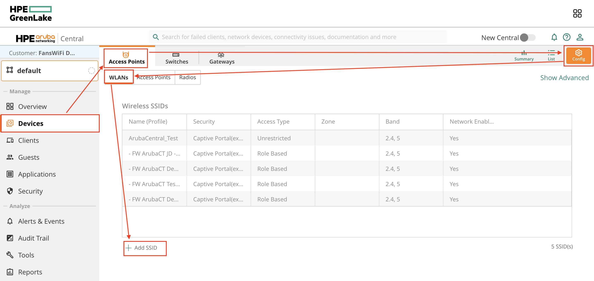
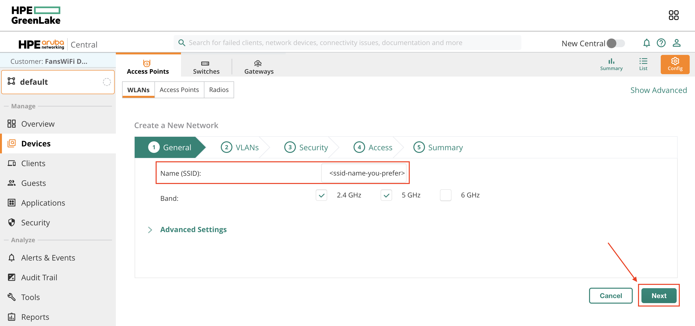
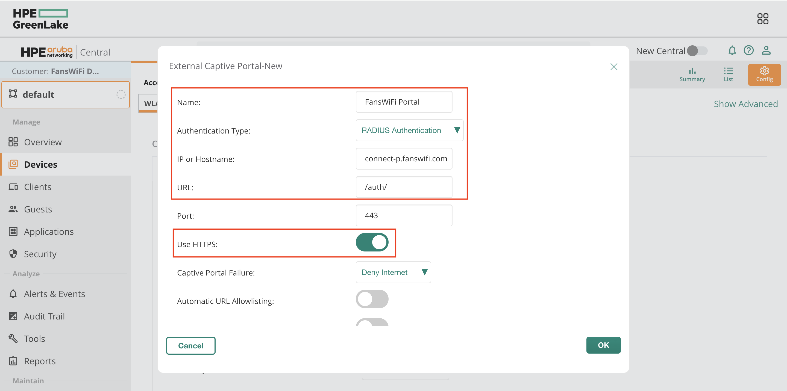
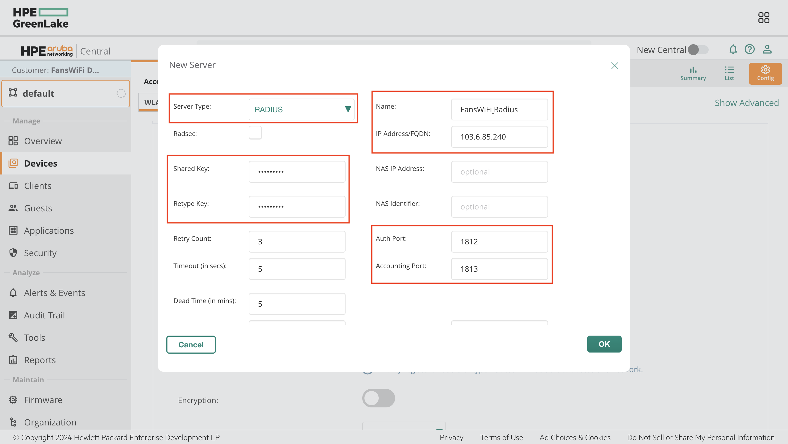
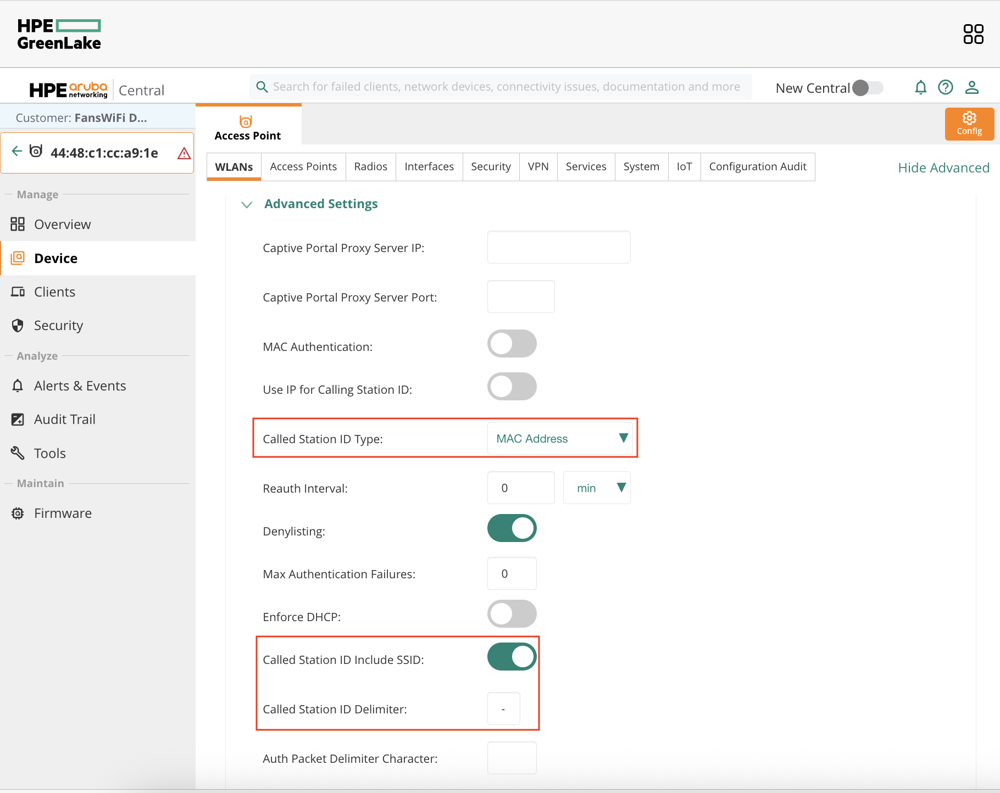
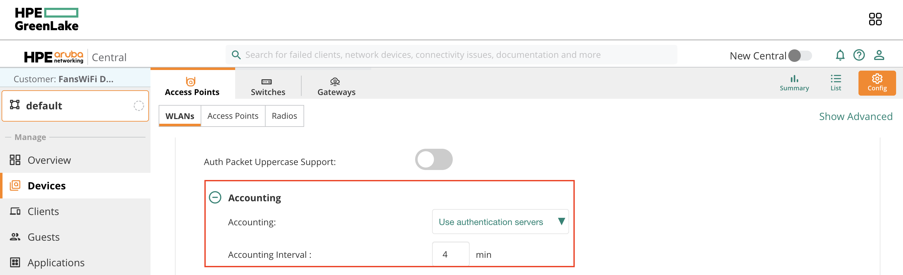
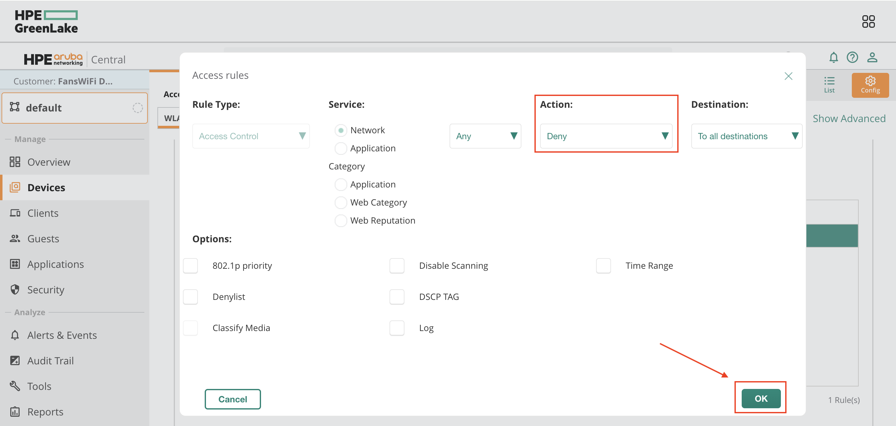
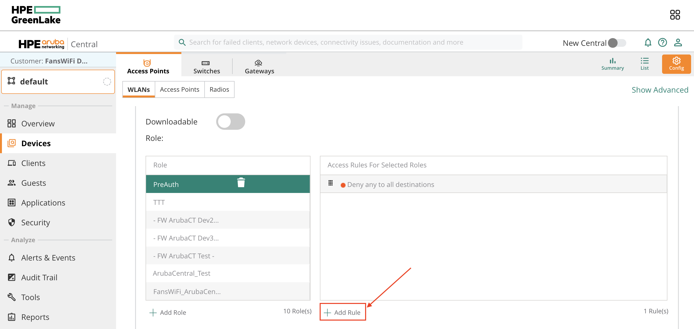
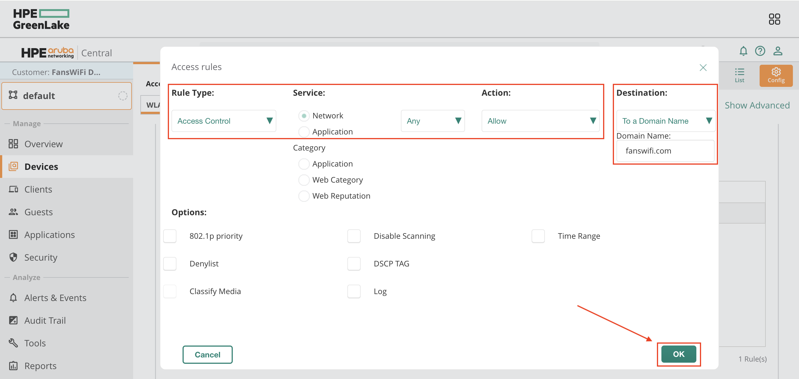
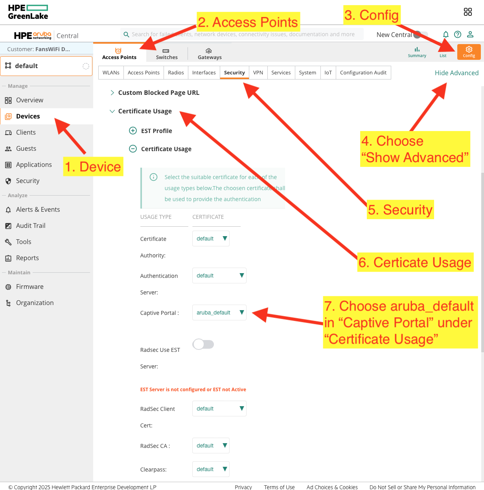

# Aruba Networking Central Setup Guide

### Information required for FansWiFi Manager

* Mac Addresses of the APs

### Tested Model and Firmware Version

* AP Firmware Version: **8.10.0.6\_86193**
* Cloud-hosted on HPE GreenLake

### Setting on Aruba Networking Central

#### Step 0: Add a New Access Point


Please refer to the following documentation:

[https://www.arubanetworks.com/techdocs/central/latest/content/nms/access-points/get-started/iap\_get\_started.html](https://www.arubanetworks.com/techdocs/central/latest/content/nms/access-points/get-started/iap_get_started.html)


#### Step 1: Create SSID

* a. Login to Aruba HPE GreenLake
  * Select **Home** on the top menu
  * Click **Launch** on Aruba Central application
* b. Click **Global** on the top left menu
* c. Select a **Group** that you are using for configuration (e.g. default)

* d. Select **Devices** on the left menu
* e. Select **Access Points** on the top menu, then click **Config** on the top right menu
* f. Select **WLANs** on the top sub-menu, then Click **Add SSID**

* g. For step 1 (General), Configure the following settings
  * **Name (SSID):**
* h. Click **Next**

#### Step 2: Captive Portal Configuration

* a. For step 2 (VLANs), remain the settings unchanged and click **Next**
*   b. For step 3 (Security), configure the following settings:

    * **Security Level:** Visitors
    * **Type:** External Captive Portal

    
* c. From the row **Captive Portal Profile,** press "+" to create a new profile
  * **Name:** (e.g. FansWiFi Portal)
  * **Authentication Type:** RADIUS Authentication
  * **IP or Hostname:** connect-p.fanswifi.com
  * **URL:** /auth/
  * **Use HTTPS:** Enable
  * **Redirect URL:** [https://connect-p.fanswifi.com/auth?res=success](https://connect-p.fanswifi.com/auth?res=success)
  * Click **OK**

* d. Configure the following setting after creating the profile
  * **Captive Portal Profile:** _Name of portal that you created_(e.g. FansWiFi Portal)

#### Step 3: Radius Configuration

* a. From the row **Primary Server,** press "+" to create a new server
  * **Server Type:** RADIUS
  * **Name:** (e.g. FansWiFi\_Radius)
  * **IP Address/FQDN:** 103.6.85.240
  * **Shared Key:** social123
  * **Retype Key:** social123
  * **Auth Port:** 1812
  * **Accounting Port:** 1813
  * **Service Type Framed User:** MAC/Captive Portal
  * Click **OK**

* b. Configure the following settings
  * **Primary Server:** _Name of server that you created_(e.g. FansWiFi\_Radius)
  * **Key Management:** Open

* c. Select **Advance setting**
  * Leave all settings as they are, except:
    * Called Station ID Type: **MAC Address**
    * Called Station ID include SSID: **Enable**
    * Called Station ID Delimiter: **-**

* d. Select **Accounting** and config the following settings:
  * **Accounting:** Use authentication servers
  * **Accounting Interval:** 4 min

#### Step 4: Walled Garden

* a. Goto **Advanced Settings** > **Walled Garden**
* b. From **Allowlist**, Click **Add** to create a new allowlist

* c. Configure the following settings:
  * **Domain:** _Enter one of domains from the following Walled Garden List_
  * Click **OK**


Repeat (b)(c) until **All domains** from Walled Garden List are included in Allowlist


* d. Click **Next**

**Walled Garden List (required)**

1. \*.[fanswifi.com](http://fanswifi.com/)

i. **Walled Garden List (Optional, you may skip this if there is no Facebook Login Enabled)**

1. \*.[facebook.com](http://facebook.com/)
2. \*.[facebook.net](http://facebook.net/)
3. \*.[fbcdn.net](http://fbcdn.net/)
4. \*.[fbcdn.com](http://fbcdn.com/)
5. \*.[akamaihd.net](http://akamaihd.net/)
6. [www.google.com](http://www.google.com/)
7. \*.[doubleclick.net](http://doubleclick.net/)
8. [www.google.com.hk](http://www.google.com.hk/)(Local Google URL of your Country / Region)
   * a. Example:
     * i. EU:[www.google.eu](http://www.google.eu)
     * ii. UK:[www.google.co.uk](http://www.google.co.uk/)
     * iii. Hong Kong:[www.google.com.hk](http://www.google.com.hk/)
     * iv. Japan:[www.google.co.jp](http://www.google.co.jp/)
     * v. Taiwan:[www.google.com.tw](http://www.google.com.tw/)
     * vi. Thailand:[www.google.co.th](http://www.google.co.th/)
     * vii. Malaysia:[www.google.com.my](http://www.google.com.my/)
     * viii. Myanmar:[www.google.com.mm](http://www.google.com.mm/)

ii. **Walled Garden List (Optional, you may skip this if there is no Weibo Login Enabled)**

1. \*.[weibo.com](http://weibo.com/)
2. \*.[weibo.cn](http://weibo.cn/)
3. \*.[sinaapp.com](http://sinaapp.com/)
4. \*.[sina.com.cn](http://sina.com.cn/)
5. \*.[sinajs.cn](http://sinajs.cn/)

iii. **Walled Garden List (Optional, you may skip this if there is no Instagram Login Enabled)**

1. \*.[instagram.com](http://instagram.com/)
2. \*.[akamaihd.net](http://akamaihd.net/)
3. \*.[cdninstagram.com](http://cdninstagram.com/)

iv. **Twitter Login (Optional, you may skip this if there is no Twitter Login Enabled)**

1. \*.[twitter.com](http://twitter.com/)
2. \*.[twimg.com](http://twimg.com/)

v. **LINE Login (Optional, you may skip this if there is no LINE Login Enabled)**

1. \*.[line.me](http://line.me/)
2. \*.[line-scdn.net](http://line-scdn.net/)

vi. **PayPal Login (Optional, you may skip this if there is no PayPal Login Enabled)**

1. \*.[paypal.com](http://paypal.com/)
2. \*.[paypalobjects.com](http://paypalobjects.com/)
3. [www.google-analytics.com](http://www.google-analytics.com/)

vii. **Video Login (Optional, you may skip this if there is no Video Login Enabled)**

1. \*.[akamaized.net](http://akamaized.net/)
2. \*.[akamaihd.net](http://akamaihd.net/)
3. [ssl.google-analytics.com](http://ssl.google-analytics.com/)
   * a. \*.[scorecardresearch.com](http://scorecardresearch.com/)
   * b. \*.[vimeocdn.com](http://vimeocdn.com/)
   * c. \*.[vimeo.com](http://vimeo.com/)

#### Step 5: Role Based Access

* a. For step 4 (Access), Configure the following Settings
  * **Access Roles:** Role Based
* b. Click **Add Role** to create Role

* c. Configure the following settings:
  * **Role:** (e.g. PreAuth)

* d. Select the Role that you created
* e. From the rule **"Allow any to all destinations"**, click the **Edit Logo**

* f. Convert to the following settings:
  * **Action:** Deny
  * Click **OK**

* g. Then, Click **Add Rule**

* h. Configure the following settings:
  * **Rule Type:** Access Control
  * **Service:** Network
  * Any
  * **Action:** Allow
  * **Destination:** To a Domain Name
  * **Domain Name:** _Enter one of domains from the following Walled Garden List_
  * Click **OK**


Repeat (g)(h) until **All domains** from Walled Garden List are included in the Rule



Make sure the Rule **"Deny any to all destinations"** is placed **on the bottom**


* i. Configure the following settings:
  * **Assign Pre-Authentication Role:** Enable
  * Select _Name of server that you created_ (e.g. PreAuth)
  * Click **Next** to continue

* j. For step 5 (Summary), click **Finish** on the right bottom

### Step 6: Add Certificate for Captive Portal⚠️⚠️⚠️

* a. Click **Device -> Access Points -> Config -> Security**
* b. Goto **Certificate Usage** section
* c. Config the following settings
  * **Captive Portal:** aruba\_default

### Step 7: Add AP to FansWiFi Admin Panel

* Login to FansWiFi Admin Panel
* Click **Settings -> Hotspots -> Create**
* Configure with following settings:
  * **Venue:** Select the venue of where your Access Point locates
  * **Hotspot Name:** Name each Access Point to make it identifiable
  * **AP Type:** Select “Aruba Instant AP (IAP)”
  * **Mac Address:** Input unique MAC Address of each Access Point in your venue
* Click **Create**

