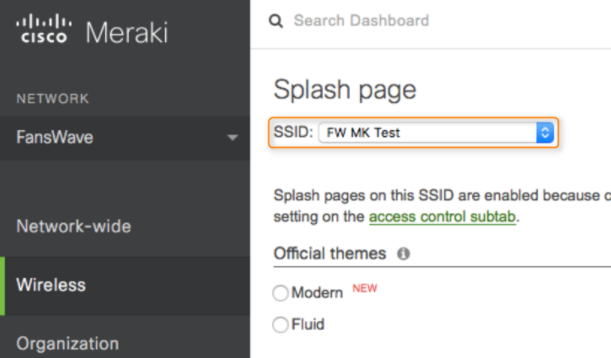
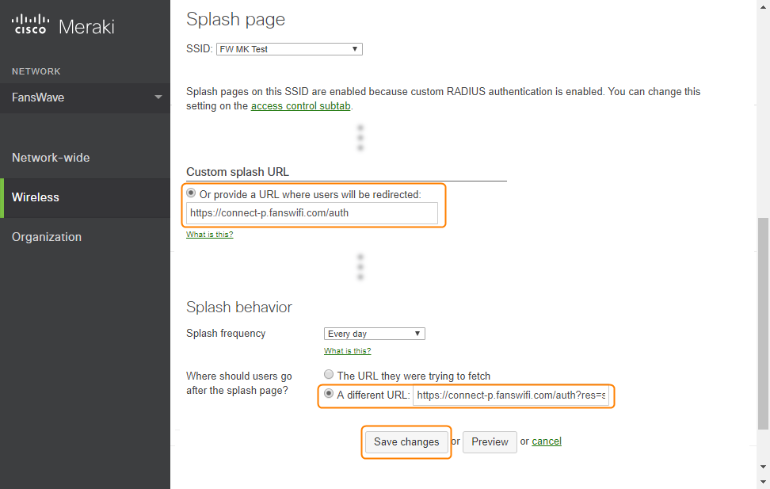
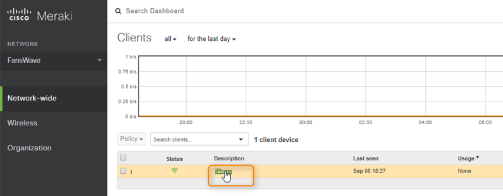
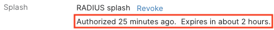

# Cisco Meraki AP Setup Guide

### Information required for FansWiFi Manager

* Mac Addresses of the APs

### Tested Model and Firmware Version

* Model: MR24
* Firmware Version: MR24.8


Note that different models may have different interface


### Setting on Meraki AP

#### Step 1: Configure the Meraki AP

* a. Login to access the Meraki Dashboard at ​[https://dashboard.meraki.com](https://dashboard.meraki.com/)
* b. Point “Wireless” on the left menu, and click “Access Control” to enter the configuration Page

#### Step 2: Configuration: Authentication Servers

*   Select the SSID which you want to use, and configure with following settings:

    * **Association requirements:** Open (no encryption)
    * **Splash page:** Sign-on with my RADIUS server
    * **RADIUS for splash page:** (click Add a server)
    * **Host:** `103.6.85.240`
    * **Port:** `1812`
    * **Secret:** `social123`

    (You may test with _Username: test, Password: testinggogogo_)

    * **Failover Policy:** Deny access
    * **Network access control:** Disabled: do not check clients for antivirus software

#### Step 3: Configuration: Walled Garden List

* Scroll down and continue to configure with following settings:
  * **Captive Portal Strength:** Block all access until sign-on is complete
  * **Walled garden:** Walled garden is enabled
  * **Walled garden ranges:**


If you see below Error message after clicking "Save", please refer to to this guide ([link](https://intercom.help/fanswifi/en/articles/10318435-cisco-meraki-enabling-dns-based-walled-garden)) to contact Cisco Meraki support to enable Domain-Based Walled Garden for your Cisco Meraki account. You can activate this function by contacting Meraki support i&#x6E;_&#x48;elp > Case&#x73;_&#x6F;n Meraki Dashboard. Before this feature is enabled in your account, you cannot only input IP Address to the Walled Garden setting.



* **Walled Garden List (Required)**
  * \*.[fanswifi.com](http://fanswifi.com/)
* **Walled Garden List (Optional, you may skip this if there is no Facebook Login Enabled)**
  * \*.facebook.com
  * \*.facebook.net
  * \*.fbcdn.net
  * \*.fbcdn.com
  * \*.akamaihd.net
  * [www.google.com](http://www.google.com)
  * \*.doubleclick.net
  * [www.google.com.hk](http://www.google.com.hk)(Local Google URL of your Country / Region)
  * Example:
    * EU: [www.google.eu](http://www.google.eu)
    * UK: [www.google.co.uk](http://www.google.co.uk)
    * Hong Kong: [www.google.com.hk](http://www.google.com.hk)
    * Japan: [www.google.co.jp](http://www.google.co.jp)
    * Taiwan: [www.google.com.tw](http://www.google.com.tw)
    * Thailand: [www.google.co.th](http://www.google.co.th)
    * Malaysia: [www.google.com.my](http://www.google.com.my)
    * Myanmar: [www.google.com.mm](http://www.google.com.mm)
    * Indonesia: [www.google.co.id](http://www.google.co.id)
* **Walled Garden List (Optional, you may skip this if there is no Weibo Login Enabled)**
  * \*.[weibo.com](http://weibo.com/)
  * \*.[weibo.cn](http://weibo.cn/)
  * \*.[sinaapp.com](http://sinaapp.com/)
  * \*.[sina.com.cn](http://sina.com.cn/)
  * \*.[sinajs.cn](http://sinajs.cn/)
* **Walled Garden List (Optional, you may skip this if there is no Instagram Login Enabled)**
  * \*.[instagram.com](http://instagram.com/)
  * \*.[akamaihd.net](http://akamaihd.net/)
  * \*.[cdninstagram.com](http://cdninstagram.com/)
* **Twitter Login (Optional, you may skip this if there is no Twitter Login Enabled)**
  * \*.[twitter.com](http://twitter.com/)
  * \*.[twimg.com](http://twimg.com/)
* **Video Login (Optional, you may skip this if there is no Video Login Enabled)**
  * \*.[akamaized.net](http://akamaized.net/)
  * \*.[akamaihd.net](http://akamaihd.net/)
  * [ssl.google-analytics.com](http://ssl.google-analytics.com/)
  * \*.[scorecardresearch.com](http://scorecardresearch.com/)
  * \*.[vimeocdn.com](http://vimeocdn.com/)
  * \*.[vimeo.com](http://vimeo.com/)
* **Controller disconnection behaviour:** Default for your settings
* Click “**Save**”

#### Step 4: Set up Splash Page

* Click **Wireless > Splash page**
* Under **SSID**, choose your SSID

* Under **Custom splash URL**, input: [https://connect.fanswifi.com/auth](https://connect.fanswifi.com/auth)
* Under **Where should users go after the splash page?**, input **A different URL**: ​[https://connect.fanswifi.com/auth?res=success\&id=cisco-meraki](https://connect.fanswifi.com/auth?res=success\&id=cisco-meraki)

#### Step 5: Get the MAC address of the AP

* You should see the MAC address at the bottom of AP
* If you are not sure about the address, don’t worry. Click **Wireless > Access points**. You can see the MAC address of the AP. Choose the one you want to put into FansWiFi Admin Panel.

### Step 6: Add AP to FansWiFi Admin Panel

* Login to FansWiFi Admin Panel
* Click **Settings -> Hotspots -> Add Hotspot**


1. **Venue:** Select the venue of where your Access Point locates
2. **Hotspot Name:** Name each Access Point to make it identifiable
3. **AP Type:** Select “**Cisco Meraki**”
4. **Mac Address:** Input unique MAC Address of each Access Point in your venue (Not controller)


* Click **Save**

## FAQ

### 1. How to deauthorize wifi user?

| WiFi User Logout trigger by: | 
WiFi User's Device (usually, access a logout url on browser)
 | Controller Web Admin Interface                  |
| ---------------------------- | ---------------------------------------------------------------------- | ----------------------------------------------- |
|                              | 
Not Available  Last Testing: 12-9-2017
                    | 
Available  Last Testing: 12-9-2017
 |

​**WiFi User Logout trigger by:**

**Controller**

* Click **Network-wide** on the left menu, select "**Clients**" under **Monitor**

* Click on the wifi user device you want to logout

* You can obtain the authorization status on "Splash" information

* Click "**revoke**" to unauthorize user

* Then the user will be listed as "**Not authorized**"


The unauth process may take up to 30-60 seconds.

