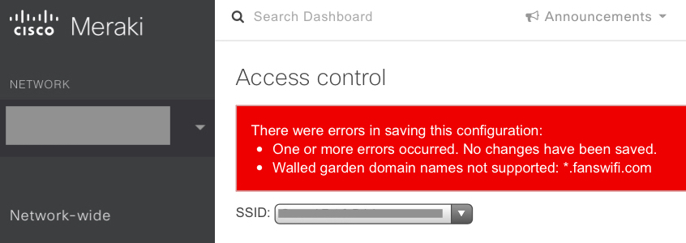
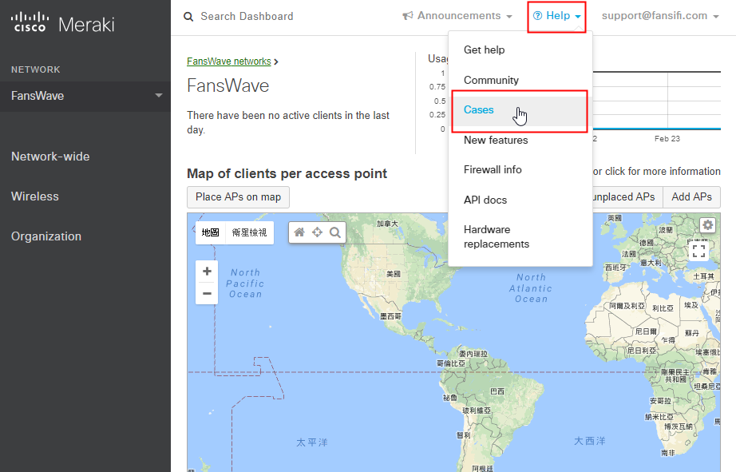
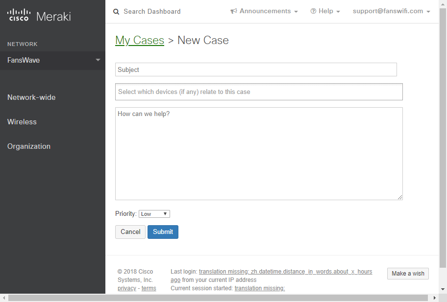

# Cisco Meraki - Enabling DNS-Based Walled Garden

### Information required for FansWiFi Manager

* Cisco Meraki Controller Admin Account

### Walled Garden

Under default setting, users can only input list of IP as walled garden. Entering domain names would show an error message.

To enable DNS-based (domain-name-based) walled garden, you need to request by contacting Meraki Support.

#### Step 1: View case page in Meraki Dashboard

* a. Login to access the Meraki Dashboard at ​[https://dashboard.meraki.com](https://support.fanswifi.com/hotspot-setup-guide/cisco-meraki/cisco-meraki-enabling-dns-based-walled-garden)
* b. Click “Help” on the top menu, and click “Cases” to enter the support case page

#### Step 2: Submit request case of DNS-based Walled Garden Feature

*   Click "New Case" to create a new request

    
*   You may input your request to support here, sample is as followed: ​**Sample Subject:** Request for enabling domain-base walled garden function ​**Select device:** ​**Sample Content:** Hi, We'd like to request for activating the domain-base walled garden feature for all of our APs. Thanks.

    

Confirmation email would be sent to your registered inbox. After support enabled the feature, you can add domains to walled garden list.

Official Ref.:[https://documentation.meraki.com/MX-Z/Access\_Control\_and\_Splash\_Page/Access\_Control](https://support.fanswifi.com/hotspot-setup-guide/cisco-meraki/cisco-meraki-enabling-dns-based-walled-garden)
