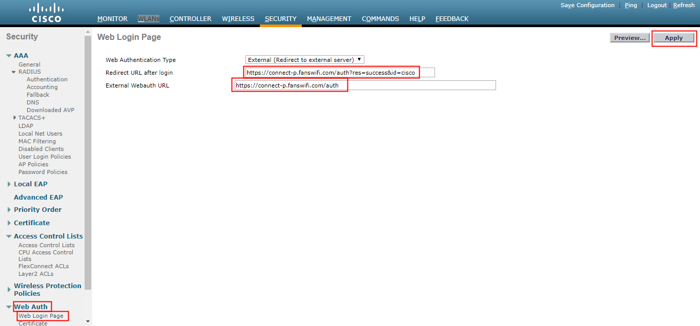
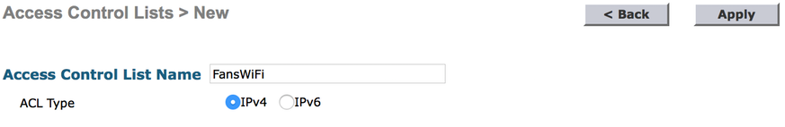
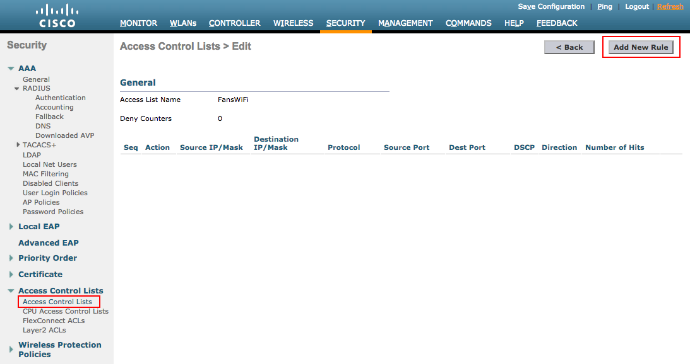
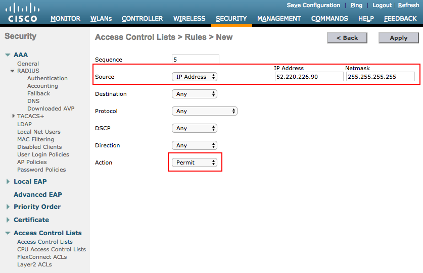
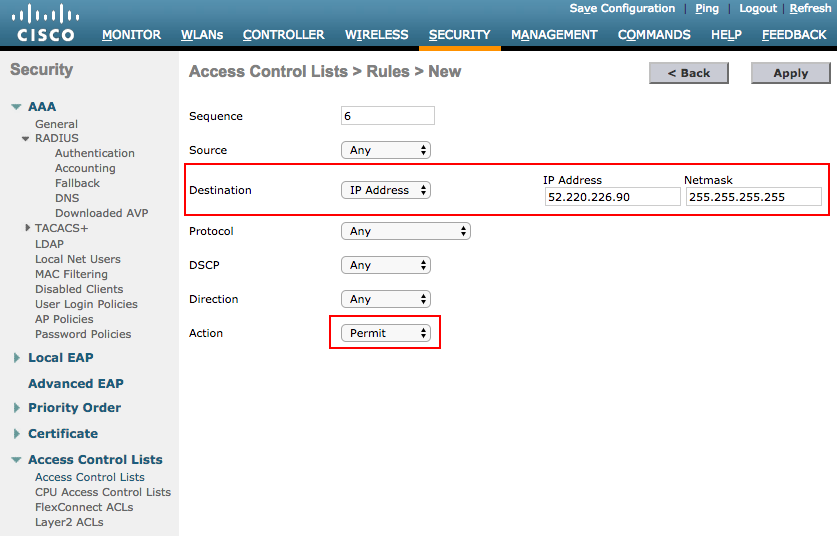
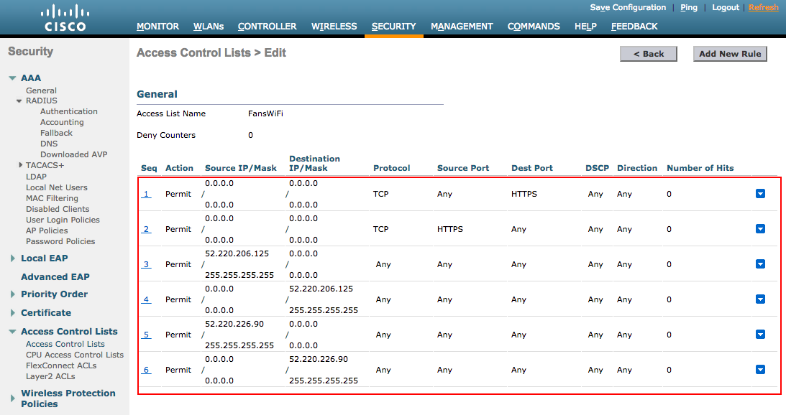
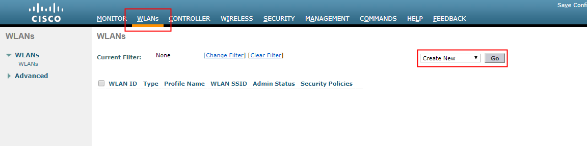
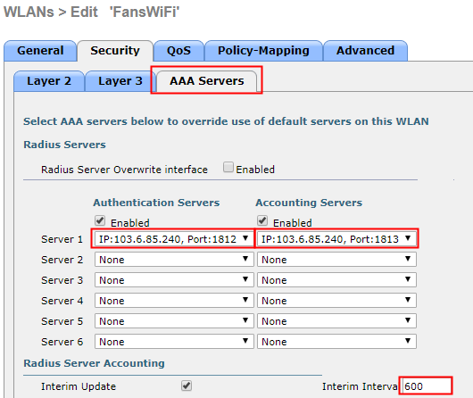
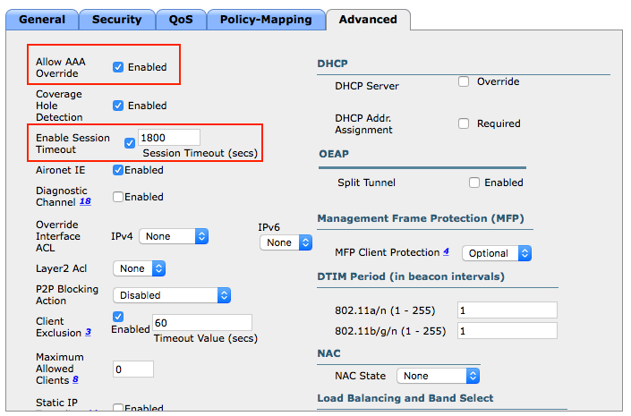
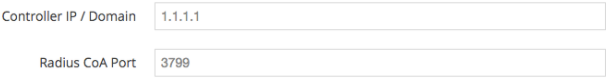

# Cisco Wireless Lan Controller (WLC) Setup Guide

### Information required for FansWiFi Manager

* Base Radio Mac of the APs (It may not the same as the Mac Address of the AP on the label)

### Tested Cisco WLC Firmware Version

* 8.0.121.0, 8.2
* Recommended Version: 8.2 or above
* Radius Debugging Tools for Troubleshooting is only available for firmware version 8.2 or above. See Troubleshooting step below.)

### FansWiFi Server / Controller Communication

The table below listed the ports that must be opened on the network firewall to ensure that the Cisco WLC, FansWiFi servers(including RADIUS server) can communicate with each other successfully.

| Port Number | Protocol  | Source                                   | Destination                           | Traffic Direction                                                                                 | Purpose                           | Required by Login Method   |
| ----------- | --------- | ---------------------------------------- | ------------------------------------- | ------------------------------------------------------------------------------------------------- | --------------------------------- | -------------------------- |
| 1812 / 1813 | UDP & TCP | Controller                               | FansWiFi RADIUS Server (103.6.85.240) | outbound                                                                                          | AAA Authentication and Accounting | All                        |
| 1700 / 3799 | UDP & TCP | FansWiFi Radius Server IP (103.6.85.240) | Controller                            | inbound (port forwarding may be needed by your firewall / router. Depends on your network setup.) | RADIUS CoA Messages               | WeChat Login / Video Login |

### Network Diagram

Communication between WLAN Controller and FansWiFi Server Cluster on Cloud


### Setting on Cisco Wireless Lan Controller (WLC)

#### Step 1: Configure the WLC

1. Access the WLC by opening a Web Browser:


#### Step 2: Configuration: Authentication Servers

1. Click **Security** Tab on the top menu
2. Click **AAA > Radius > Authentication** from the left menu
3. Click **New...** with below Setting
   * a. **IP Address:** 103.6.85.240
   * b. **Shared Secret:** social123
   * c. **Confirm Secret:** social123
   * d. **Port:** 1812
   * e. **Network User:** (tick) Enable
   * f. **Management:** (untick) Disable
4. Click **Apply** to save the configuration


#### Step 3: Configuration: Accounting Servers

**Accounting**

1. Click "**AAA > Radius > Accounting**" from the left menu
2. Click "**New...** " with below Setting
   * a. **IP Address:** 103.6.85.240
   * b. **Shared Secret:** social123
   * c. **Confirm Secret:** social123
   * d. **Port:** 1813
   * e. **Network User:** (tick) Enable
3. Click "**Apply**" to save the configuration


#### Step 4: Configuration: Web Auth

1. Click "Web Auth > Web Login Page" from the left menu
2. Configure the below setting
   * a. **Web Authentication Type:** External (Redirect to external server)
   * b. **Redirect URL after login:** [https://connect-p.fanswifi.com/auth?res=success\&id=cisco](https://support.fanswifi.com/hotspot-setup-guide/cisco/cisco-wireless-lan-controller-wlc-setup-guide)
   * c. **External Webauth URL:** [https://connect-p.fanswifi.com/auth](https://support.fanswifi.com/hotspot-setup-guide/cisco/cisco-wireless-lan-controller-wlc-setup-guide)
3. Click "Apply" to save the configuration


Please make sure you enter “https” in the URL instead of “http”




#### Step 5: Configuration: Access Control List

1. Click "**Security**" on the top menu, then click "**Access Control List > Access Control Lists**" on the left menu
   * a. (Optional) if your setting is using FlexConnect Mode, please click "Access Control Lists > FlexConnect ACLs" instead
2. Click "**New**" on the Access Control Lists page to add new list


3. Enter "**FansWiFi**" as the "**Access Control List Name**"
4. Choose "**IPv4**" as "**ACL Type**"



5. Click "**Apply**" to save the configuration
6. Select "**FansWiFi**" on the Access Control Lists page to edit the list we just created


7. Click "**Add New Rule**" on the top right corner



8. Configure the Access Control List according to below table Aim: Allow WiFi user accessing FansWiFi Captive Portal Server (52.220.206.125, 52.220.226.90) and Social Media (e.g. Facebook) to complete Social Login process

| Sequence | Source     | Destination | IP Address     | Netmask         | Protocol | Source | Destination | Action |
| -------: | ---------- | ----------- | -------------- | --------------- | -------- | ------ | ----------- | ------ |
|        1 | Any        | Any         |                |                 | TCP      | HTTPS  | Any         | Permit |
|        2 | Any        | Any         |                |                 | TCP      | Any    | HTTPS       | Permit |
|        3 | IP Address | Any         | 52.220.206.125 | 255.255.255.255 | Any      | Any    | Any         | Permit |
|        4 | Any        | IP Address  | 52.220.206.125 | 255.255.255.255 | Any      | Any    | Any         | Permit |
|        5 | IP Address | Any         | 52.220.226.90  | 255.255.255.255 | Any      | Any    | Any         | Permit |
|        6 | Any        | IP Address  | 52.220.226.90  | 255.255.255.255 | Any      | Any    | Any         | Permit |








#### Step 6: Disable WebAuth SecureWeb in the HTTP-HTTPS setting

1. Select “**Management**" from the above menu
2. Click “**HTTP-HTTPS**" on the left side menu
3. Disable the "**WebAuth SecureWeb**" option
4. Click Apply
5. Click Save Configuration
6. Reboot the Controller


Controller must be rebooted for the WebAuth SecureWeb configuration change to take effect



#### Step 7: Create WLAN and SSID for customer access

1. Select **WLANs** from the top menu.
2. Click **Create New** and give it a name.



3.  Click the newly created WLAN to open its configuration.

    1. **Profile Name:** FansWiFi
    2. **SSID:** FansWiFi
    3. **Status:** Enabled
    4. **NAS-ID:** socialnas

    
4. Open the **Security** tab.
   1.  Select **Layer 2**.

       * **Layer 2 Security:** None

       
   2.  Select **Layer 3**.

       * **Layer 3 Security:** Web Policy
       * Select **Authentication**
       * **Preauthentication ACL > IPv4:** FansWiFi

       

       * **(Optional) FlexConnect Mode:**
         * **Preauthentication ACL > IPv4:** None
         * **Preauthentication ACL > WebAuth FlexAcl:** FansWiFi

       
5.  Open the **AAA Servers** tab.

    1. Enable and select the available **Authentication** and **Accounting** servers.
    2. Set **Interim Interval** to **600**.
    3. Move both **LOCAL** and **LDAP protocol** to **Not used**.

    
6.  Open the **Advanced** tab.

    1. Enable **Override AAA**.
    2. Set **Timeout** to **1800**.

    

    3.  **(Optional) FlexConnect Mode:**

        * **FlexConnect Local Switching:** Enabled

        

#### Step 8: Save Configuration

Make sure to always save configurations after editing the settings in the right hand corner.


#### Step 9: Configure Cisco Controller IP Address to FansWiFi Admin Panel for Radius CoA

_Please send this information to your FansWiFi account manager_

**(Required for WeChat WiFi, you may skip this step if there is no WeChat WiFi Enabled)**

**FansWiFi Admin Panel (Setting > Venue Setting)**



1. Send below information to FansWiFi
   * Public IP Addresses / Domain Name of Cisco Controller
   * Radius CoA Port: 1700 / 3799



Exceptional Case: ZoneDirector behinds Router / Firewall



If the ZoneDirector is behind Router / Firewall, it is not directly accessible via FansWiFi Radius Server via Internet. In this case, you need to configure port forwarding on your Router / Firewall to forward the port to the ZoneDirector



Please see below example:

Assume the Public IP of the Router is 1.1.1.1 in this example

1. Configure Port Forwarding to forward Router’s Port 1700 and 3799 to WiFi Controller's CoA Port (Default: 1700 and 3799)

* Inbound port: 1700 / 3799
* (You can replace any port you want in your setup)
* Destination IP: 192.168.1.100 (ZoneDirector’s IP in your network)
* Destination Port: 1700 / 3799

2. Send below information to FansWiFi

* Public IP Addresses of Router: 1.1.1.1 or Domain Name (URL)
* Radius CoA Port: 3799 (You can replace any port you want in your setup)

Setting in FansWiFi Admin Panel


#### Step 10: Add AP to FansWiFi Admin Panel

1. Log in to FansWiFi Admin Panel
2.  Click **Settings” -> Hotspots -> Add Hotspot**

    * a. **venue:** Select the venue of where your Access Point locates
    * b. **Hotspot Name:** Name each Access Point to make it identifiable
    * c. **AP Type:** Select “Cisco WLC”
    * d. **Mac Address:** Input unique Base Radio MAC of each Access Point in your venue (Not controller) (Base Radio MAC may not be the same as the Mac Address of the AP printed on the label. Please check the Base Radio MAC via **Monitor -> Access Points** on the WLC WebUI)

    
3. Click Save


### Step 11: Troubleshooting

**Test AAA RADIUS Interactions for WLAN Authentication**

Requirement: Cisco WLC Firmware Version 8.2 or above

**Execute below commands to query our Radius server using our test account (username: test, password: testinggogogo)**

(Cisco Controller) > **testaaaradius\*\*\*\*username** test **password** testinggogogo

(Cisco Controller) > test aaa show radius

* If the connection is success, you should see message like below:

```
Radius Test Request
  Wlan-id.................................. 7
  ApGroup Name............................. default-group
  Server Index............................. 2

Radius Test Response
  Radius Server           Retry  Status
  --------------------    -----  --------------------------
  103.6.85.240                1  Success

Authentication Response:
  Result Code: Success

Attributes                   Values
--------------------------  --------------------------------
User-Name                    user1
Class                        CACS:rs-acs5-6-0-22/230677882/20313
Session-Timeout              0x0000001e (30)
Termination-Action           0x00000000 (0)
Tunnel-Type                  0x0000000d (13)
Tunnel-Medium-Type           0x00000006 (6)
Tunnel-Group-Id              0x00000051 (81)
```

* If the connection do not success, you should see message like below:

```
Radius Test Request
  Wlan-id.................................. 7
  ApGroup Name............................. default-group
  Server Index............................. 3

Radius Test Response
  Radius Server           Retry  Status
  --------------------    -----  --------------------------
  172.20.227.72               6  No response received from server

Authentication Response:
  Result Code: No response received from server
  No AVPs in Response
```

You can also enable the debug message for more details by using below command (Cisco Controller) > **debug aaa all enable**

Reference:

Cisco Wireless Controller Configuration Guide, Release 8.2 Chapter: Debugging on Cisco Wireless Controllers [http://www.cisco.com/c/en/us/td/docs/wireless/controller/8-2/config-guide/b\_cg82/b\_cg82\_chapter\_0110011.html](https://support.fanswifi.com/hotspot-setup-guide/cisco/cisco-wireless-lan-controller-wlc-setup-guide)

​
