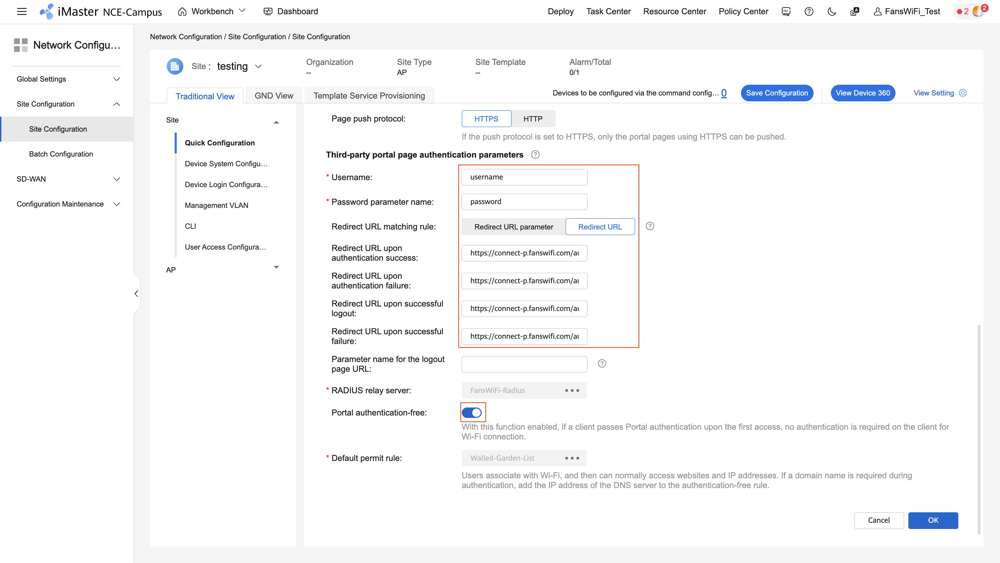
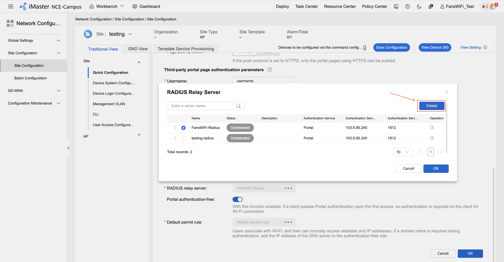
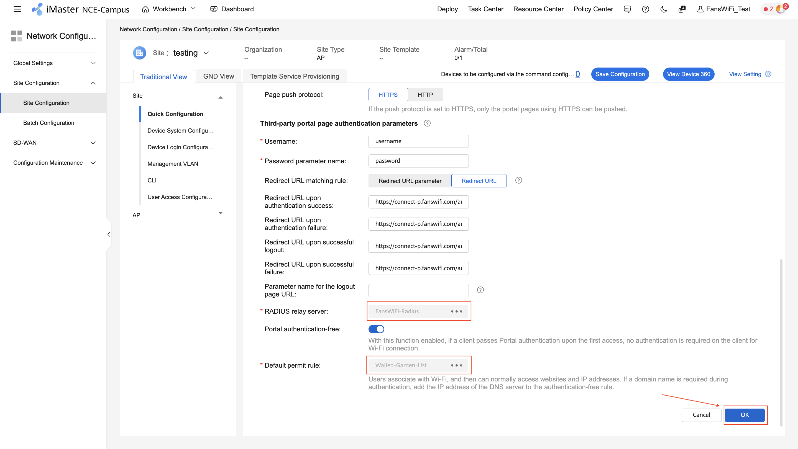
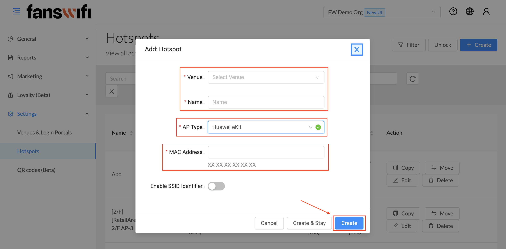

# Huawei iMaster NCE-Campus Cloud Controller Setup Guide

### Information required for FansWiFi Manager

* Mac Addresses of the APs

### Setting on Huawei iMaster

#### Step 1: Configure with Huawei iMaster

1. Access the Portal by opening a Web Browser [https://naas-intl.huaweicloud.com/](https://naas-intl.huaweicloud.com/)
2. Click the **menu logo** on the top left conner
3. Select **Network Configuration > Site Configuration** on the left menu

#### Step 2: Create SSID

1. Click **Traditional view** on the top menu
2. Select **Quick Configuration** on the left sub-menu
3. Select **Cloud AP > Region & SSID**
4. Click **+** to create a SSID

#### Step 3: SSID Configuration

1. Configure with the following settings:
   1. **SSID name:** (e.g. - FansWiFi Free WiFi -)
   2. **Data forwarding mode:** Direct
   3. **Global DHCP address pool:** Disable
   4. **VLAN:** 1
2.  For **Security Authentication** session, configure with the following settings:

    1. **WLAN security policy:** Open Network
       1. Then select **Open+Portal authentication**
    2. **Authentication type:** Relay authentication by cloud platform
    3. **Interconnection mode:** RADIUS relay
    4. **Page push protocol:** HTTPS

    
3.  For **Third-party portal page authentication parameters** session, configure with the following settings:

    1. **Username:** username
    2. **Password parameter name:** password
    3. **Redirect URL matching rule:** Redirect URL
    4. **Redirect URL upon successful authentication:** [https://connect-p.fanswifi.com/auth?res=success\&id=huawei-imaster-nce](https://connect-p.fanswifi.com/auth?res=success\&id=huawei-imaster-nce)
    5. **Redirect URL upon failed authentication:** [https://connect-p.fanswifi.com/auth?res=failed\&id=huawei-imaster-nce](https://connect-p.fanswifi.com/auth?res=failed\&id=huawei-imaster-nce)
    6. **Redirect URL upon successful logout:** [https://connect-p.fanswifi.com/auth?res=not-yet\&id=huawei-imaster-nce](https://connect-p.fanswifi.com/auth?res=not-yet\&id=huawei-imaster-nce)
    7. **Redirect URL upon successful failure:** [https://connect-p.fanswifi.com/auth?res=not-yet\&id=huawei-imaster-nce](https://connect-p.fanswifi.com/auth?res=not-yet\&id=huawei-imaster-nce)
    8. **Portal authentication-free:** Enable

    
4.  Configure Radius rely server

    1. For **RADIUS relay server** session, click **... > Create** to create a new portal server

    

    

    2. Configure with the following settings:
       1. **Name:** (e.g. FansWiFi-Radius)
       2. **Authentication service:** Portal
       3. **Authentication server**
          1. Click **Add**
          2. **Authentication server address:** 103.6.85.240
          3. **Port:** 1812
          4. **Key:** social123
             1. Click **Set** to enter the keY
             2. **Key:** social123
             3. **Confirm key:** social123
             4. Click **OK**
          5. Click **Tick button** to save
       4. **Authentication protocol:** PAP
       5. **NAS-Identifier:** Device MAC
       6. **Real-Time Accounting:** Enable
       7. **Accounting server**
          1. Click **Add**
          2. **Authentication server address:** 103.6.85.240
          3. **Port:** 1812
          4. **Key:** social123
             1. Click **Set** to enter the keY
             2. **Key:** social123
             3. **Confirm key:** social123
             4. Click **OK**
          5. Click **Tick button** to save
       8. **Load balancing mode:** By priority
       9. **Set MAC address format:** Enable
       10. **MAC address case:** Uppercase
       11. **MAC address delimiter:** Hyphen (-)
       12. **MAC address format:** XX-XX-XX-XX-XX-XX
       13. **Automatic detection of server status:** Disable
       14. Click **OK**
       15. Select **RADIUS server** that you created

    
5.  Access Control Configuration

    1. For **Default permit rule** session, click **... > Create**

    

    

    2. Configure with the following settings:
       1. **Name:** (e.g. Walled-Garden-List)
    3.  Add **Rule list** with the following configurations:

        1. Click **Create**
        2. **Address Type:** IP Address/Mask
        3. **IP Address/Mask:** Refer to the following IP address
           1. 192.168.0.0/16
           2. 172.16.0.0/12
           3. 10.0.0.0/8
        4. **Protocol:** Any

        
    4. Add **IPv4 rule** with the following configurations:
       1. Click **Create**
       2. **Address Type:** Domain name
       3. **Domain name:** Refer to the Walled Garden List (below)
          1. \*.[fanswifi.com](http://fanswifi.com/)
       4. **Protocol:** Any
       5. Repeat (i)-(iv) to add another domains in Walled Garden List
    5. Walled Garden List
       1. **Walled Garden List (required)**
          1. 192.168.0.0/16
          2. 172.16.0.0/12
          3. 10.0.0.0/8
          4. \*.[fanswifi.com](http://fanswifi.com/)
       2. **Walled Garden List (Optional, you may skip this if there is no Facebook Login Enabled)**
          1. \*.[facebook.com](http://facebook.com/)
          2. \*.[facebook.net](http://facebook.net/)
          3. \*.[fbcdn.net](http://fbcdn.net/)
          4. \*.[fbcdn.com](http://fbcdn.com/)
          5. \*.[akamaihd.net](http://akamaihd.net/)
          6. [www.google.com](http://www.google.com/)
          7. \*.[doubleclick.net](http://doubleclick.net/)
          8. [www.google.com.hk](http://www.google.com.hk/)(Local Google URL of your Country / Region)
             1. Example:
                1. EU:[www.google.eu](http://www.google.eu/)
                2. UK:[www.google.co.uk](http://www.google.co.uk/)
                3. Hong Kong:[www.google.com.hk](http://www.google.com.hk/)
                4. Japan:[www.google.co.jp](http://www.google.co.jp/)
                5. Taiwan:[www.google.com.tw](http://www.google.com.tw/)
                6. Thailand:[www.google.co.th](http://www.google.co.th/)
                7. Malaysia:[www.google.com.my](http://www.google.com.my/)
                8. Myanmar:[www.google.com.mm](http://www.google.com.mm/)
       3. **Walled Garden List (Optional, you may skip this if there is no Weibo Login Enabled)**
          1. \*.[weibo.com](http://weibo.com/)
          2. \*.[weibo.cn](http://weibo.cn/)
          3. \*.[sinaapp.com](http://sinaapp.com/)
          4. \*.[sina.com.cn](http://sina.com.cn/)
          5. \*.[sinajs.cn](http://sinajs.cn/)
       4. **Walled Garden List (Optional, you may skip this if there is no Instagram Login Enabled)**
          1. \*.[instagram.com](http://instagram.com/)
          2. \*.[akamaihd.net](http://akamaihd.net/)
          3. \*.[cdninstagram.com](http://cdninstagram.com/)
       5. **Twitter Login (Optional, you may skip this if there is no Twitter Login Enabled)**
          1. \*.[twitter.com](http://twitter.com/)
          2. \*.[twimg.com](http://twimg.com/)
       6. **LINE Login (Optional, you may skip this if there is no LINE Login Enabled)**
          1. \*.[line.me](http://line.me/)
          2. \*.[line-scdn.net](http://line-scdn.net/)
       7. **PayPal Login (Optional, you may skip this if there is no PayPal Login Enabled)**
          1. \*.[paypal.com](http://paypal.com/)
          2. \*.[paypalobjects.com](http://paypalobjects.com/)
          3. [www.google-analytics.com](http://www.google-analytics.com/)
       8. **Video Login (Optional, you may skip this if there is no Video Login Enabled)**
          1. \*.[akamaized.net](http://akamaized.net/)
          2. \*.[akamaihd.net](http://akamaihd.net/)
          3. [ssl.google-analytics.com](http://ssl.google-analytics.com/)
          4. \*.[scorecardresearch.com](http://scorecardresearch.com/)
          5. \*.[vimeocdn.com](http://vimeocdn.com/)
          6. \*.[vimeo.com](http://vimeo.com/)
    6. Click **OK** to save

    
6. Click **OK** to create SSID

#### Step 4: Add AP to FansWiFi Admin Panel

* Login to FansWiFi Admin Panel
* Click **Settings -> Hotspots -> Create**
* Configure with following settings:
  * **Venue:** Select the venue of where your Access Point locates
  * **Hotspot Name:** Name each Access Point to make it identifiable
  * **AP Type:** Select "Huawei eKit"
  * **Mac Address:** Input unique MAC Address of each Access Point in your venue
* Click **Create**

