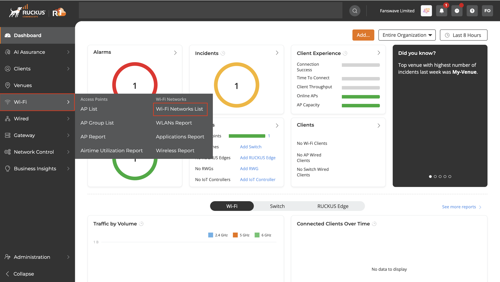
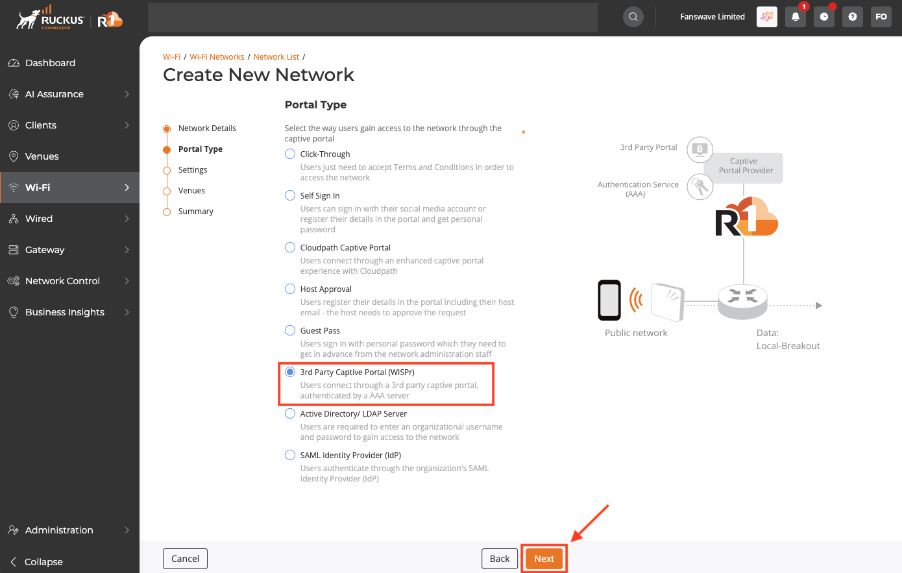
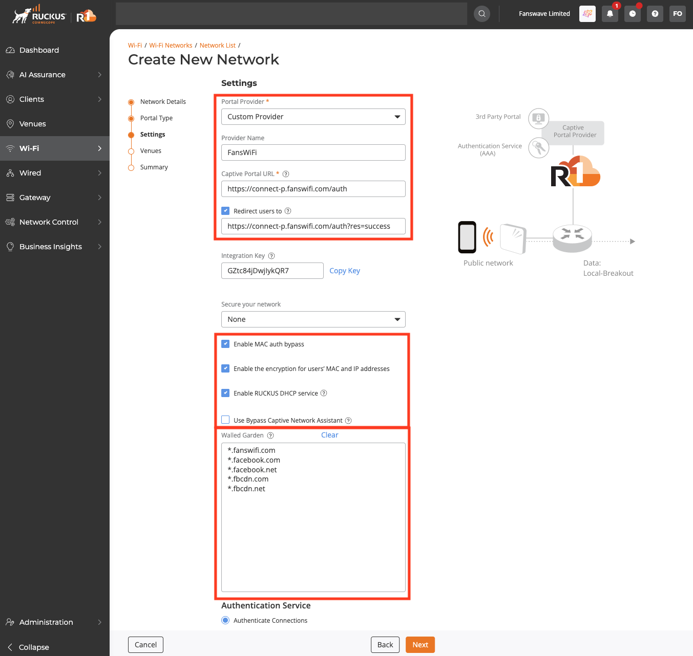
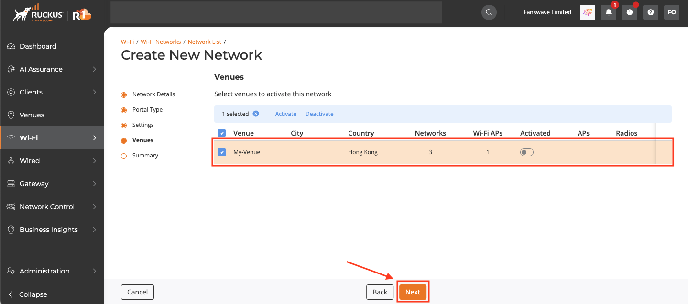
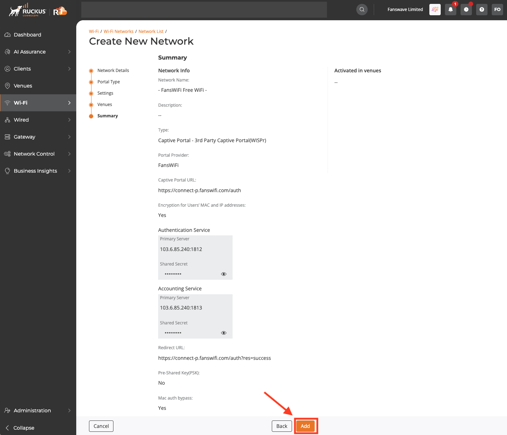

# Ruckus One Setup Guide

### Information Required for FansWiFi Manager

* **MAC Addresses** of the APs

### Setting on Ruckus One Cloud

#### Step 1: Access Ruckus One Cloud

1. Access the Portal by opening a Web Browser
2. Click **Wi-Fi** on the left menu, then select **Wi-Fi Networks List**.

#### Step 2: Create SSID

1. Select **Networks List** on the top menu.
2. Click **Add Wi-Fi Network** on the top right.

3.  In the **Network Details** section, configure the following:

    * **Network Name:** (Your preferred SSID, e.g., "FansWiFi Free WiFi")
    * **Network Type:** Captive Portal
    * Click **Next**.

    

#### Step 3: Captive Portal Configuration

1.  In the **Portal Type** section:

    * **Portal Type:** 3rd Party Captive Portal (WISPr)
    * Click **Next**.

    
2. In the **Settings** section, configure:
   * **Portal Provider:** Custom Provider
   * **Provider Name:** FansWiFi
   * **Captive Portal:** [https://connect-p.fanswifi.com/auth](https://connect-p.fanswifi.com/auth)
   * **Redirect users to:** Enabled
   * **Redirect URL:** [https://connect-p.fanswifi.com/auth?res=success](https://connect-p.fanswifi.com/auth?res=success)
   * **Secure your network:** None
   * **Enable MAC auth bypass:** Enabled
   * **Enable encryption for users’ MAC and IP addresses:** Enabled
   * **Enable RUCKUS DHCP service:** Enabled
   * **Use Bypass Captive Network Assistant:** Disabled
   * **Walled Garden:** (Configure using the list below)

**Walled Garden List (required)**

1. \*.[fanswifi.com](http://fanswifi.com/)

i. **Walled Garden List (Optional, you may skip this if there is no Facebook Login Enabled)**

1. \*.[facebook.com](http://facebook.com/)
2. \*.[facebook.net](http://facebook.net/)
3. \*.[fbcdn.net](http://fbcdn.net/)
4. \*.[fbcdn.com](http://fbcdn.com/)
5. \*.[akamaihd.net](http://akamaihd.net/)
6. [www.google.com](http://www.google.com/)
7. \*.[doubleclick.net](http://doubleclick.net/)
8. [www.google.com.hk](http://www.google.com.hk/)(Local Google URL of your Country / Region)
   * a. Example:
     * i. EU:[www.google.eu](http://www.google.eu)
     * ii. UK:[www.google.co.uk](http://www.google.co.uk/)
     * iii. Hong Kong:[www.google.com.hk](http://www.google.com.hk/)
     * iv. Japan:[www.google.co.jp](http://www.google.co.jp/)
     * v. Taiwan:[www.google.com.tw](http://www.google.com.tw/)
     * vi. Thailand:[www.google.co.th](http://www.google.co.th/)
     * vii. Malaysia:[www.google.com.my](http://www.google.com.my/)
     * viii. Myanmar:[www.google.com.mm](http://www.google.com.mm/)

ii. **Walled Garden List (Optional, you may skip this if there is no Weibo Login Enabled)**

1. \*.[weibo.com](http://weibo.com/)
2. \*.[weibo.cn](http://weibo.cn/)
3. \*.[sinaapp.com](http://sinaapp.com/)
4. \*.[sina.com.cn](http://sina.com.cn/)
5. \*.[sinajs.cn](http://sinajs.cn/)

iii. **Walled Garden List (Optional, you may skip this if there is no Instagram Login Enabled)**

1. \*.[instagram.com](http://instagram.com/)
2. \*.[akamaihd.net](http://akamaihd.net/)
3. \*.[cdninstagram.com](http://cdninstagram.com/)

iv. **Twitter Login (Optional, you may skip this if there is no Twitter Login Enabled)**

1. \*.[twitter.com](http://twitter.com/)
2. \*.[twimg.com](http://twimg.com/)

v. **LINE Login (Optional, you may skip this if there is no LINE Login Enabled)**

1. \*.[line.me](http://line.me/)
2. \*.[line-scdn.net](http://line-scdn.net/)

vi. **PayPal Login (Optional, you may skip this if there is no PayPal Login Enabled)**

1. \*.[paypal.com](http://paypal.com/)
2. \*.[paypalobjects.com](http://paypalobjects.com/)
3. [www.google-analytics.com](http://www.google-analytics.com/)

vii. **Video Login (Optional, you may skip this if there is no Video Login Enabled)**

1. \*.[akamaized.net](http://akamaized.net/)
2. \*.[akamaihd.net](http://akamaihd.net/)
3. [ssl.google-analytics.com](http://ssl.google-analytics.com/)
   * a. \*.[scorecardresearch.com](http://scorecardresearch.com/)
   * b. \*.[vimeocdn.com](http://vimeocdn.com/)
   * c. \*.[vimeo.com](http://vimeo.com/)

#### Step 4: RADIUS Configuration

1. Under **Authentication Service**, select **Authenticate Connections**.
2. For **Authentication Server**, click **Add Server**:
   * **Server Name:** FansWiFi Radius
   * **IP Address:** 103.6.85.240
   * **Port:** 1812
   * **Shared Key:** social123
3. Click **Add**.

4. Enable **Accounting Service**.
5. For **Accounting Server**, click **Add Server**:
   * **Server Name:** FansWiFi Accounting
   * **IP Address:** 103.6.85.240
   * **Port:** 1813
   * **Shared Key:** social123
6. Click **Add**.
7. Click **Next**.

8. Select your **Venue** (e.g., "My-Venue") and click **Next**.

9. In the **Summary** section, click **Add** to create the network.

#### Step 5: Add AP to FansWiFi Admin Panel

1. Log in to the FansWiFi Admin Panel.
2. Navigate to **Settings** > **Hotspots** > **Create**.
3. Configure the following:
   * **Venue:** Select your AP location.
   * **Hotspot Name:** Give the AP an identifiable name.
   * **AP Type:** Select **Ruckus SmartZone (formerly SCG)**.
   * **MAC Address:** Enter the unique MAC address of the AP.
4. Click **Create**.

