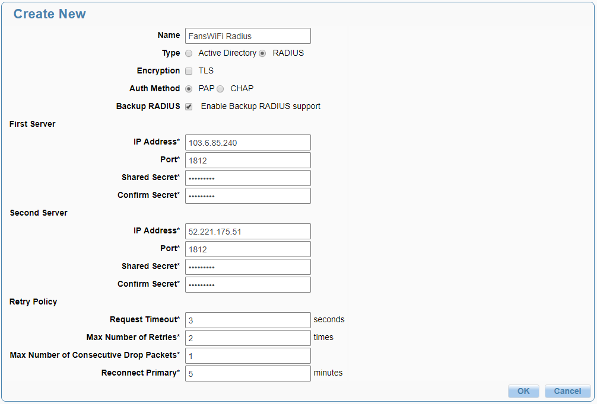
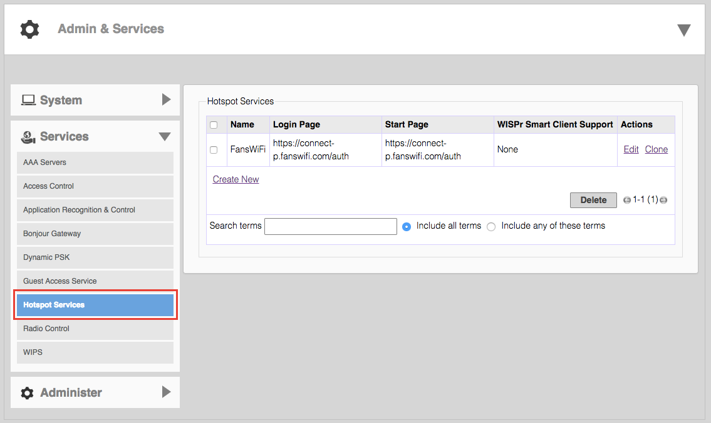
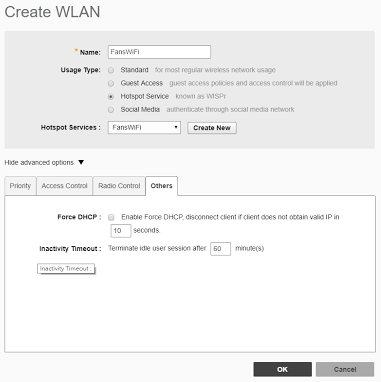
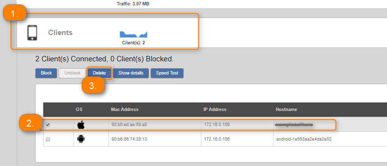

# Ruckus Unleashed Setup Guide

### Information Required for FansWiFi Manager

* **MAC Addresses** of the APs

### Tested Firmware Version

* **Version:** 200.3.9.13.228

### Setting on Ruckus Unleashed

#### Step 1: Access Ruckus Unleashed

1. Access the Ruckus Unleashed management interface via a Web Browser.

#### Step 2: Configuration: Authentication Servers (AAA Servers)

1. Click **Admin & Services** in the top menu.

2. Select **Services** > **AAA Servers** from the left menu.
3. Click **Create New** under **Authentication Servers** and configure:
   * **Name:** FansWiFi Radius
   * **Type:** RADIUS
   * **Auth Method:** PAP
   * **Backup RADIUS:** Enabled
     * **First Server:**
       * **IP Address:** 103.6.85.240
       * **Port:** 1812
       * **Shared Secret:** social123

* Second Server:
  * **IP Address:** 52.221.175.51
  * **Port:** 1812
  * **Shared Secret:** social123

4. Click **OK** to save.

#### Step 4: Configuration: Hotspot Services

1. Select **Hotspot Services** from the left menu.

2. Click **Create New** and configure:

**General Tab:**

* **Name:** FansWiFi
* **WISPr Smart Client Support:** None
* **Login Page:** [https://connect-p.fanswifi.com/auth](https://connect-p.fanswifi.com/auth)
* **Start Page (redirect to the following URL):** [https://connect-p.fanswifi.com/auth](https://connect-p.fanswifi.com/auth)
* **User Session:** (Configure only if your FansWiFi Admin Panel has session timeouts enabled)
  * Example: Session Timeout / Daily Quota: 60 minute
  * Setting:
    * **Session Timeout:** 60 Minutes
    * **Grace Period:** 60 Minutes
* **Intrusion Prevention:** Disabled

**Authentication Tab:**

* **Authentication Server:** FansWiFi Radius
* **Isolate wireless client traffic from other clients on the same AP:** Enabled

**Walled Garden Tab:**

* **Walled Garden List (required)**
  * 1.[fanswifi.com](https://support.fanswifi.com/hotspot-setup-guide/openmesh/openmesh-setup-guide-ng6xx-series)
* **Walled Garden List** (Optional, you may skip this if there is no Facebook Login Enabled)
  * 1.[facebook.com](https://support.fanswifi.com/hotspot-setup-guide/openmesh/openmesh-setup-guide-ng6xx-series)
  * 2.[facebook.net](https://support.fanswifi.com/hotspot-setup-guide/openmesh/openmesh-setup-guide-ng6xx-series)
  * 3.[fbcdn.net](https://support.fanswifi.com/hotspot-setup-guide/openmesh/openmesh-setup-guide-ng6xx-series)
  * 4.[fbcdn.com](https://support.fanswifi.com/hotspot-setup-guide/openmesh/openmesh-setup-guide-ng6xx-series)
  * 5.[Akamaihd.net](https://support.fanswifi.com/hotspot-setup-guide/openmesh/openmesh-setup-guide-ng6xx-series)
  * 6.[www.google.com](https://support.fanswifi.com/hotspot-setup-guide/openmesh/openmesh-setup-guide-ng6xx-series)
  * 7.[doubleclick.net](https://support.fanswifi.com/hotspot-setup-guide/openmesh/openmesh-setup-guide-ng6xx-series)
  * 8.[www.google.us](https://support.fanswifi.com/hotspot-setup-guide/openmesh/openmesh-setup-guide-ng6xx-series)(Local Google URL of your Country / Region)
    * Example:
      * i. EU:[www.google.eu](http://www.google.eu)
      * ii. UK:[www.google.co.uk](https://support.fanswifi.com/hotspot-setup-guide/openmesh/openmesh-setup-guide-ng6xx-series)
      * iii. Hong Kong:[www.google.com.hk](https://support.fanswifi.com/hotspot-setup-guide/openmesh/openmesh-setup-guide-ng6xx-series)
      * iv. Japan:[www.google.co.jp](https://support.fanswifi.com/hotspot-setup-guide/openmesh/openmesh-setup-guide-ng6xx-series)
      * v. Taiwan:[www.google.com.tw](https://support.fanswifi.com/hotspot-setup-guide/openmesh/openmesh-setup-guide-ng6xx-series)
      * vi. Thailand:[www.google.co.th](https://support.fanswifi.com/hotspot-setup-guide/openmesh/openmesh-setup-guide-ng6xx-series)
      * vii. Malaysia:[www.google.com.my](https://support.fanswifi.com/hotspot-setup-guide/openmesh/openmesh-setup-guide-ng6xx-series)
      * viii. Myanmar:[www.google.com.mm](https://support.fanswifi.com/hotspot-setup-guide/openmesh/openmesh-setup-guide-ng6xx-series)
* **Walled Garden List** (Optional, you may skip this if there is no Weibo Login Enabled)
  * 1.[weibo.com](https://support.fanswifi.com/hotspot-setup-guide/openmesh/openmesh-setup-guide-ng6xx-series)
  * 2.[weibo.cn](https://support.fanswifi.com/hotspot-setup-guide/openmesh/openmesh-setup-guide-ng6xx-series)
  * 3.[sinaapp.com](https://support.fanswifi.com/hotspot-setup-guide/openmesh/openmesh-setup-guide-ng6xx-series)
  * 4.[sina.com.cn](https://support.fanswifi.com/hotspot-setup-guide/openmesh/openmesh-setup-guide-ng6xx-series)
  * 5.[sinajs.cn](https://support.fanswifi.com/hotspot-setup-guide/openmesh/openmesh-setup-guide-ng6xx-series)
* **Walled Garden List** (Optional, you may skip this if there is no Instagram Login Enabled)
  * 1.[instagram.com](https://support.fanswifi.com/hotspot-setup-guide/openmesh/openmesh-setup-guide-ng6xx-series)
  * 2.[akamaihd.net](https://support.fanswifi.com/hotspot-setup-guide/openmesh/openmesh-setup-guide-ng6xx-series)
  * 3.[cdninstagram.com](https://support.fanswifi.com/hotspot-setup-guide/openmesh/openmesh-setup-guide-ng6xx-series)
* **Walled Garden List** (Optional, you may skip this if there is no Twitter Login Enabled)
  * 1.[twitter.com](https://support.fanswifi.com/hotspot-setup-guide/openmesh/openmesh-setup-guide-ng6xx-series)
  * 2.[twimg.com](https://support.fanswifi.com/hotspot-setup-guide/openmesh/openmesh-setup-guide-ng6xx-series)
* **Walled Garden List** (Optional, you may skip this if there is no Video Login Enabled)
  * 1.[akamaized.net](https://support.fanswifi.com/hotspot-setup-guide/openmesh/openmesh-setup-guide-ng6xx-series)
  * 2.[akamaihd.net](https://support.fanswifi.com/hotspot-setup-guide/openmesh/openmesh-setup-guide-ng6xx-series)
  * 3.[ssl.google-analytics.com](https://support.fanswifi.com/hotspot-setup-guide/openmesh/openmesh-setup-guide-ng6xx-series)
  * 4.[scorecardresearch.com](https://support.fanswifi.com/hotspot-setup-guide/openmesh/openmesh-setup-guide-ng6xx-series)
  * 5.[vimeocdn.com](https://support.fanswifi.com/hotspot-setup-guide/openmesh/openmesh-setup-guide-ng6xx-series)
  * 6.[vimeo.com](https://support.fanswifi.com/hotspot-setup-guide/openmesh/openmesh-setup-guide-ng6xx-series)
* Click “OK” to Save the configuration

3. Click **OK** to save.

#### Step 5: Create WLAN and SSID

1. Select **WiFi Networks** in the top menu.

2. Click **Create** and configure:
   * **Name:** FansWiFi
   * **Usage Type:** Hotspot Service
   * **Hotspot Service:** FansWiFi
3. Under **Advanced Configuration** > **Others**:
   * **Inactivity Timeout:** 60 minutes
4. Click **OK**.

#### Step 6: Get AP MAC Address

1. In the Unleashed Admin Panel, click **Access Points**
2. Click on the AP which you want to register on FansWiFi
3. Click “Edit” to view the MAC Address
4. Copy the MAC Address for FansWiFi Hotspot Setting

### Step 7: Add AP to FansWiFi Admin Panel

* Log in to the FansWiFi Admin Panel.
* Navigate to **Settings** > **Hotspots** > **Add Hotspot**.


1. **Organization:** Select the organization of where your Access Point locates
2. **Venue:** Select the venue of where your Access Point locates
3. **Hotspot Name:** Name each Access Point to make it identifiable
4. **AP Type:** Select “Open Mesh Firmware 6”
5. **Mac Address:** Input unique MAC Address of each Access Point in your venue


* Click **Save**

### FAQ

#### 1. How do I deauthorize a user to reset the login page?

* During testing, you may need to clear an authorized session to test different login methods.
* But after user authorized in any login method, captive portal will not be shown again before the expiry of session time.
* If you may want to bring the user back to the captive portal page for testing different login methods, you will need to unauthorize the WiFi user.

| WiFi User Logout trigger by: | 
WiFi User's Device (usually, access a logout url on browser)
 | Controller Web Admin Interface                  |
| ---------------------------- | ---------------------------------------------------------------------- | ----------------------------------------------- |
|                              | 
Not Available  Last Testing: 11-9-2017
                    | 
Available  Last Testing: 11-9-2017
 |

**Option A: Controller Interface**

1. Click the **Client** header.
2. Select the device and click **Delete**.

