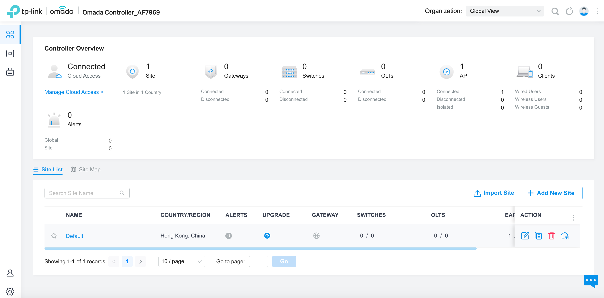
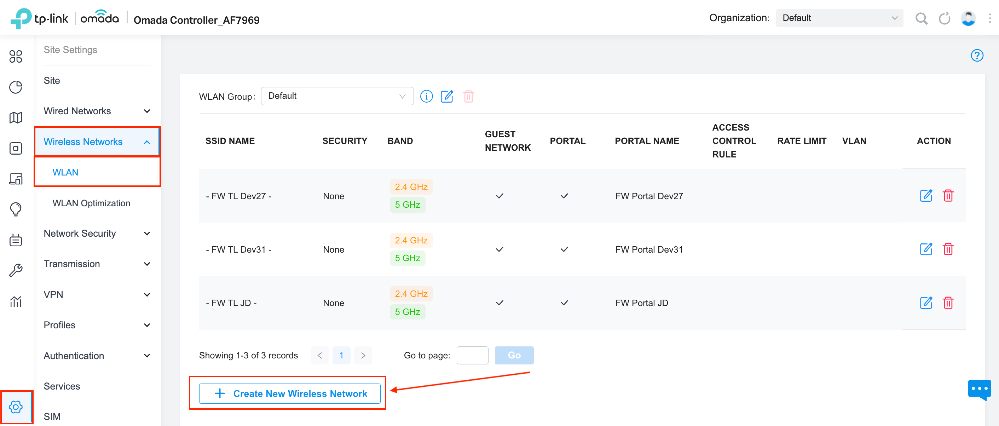
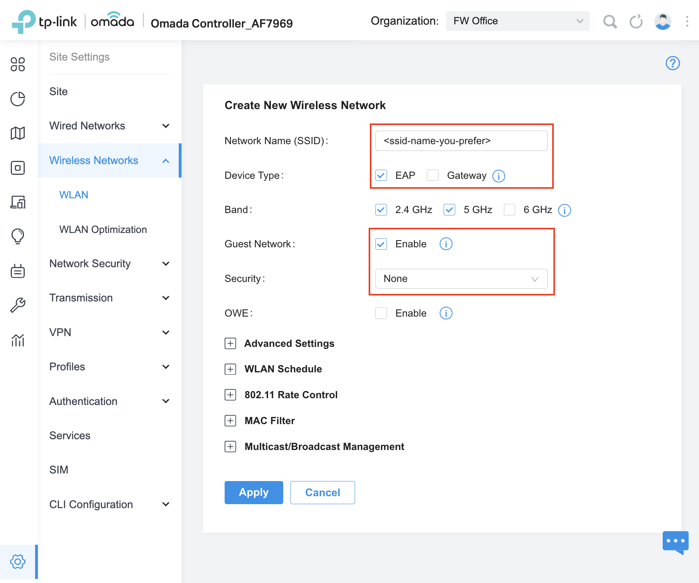
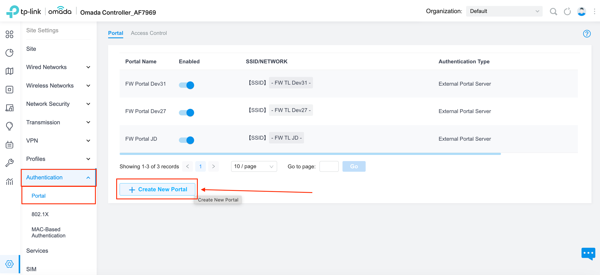
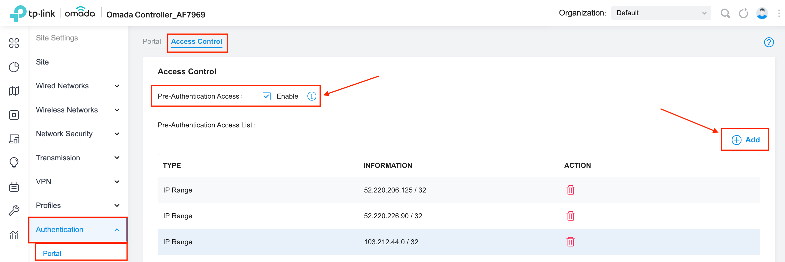
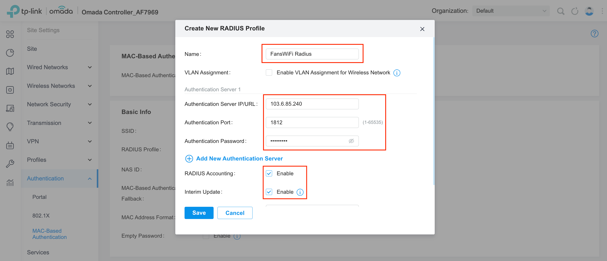
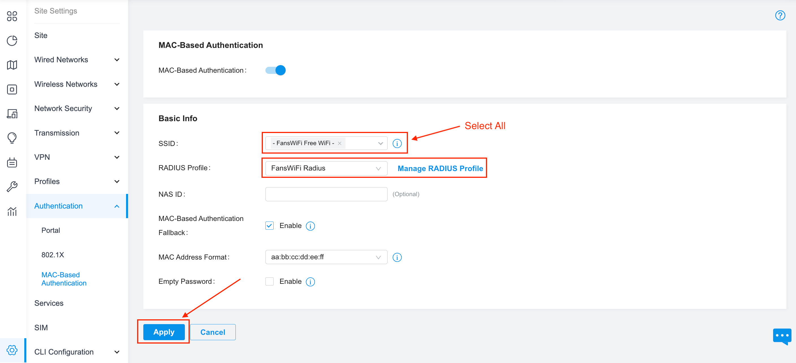
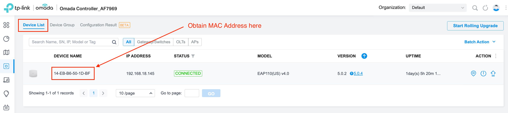
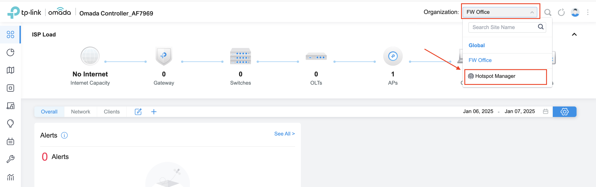
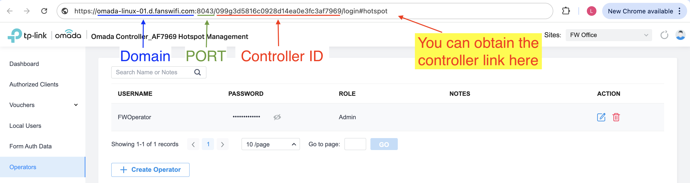

# TP-Link Omada Controller (Self-Hosted) Setup Guide

### Information required for FansWiFi Manager

* Mac Addresses of the APs
* IP / Domain Name of Omada server
* Hotspot Operator username and password
  * Admin username and password is not required

### Tested Model and Firmware Version

* Access Point
  * AP Model: EAP110 (Standalone Mode, managed by EAP Controller)
    * Hardware version: 2.0
    * Firmware Version: 1.2.0 Build 20170915 Rel. 35864
  * EAP 115 Cluster Mode is NOT supported
  * EAP 120 is NOT supported
  * Standalone EAP without Omada EAP Controller is NOT supported
* Omada EAP Controller Software: Controller Version: 5.14.26.1
  * Omada EAP Controller Software is required to be always on

Note that different models may have different interface


**Connect TP-Link EAP to Omada Controller**

Please refer to [here](https://intercom.help/fanswifi/en/articles/10329800-connect-tp-link-eap-to-omada-controller-self-hosted)


### Setting on TP-Link EAP Controller

#### Step 1: Configure DNS Setting to the Core Router of the WiFi Network

* Optional \[For specific setup only]
  * Please contact FansWiFi support if needed.

#### Step 2: Configure the TP-Link EAP Local Controller

* Start EAP Local Controller (Omada) software and login the management page

#### Step 3: Configuration: SSID

* You can skip this part if you already create SSID
* a. Click "Dashboard" on the left menu
* b. Select "Site List" on the top menu
* c. Select a site from the list, and click "Launch"

* d. Click "Setting" on the left menu
* e. Click "Wireless Networks" and choose "WLAN" on the left sub-menu
* f. Click "Create New Wireless Network"

* g. Configure with following settings:
  * **SSID Name:** \<ssid-name-you-prefer>
  * **Device Type:** EAP
  * **Guest Network:** Enable
  * **Security:** None
* h. Click Apply

#### Step 4: Configuration: Portal

* a. Click "Authentication" and "Portal" on the left sub-menu
* b. Click "Portal" on the top menu
* c. Click "Add a new portal"

* d. Configure with following settings:
  * **Portal Name:** FansWiFi Portal
  * **Portal:** Enable
  * **SSID & Network:** Select "Default \[SSID]"
    * After that, it would automatically select the SSID that already created
  * **Authentication Type:** External Portal Server
  * **External Portal Server:** URL
    * **URL:** [https://connect-p.fanswifi.com/auth](https://connect-p.fanswifi.com/auth)
  * **HTTPS Redirection:** Disable
  * **Landing Page:** The Promotional URL
    * **URL:** [https://connect-p.fanswifi.com/auth?res=success](https://connect-p.fanswifi.com/auth?res=success)
* e. Click "Apply"

#### Step 5: Configuration: Access Control

* a. Click "Access Control" on the top menu

* b. Config with following settings
  * **Pre-Authentication Access:** Enable
* c. Click "Add"
* d. Add policies with the following configurations:
  * Click "IP Range" and enter the following IP Range
  * Click "Add New Pre-Authentication Access Entry" to add more "IP Range"

| Policy Name   | IP Range          |
| ------------- | ----------------- |
| Production 1  | 52.220.206.125/32 |
| Production 2  | 52.220.226.90/32  |
| Cloudflare 1  | 103.21.244.0/22   |
| Cloudflare 2  | 103.22.200.0/22   |
| Cloudflare 3  | 103.31.4.0/22     |
| Cloudflare 4  | 104.16.0.0/12     |
| Cloudflare 5  | 108.162.192.0/18  |
| Cloudflare 6  | 131.0.72.0/22     |
| Cloudflare 7  | 141.101.64.0/18   |
| Cloudflare 8  | 162.158.0.0/15    |
| Cloudflare 9  | 172.64.0.0/13     |
| Cloudflare 10 | 173.245.48.0/20   |
| Cloudflare 11 | 188.114.96.0/20   |
| Cloudflare 12 | 190.93.240.0/20   |
| Cloudflare 13 | 197.234.240.0/22  |
| Cloudflare 14 | 198.41.128.0/17   |

* e. Click "Save"

#### Step 6: Configuration: Radius

* a. Click "Authentication" and "MAC-Based Authentication" on the left sub-menu
* b. **MAC-Based Authentication:** Enable
* c. **RADIUS Profile:** Click "Create New RADIUS Profile"

* d. Configure with following settings for new RADIUS Profile:
  * **Portal Name:** FansWiFi Radius
  * **Authentication Server 1**
    * **Authentication Server IP/URL:** `103.6.85.240`
    * **Authentication Port:** `1812`
    * **Authentication Password:** `social123`
  * **RADIUS Accounting:** Enable
  * **Interim Update:** Enable
  * **Interim Update Interval:** 300 Seconds
  * **Accounting Server 1**
    * **Authentication Server IP/URL:** `103.6.85.240`
    * **Authentication Port:** `1813`
    * **Authentication Password:** `social123`
  * Click "Save"

* e. Config the following settings for MAC-Based Authentication:
  * **SSID:** Select "Default \[SSID]"
    * After that, it would automatically select the SSID that already created
  * **RADIUS Profile:** FansWiFi Radius
  * Click "Apply"

#### Step 7: Get the MAC address of the AP (Will be used [on Step 10](tp-link-omada-controller-self-hosted-setup-guide.md#step-10))

* You should see the MAC address at the bottom of AP
* If you are not sure about the address, don’t worry.
  * Click "Devices" on the left menu
  * Click "Access Points" on the top menu.
  * You can see the MAC address of the AP. Choose the one you want to put into FansWiFi Admin Panel.

#### Step 8: Add FansWiFiAPI Admin account for API call by FansWiFi Portal Server (Will be used in [Step 11](tp-link-omada-controller-self-hosted-setup-guide.md#step-11))

* a. From "Organization" on the top menu, Select "Hotspot

* b. Select "Operators" on the left menu, then click "Create Operator"

* c. Configure with the following settings:
  * **Administrator Type:** Local User
  * **Username:** \<admin-id-you-prefer> (e.g. FansWiFiAPI)
  * **Password:** \<password-you-set>
  * **Role:** Admin
  * **Site Privileges:** _Select the site that you want to manage_
* d. Click "Create"

#### Step 9: Get the Domain, Port and ID of controller (Will be used in [Step 11](tp-link-omada-controller-self-hosted-setup-guide.md#step-11))

* You can obtain the domain, Port and controller ID through the website URL on Hotspot Manager section

#### Step 10: Add AP to FansWiFi Admin Panel

* Login to FansWiFi Admin Panel

* Click **Settings -> Hotspots -> Create**
  1. **Venue:** Select the venue of where your Access Point locates
  2. **Hotspot Name:** Name each Access Point to make it identifiable
  3. **AP Type:** Select “TP-Link EAP”
  4. **Mac Address:** Input unique MAC Address of each Access Point in your venue (Not controller)
* Click **Save**

#### Step 11: Add API Profile in FansWiFi Admin Panel

* a. Click "Venues & Login Portals" on the left menu
* b. Click "Edit" on the venue where your TP-Link EAP would be put under

* c. Click "Controllers"
* d. Configure with the following settings:
  * **TP-Link EAP Controller IP Address or URL:** https://\<your-controller-ip-address-or-url>
  * **Port Number (Default: 8043):** 8043
  * **Admin Username:** \<your-admin-id> (Hotspot Operator Username configured in [Step 8](tp-link-omada-controller-self-hosted-setup-guide.md#step-8), i.e. FansWiFiAPI)
  * **Admin Password:** \<your-admin-password> (Hotspot Operator Password configured in [Step 8](tp-link-omada-controller-self-hosted-setup-guide.md#step-8))
* e. Click "Save"

