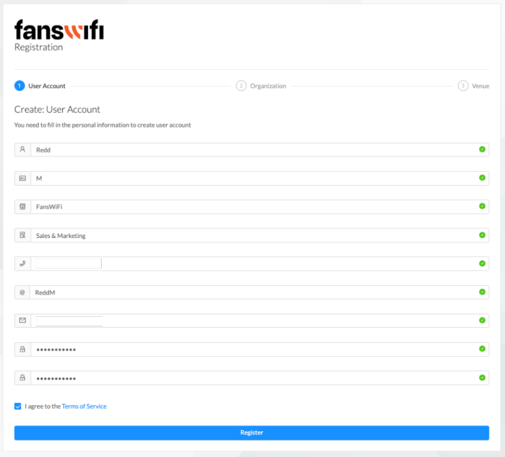
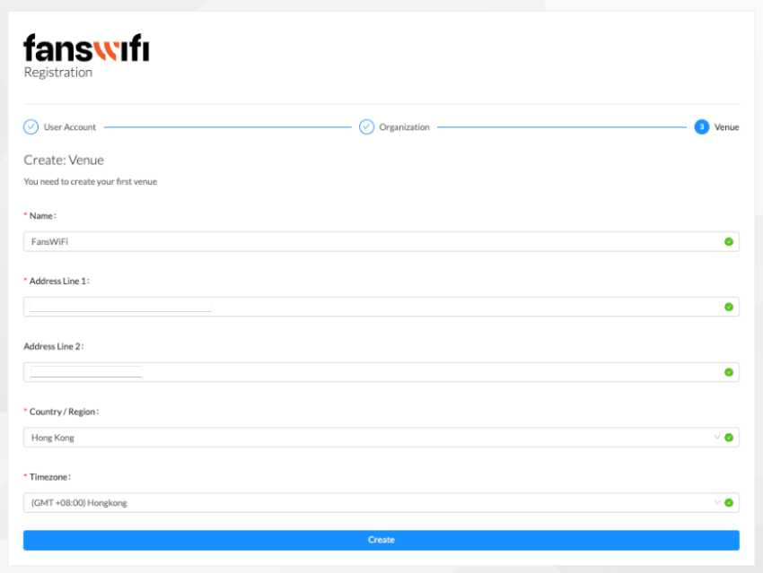

# 1. Account setup

## Step 1: Enter valid credentials in the provided fields

* First Name
* Last Name
* Company Name
* Job Position
* Contact Number
* Username (Username should only contain letters A-Z, a-z, or numbers 0-9)
* Email Address
* Password (Must be at least 8 characters in length)

Make sure to fill in each field with accurate and appropriate information. Once the required details are complete, proceed to the next step in the registration process.



```
Note: To register and proceed further, the user must agree to the Terms and Conditions.
```

Before completing the registration process, it is important to review and agree to the Terms and Conditions. These terms outline the rules, guidelines, and responsibilities associated with using the service. To proceed, it is compulsory to accept the Terms and Conditions by checking the appropriate box provided on the registration page.

## Step 2: Input company information to create an organization

Please provide the following details to create your organization:

* Organization Name
* Country/Region
* Industry
* Website (if applicable)
* Address Line 1
* Address Line 2 (if applicable)

Enter the requested information accurately and ensure that it reflects the company's details. Once the required fields are filled, proceed to the next step to complete the organization creation process.


## Step 3: Input company information to create a venue

To create your first venue, provide the following details:

* Venue Name
* Address Line 1
* Address Line 2 (if applicable)
* Country/Region
* Timezone

Enter the requested information accurately to ensure the correct setup of the venue. Once you have filled in the required fields, proceed to the next step to finalize the creation of the first venue.




[Check out the demo video](../demo-videos/step-1-account-setup.md)

