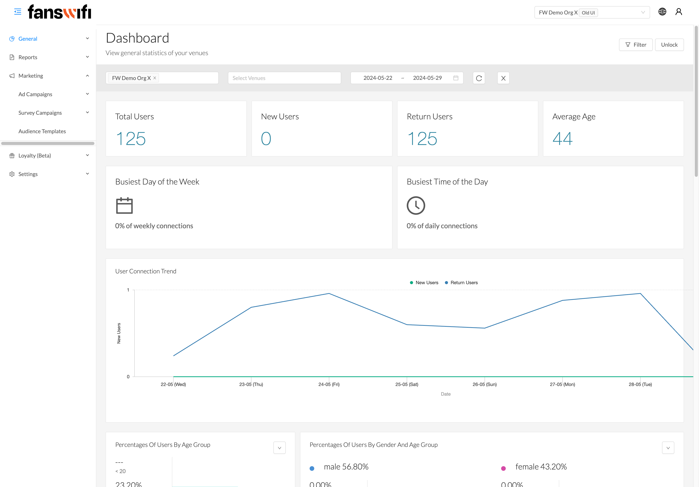
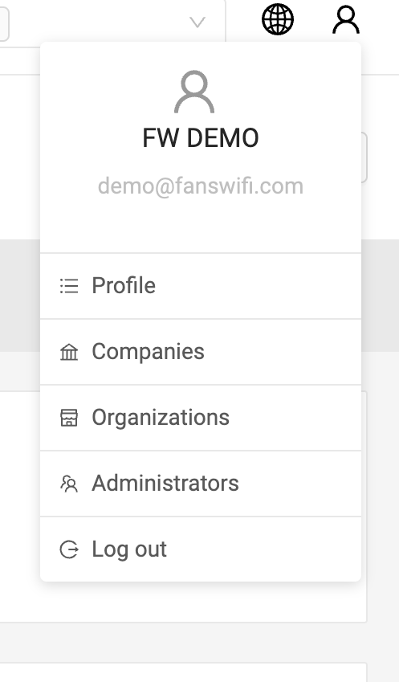
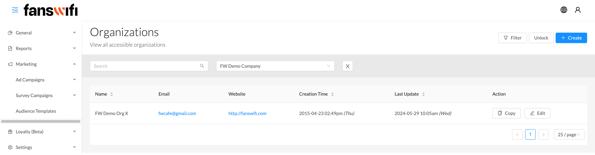
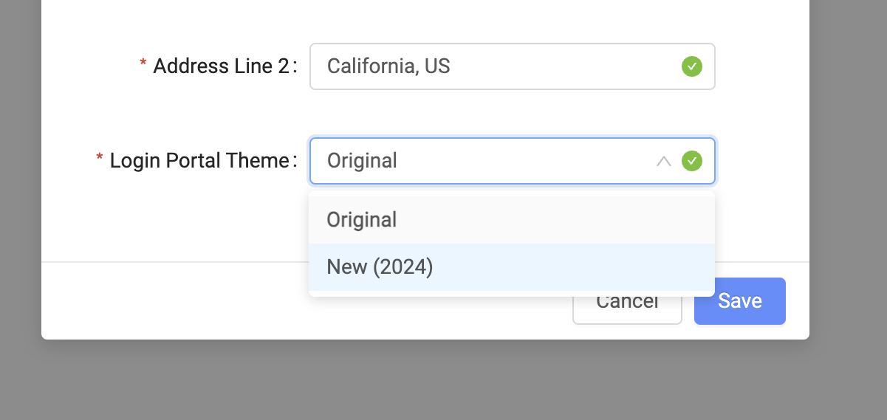
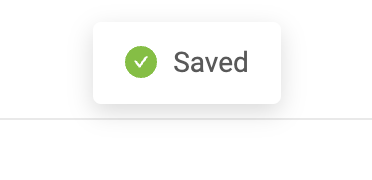

# UI Upgrade: Transitioning from Old to New Design

## We're thrilled to introduce FansWiFi's brand new UI, designed to bring you a fresh and innovative experience.


\***Please note: If you are a new customer, the new UI will be set as the default option. For old users, please get in touch with us to unlock the new UI.**


**Now,** log in to your admin portal account.

Next, click on the Profile icon at the top right corner. This will open up your personal account information.

From here, you'll see an overview of your Profile, Companies, Organizations, Administrator Accounts, and the Log-out option.

Now, head over to the Organizations section to view all the organizations you have access to.

Ready to update your company info? Create or edit the details as needed.

Once everything looks good, it's time to switch to our new UI.

Click on Login Portal Theme and change the theme **from Original to New (2024)**– our latest UI version.

Finally, hit save. Once you see the "Saved" notification, you've successfully switched to the new UI.


[Demo Video](https://vimeo.com/951430011/2f23ba0c1a?share=copy)

