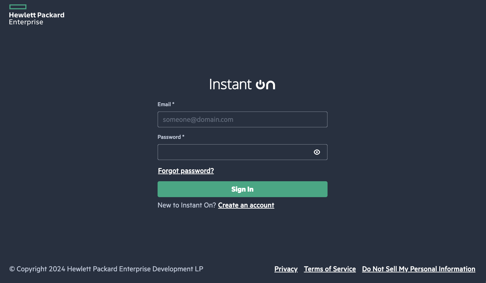
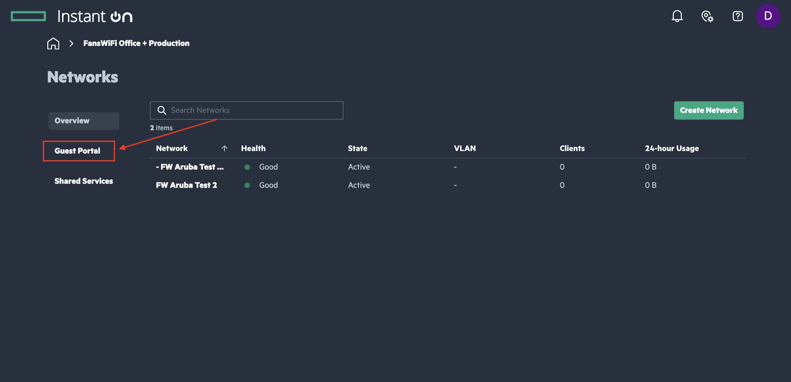
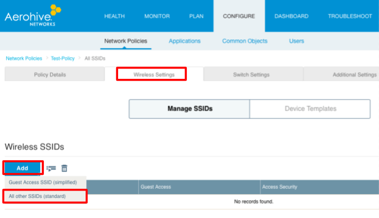
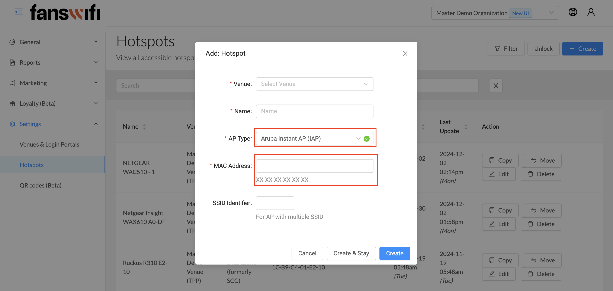

# Aruba (HPE) Instant-On AP Setup Guide

### Information required for FansWiFi Manager

* Mac Addresses of the APs (usually can be found at the back of the router)

### Tested model and firmware version

* **Model:** Aruba Instant-On AP11
* **Firmware:** 2.8.0

### Official documentation

* Portal setup: [Set up external portal](https://www.arubainstanton.com/techdocs/en/content/intro/desktop/set-portal-des.htm)
* Setup guide: [Provisioning / onboarding](https://www.arubainstanton.com/techdocs/en/content/get-started/prov-oc.htm)
* Deployment guide (PDF): [Aruba Instant On Deployment Guide](https://www.arubainstanton.com/files/Aruba_Instant_On_Deployment_Guide.pdf)

***

## Accessing Aruba Instant-On AP

1. Ensure the AP is on the **same network** as your PC/mobile/laptop for initial onboarding (per Aruba’s setup guide).
2. Open:
   * [https://portal.arubainstanton.com/](https://portal.arubainstanton.com/) **or**
   * [https://portal.instant-on.hpe.com](https://portal.instant-on.hpe.com)
3. Log in with your email/password. If you don’t have an account, register via:
   * [https://www.arubainstanton.com/techdocs/en/content/get-started/prov-oc.html](https://www.arubainstanton.com/techdocs/en/content/get-started/prov-oc.html)

***

### Setting FansWiFi on Aruba Instant-On Cloud Portal

#### Step 1: Click **Networks / Active networks**

***

#### Step 2: Click _Create Network_ at the top right corner to add a new network or choose a existing one

***

#### Step 3: Choose the configurations like the following figure (you can choose your own network name) and click _Save_

**Identification**

* **Network Usage:** Guest
* **Security:** None or Wi-Fi Enhanced Open
* **Network Option:** Guest Portal (enabled)
* Click **Save**

**IP Assignment (suggested)**

* **IP Assignment:** Specific to This Network **(Suggested)**
* **Base IP Address:** 172.16.0.0 _(or change to other network if needed)_
* **Subnet Mask:** 255.255.248.0 _(2048 clients)_ **(Suggested)**

***

#### Step 4: Configure the Guest Portal

a. After configuring the SSIDs, move to the “Guest Portal” session

***

#### Step 5: Finish the settings according to the following configuration and screenshot

* **Type:** External
* **Portal URL:** [https://connect-p.fanswifi.com/auth](https://connect-p.fanswifi.com/auth)
* **Redirect URL:** [https://connect-p.fanswifi.com/auth?res=success](https://connect-p.fanswifi.com/auth?res=success)
* **Authentication:** Select "User authentication (default)"

**Authentication options**

* **Require RADIUS Message-Authenticator:** Unchecked / Disabled
* **RADIUS Accounting:** Checked / Enabled

**Primary RADIUS server**

* **Server IP address or domain name:** [radius.fanswifi.com](../../Hotspot-Setup-Guide/Aruba-\(HPE\)/radius.fanswifi.com)
* **Shared Secret:** `social123`

**Network access attributes**

* **NAS Identifier:** `socialnas`
* **NAS IP Address:** Use device IP (default)

***

#### Step 6: For “Allowed domains” (Walled Garden) part, please follow below setup

**Add FansWiFi domain (required)**

* [fanswifi.com](../../Hotspot-Setup-Guide/Aruba-\(HPE\)/fanswifi.com)
* [cacerts.digitalcertvalidation.com](../../Hotspot-Setup-Guide/Aruba-\(HPE\)/cacerts.digitalcertvalidation.com)
* [statusa.digitalcertvalidation.com](../../Hotspot-Setup-Guide/Aruba-\(HPE\)/statusa.digitalcertvalidation.com)
* [ocsp.digicert.com](../../Hotspot-Setup-Guide/Aruba-\(HPE\)/ocsp.digicert.com)

**Select the Social Media you wish to use for Login if it is available on the list**

* Aruba may update this list accordingly

**Social login domains**

1. If your desired social media login is already available in Aruba’s list, select it.
2. If it is **not** available, add the domains below as needed.

**Walled Garden List (Optional, you may skip this if there is no Weibo Login Enabled)**

* [weibo.com](http://weibo.com/)
* [weibo.cn](http://weibo.cn/)
* [sinaapp.com](http://sinaapp.com/)
* [sina.com.cn](http://sina.com.cn/)
* [sinajs.cn](http://sinajs.cn/)

**Instagram Login (Optional, you may skip this if there is no Instagram Login Enabled)**

* [instagram.com](http://instagram.com)
* [akamaihd.net](http://akamaihd.net)
* [cdninstagram.com](http://cdninstagram.com)

**Twitter/X Login (Optional, you may skip this if there is no Twitter/X Login Enabled)**

* [twitter.com](http://twitter.com)
* [twimg.com](http://twimg.com)

**LINE Login (Optional, you may skip this if there is no LINE Login Enabled)**

* [line.me](http://line.me)
* [line-scdn.net](http://line-scdn.net)

**PayPal Login (Optional, you may skip this if there is no PayPal Login Enabled)**

* [paypal.com](http://paypal.com)
* [paypalobjects.com](http://paypalobjects.com)
* [www.google-analytics.com](http://www.google-analytics.com)

**Video Login (Optional, you may skip this if there is no Video Login Enabled)**

* [akamaized.net](http://akamaized.net)
* [akamaihd.net](http://akamaihd.net)
* [ssl.google-analytics.com](http://ssl.google-analytics.com)
* [scorecardresearch.com](http://scorecardresearch.com)
* [vimeocdn.com](http://vimeocdn.com)
* [vimeo.com](http://vimeo.com)

***

#### Step 7: Suggested access control (security setting)

1. Enable **Access Restrictions**
2. Select **Network Destinations**
3. Allow guests to access **Internet only**

This helps prevent guests from accessing devices on your internal network (router, POS, cameras, internal PCs, etc.).

***

#### Step 8: Add AP to FansWiFi Admin Panel

1. Log in to FansWiFi Admin Panel
2. Go to **Settings → Hotspots → Add Hotspot**
3. Configure:
   * **Venue:** Where the AP _(Access Point)_ is located
   * **Hotspot Name:** Friendly name for the AP to make it identifiable
   * **AP Type:** Select "Aruba"
   * **MAC Address:** Input unique MAC Address of each Access Point in your venue (Not controller)
4. Click **Save**

