# Mikrotik RouterOS AP / Gateway Setup Guide

### Prerequisites

* Experience and knowledge of Mikrotik WiFi AP Setting

### Information required for FansWiFi Manager

* Mac Addresses of the APs / Gateway

#### Tested Firmware Version

* Version: **6.38.7** on hAP AC (RB962UiGS-5HacT2HnT)
* Version: **6.39.1** on RB951-2n
* NOT Supported Version: 5.xx Series or below
  * Warning: RouterOS 5.26 is confirmed NOT working. Please do not use firmware 5.xx Series or below.
  * Download the latest firmware on[https://mikrotik.com/download](https://support.fanswifi.com/hotspot-setup-guide/mikrotik/mikrotik-routeros-ap-/-gateway-setup-guide)

#### Tested Device Model

* Mikrotik hAP AC (Product Code: RB962UiGS-5HacT2HnT)
* Mikrotik RB951-2n (Product Code: RB951-2n)

#### Setting on Mikrotik AP / Gateway

**Step 1: Connect your router with Winbox**

If you do not have the software, you can download it from the link below:

[http://download2.mikrotik.com/winbox.exe](https://support.fanswifi.com/hotspot-setup-guide/mikrotik/mikrotik-routeros-ap-/-gateway-setup-guide)

* Run Winbox with your router connected with a RJ45 network cable.
*   Click “...” button to select the MAC address(not IP address) and “Connect”. You may have to wait a while for system to obtain the address.

    * (The Mac address should be on the back of your router)

    

**Step 2: Quick Set Network**

* After successfully login to Winbox, setup the basic WiFi Setting using Quick Set

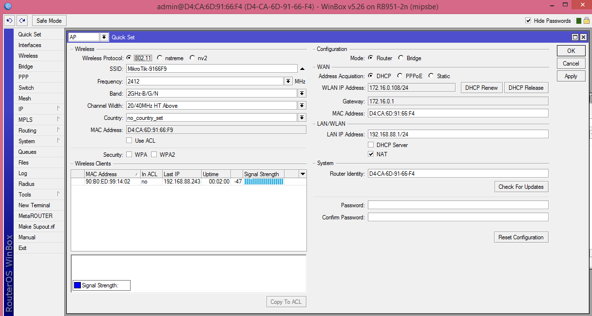

* Choose “Home AP Dual” at the top left hand corner

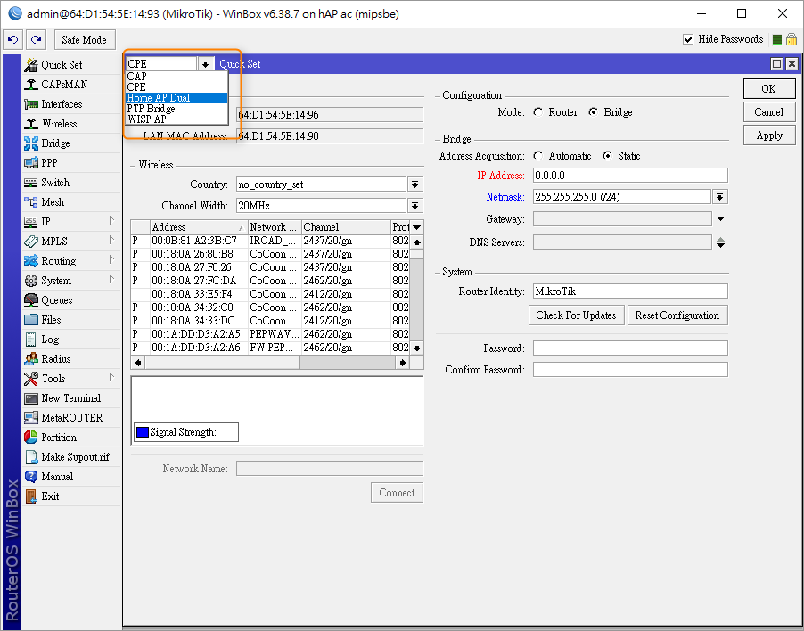

* Then set your SSID and settings as follow:
* Under **Wireless**:
  * **Network Name:** -FansWiFi -
* Under **Internet**:
  * **Address Acquisition:** Automatic
  * **Firewall Router:** Enabled
* Under **Local Network**:
  * **IP Address:** `192.168.88.1`
* ​**Netmask:** `255.255.255.0 (/24)` ​- **DHCP Server:** Enabled ​- **DHCP Server Range:** `192.168.88.2-192.168.88.254` ​- **NAT:** Enabled ​- **UPnP:** Enabled

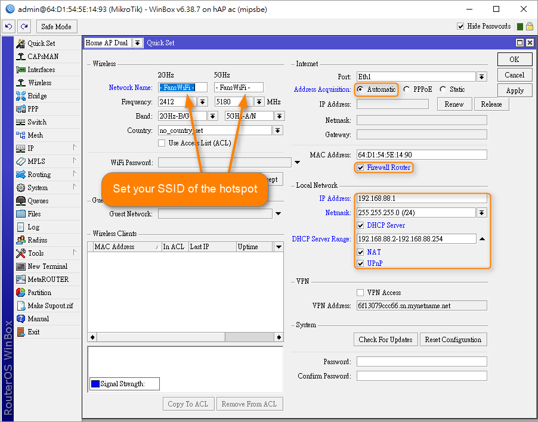

**Step 3: HotSpot Setting**

* Go to **IP > Hotspot**

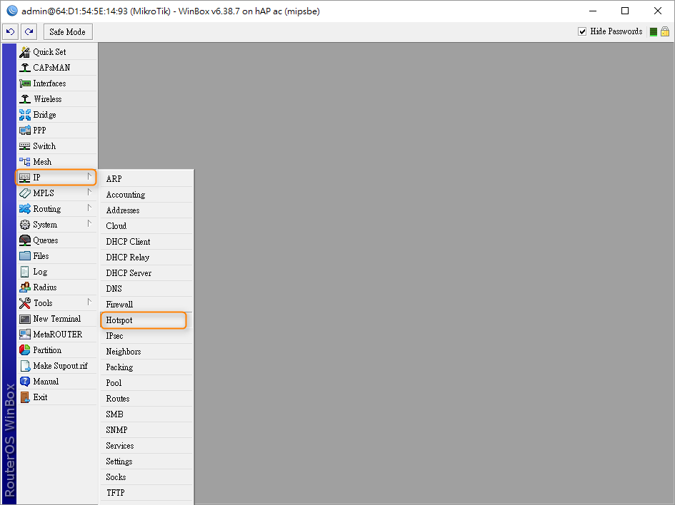

* Click **Hotspot Setup**, select **bridge** and click the next button.

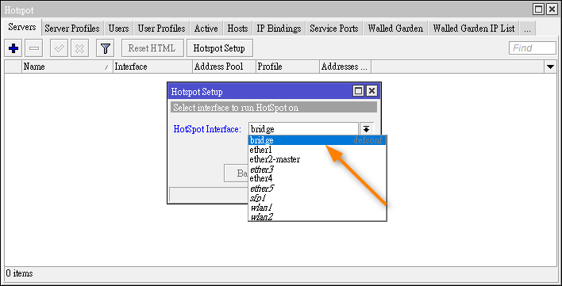

* Enter Local area network address as the following.

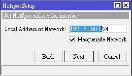

* Enter Address Pool of Network as the following.

* Select none for Certificate.

* Enter the IP address of SMTP Server as following.

* Leave DNS server as blank.

* Leave DNS Name as blank.

* Enter the name of Local Hotspot User and Password as following.

* You should see a Setup successful pop-up afterwards.

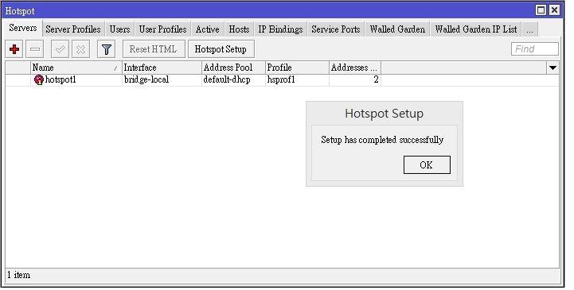

**Step 4: Change Hotspot Settings**

* Under **IP > Hotspot**, click the **User Profiles** tab
* Select **default**
* Under **General**, clear **Shared Users**. (default setting is 1) _If Shared Users setting is not removed, number of device a WiFi user can login to the system is restricted._

**Step 5: Change Authentication Method**

* Select the Server Profile tab and double-click hsprof1 to open up the detail.

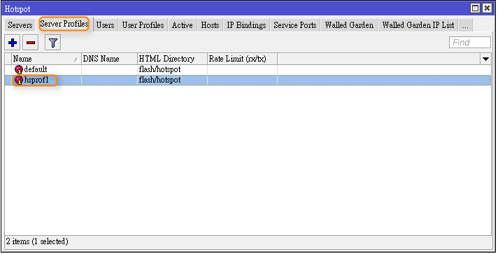

* Select the Login tab. Check the box for MAC and HTTP PAP and make sure the other checkboxes are unchecked, then click the apply button.

* Select the Radius tab. Check the box for use Radius, then select “XX-XX-XX-XX-XX-XX” as the MAC Format. Click OK to confirm the settings.

**Step 6: Add Radius Server**

* Go to Radius in the main menu, then click the “+” button to add a new radius server.

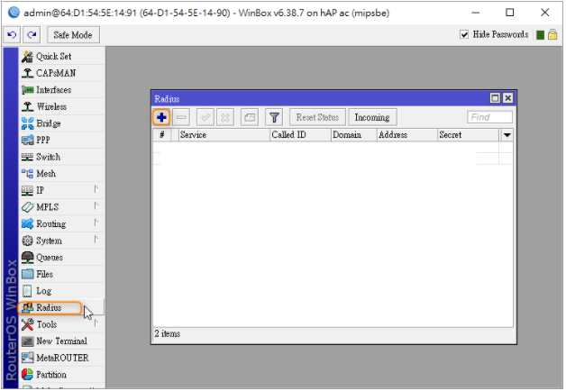

* Check only the hotspot check box and enter below Radius IP Addresses as the Address. Please choose the Radius Server IP according to your geographical region.
* You can choose server with smallest latency by “ping” command from your network.
* Enter “**social123**” as the Secret. Click Ok to finalize the settings.
  * **Radius Settings**
  * a. Service: Hotspot
  * b. Address:
    * Asia Pacific, US, America, Europe, the Middle East and Africa: Address: 103.6.85.240
  * c. Radius Secret: social123
  * d. **Timeout: 1500 ms**

**Step 7: Set up Walled Garden List**

**7.1 Upload Walled Garden List File**

* Go to Files on the main menu. Download the script file from the following link

[https://cdn.fanswifi.com/assets/mikrotik/fanswifi\_hotspot\_walled\_garden.rsc](https://cdn.fanswifi.com/assets/mikrotik/fanswifi_hotspot_walled_garden.rsc).

* Then drag the downloaded rsc file to:
  * “**flash**” for model hAP AC (RB962UiGS-5HacT2HnT), or
  * the **root of the File list** for model RB951-2n in Winbox.

* After that, you should see the file “fanswifi\_hotspot\_walled\_garden.rsc” in the root folder.

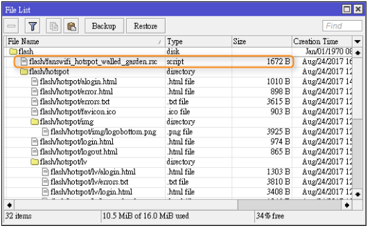

**7.2 Import the uploaded files**

* Go to New Terminal in the main menu. Then enter:
  * “import flash/fanswifi\_hotspot\_walled\_garden.rsc” for model hAP AC (RB962UiGS-5HacT2HnT), or
  * “import fanswifi\_hotspot\_walled\_garden.rsc” for model RB951-2n in the terminal. You should see a success message afterwards like the following screen.

* Go to IP > Hotspot in the main menu. Then select the walled Garden tab. You should see a new list of Dst. Host like in the following screen.

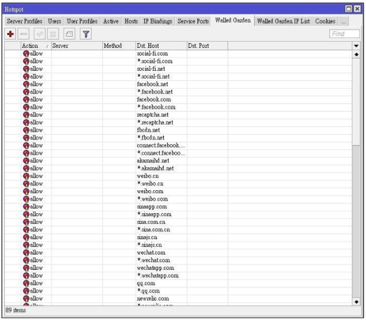

**7.3 Add Walled Garden IP List**

* Go to **IP > Hotspot > Walled Garden IP List**
* Add below records to the **Walled Garden IP List**:

| Rule | Server   | Src. Address       | Dst. Address       | Protocol | Dest. Port |
| ---: | -------- | ------------------ | ------------------ | -------- | ---------: |
|    1 | \<empty> | \<empty>           | \<empty>           | **tcp**  |    **443** |
|    2 | \<empty> | **52.220.226.90**  | \<empty>           | \<empty> |   \<empty> |
|    3 | \<empty> | \<empty>           | **52.220.226.90**  | \<empty> |   \<empty> |
|    4 | \<empty> | **52.220.206.125** | \<empty>           | \<empty> |   \<empty> |
|    5 | \<empty> | \<empty>           | **52.220.206.125** | \<empty> |   \<empty> |

Example:

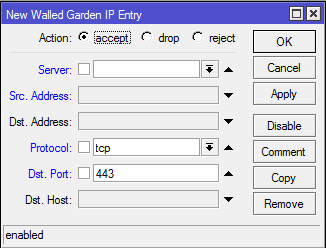

**Step 8: Set AP Identity**

* Go to **System > Identity** and enter the MAC address (The first one) of your router into the Identity field. Please be reminded that the MAC address must be in a XX-XX-XX-XX-XX-XX format.
* Example: 11-22-33-44-55-66

Please do **NOT** enter 11:22:33:44:55:66

​

**Step 9: Upload Hotspot Files**

* Download and Unzip the file from the following links:

[https://cdn.fanswifi.com/assets/mikrotik/fanswifi\_mikrotik\_files.zip](https://support.fanswifi.com/hotspot-setup-guide/mikrotik/mikrotik-routeros-ap-/-gateway-setup-guide)

* You should get 3 file: **alogin.html**, **login.html** and **logout.html**.
* Go to **Files** in the main menu and drag the 3 downloaded files into the **hotspot** folder in the File list.

### Final Step: Add AP to FansWiFi Admin Panel

* Login to FansWiFi Admin Panel
* Click **Settings -> Hotspots -> Add Hotspot**


1. **Venue:** Select the venue of where your Access Point locates
2. **Hotspot Name:** Name each Access Point to make it identifiable
3. **AP Type:** Select “**Mikrotik**”
4. **Mac Address:** Input unique MAC Address of each Access Point in your venue (Not controller)


* Click **Save**

## FAQ

### 1. How to deauthorize wifi user to bring user back to the login page after login?

* During testing, you may want to try different login methods.
* But after user authorized in any login method, captive portal will not be shown again before the expiry of session time.
* If you may want to bring the user back to the captive portal page for testing different login methods, you will need to unauthorize the WiFi user.

| WiFi User Logout trigger by: | 
WiFi User's Device (usually, access a logout url on browser)
 | AP Web Admin Interface / Winbox                     |
| ---------------------------- | ---------------------------------------------------------------------- | --------------------------------------------------- |
|                              | 
Available  Last Testing: 11-9-2017
                        | 
Not available  Last Testing: 11-9-2017
 |

**WiFi User Logout trigger by:**

**WiFi User's Device**

* On the wifi user device, open web browser
* Go **http://\<ap-local-ip-address>/logout**\
  (192.168.88.1 is default local IP setting(i.e.[http://192.168.88.1/logout](http://192.168.88.1/logout)), if you are using different setting, please input your AP's local IP here) ​
