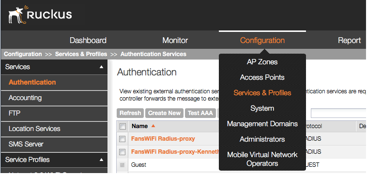
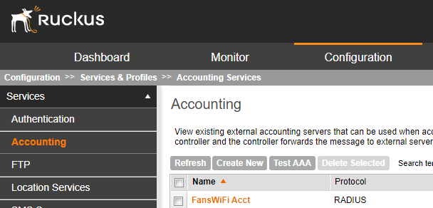
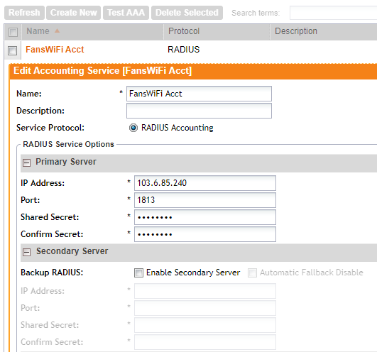
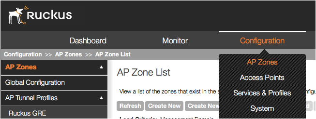
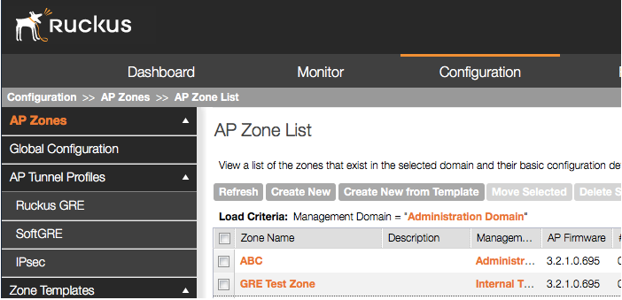
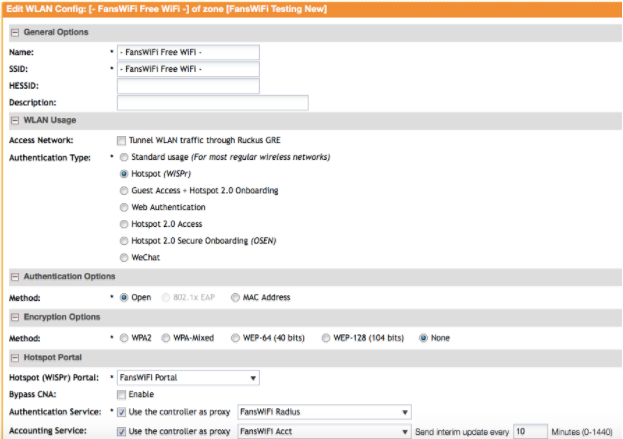
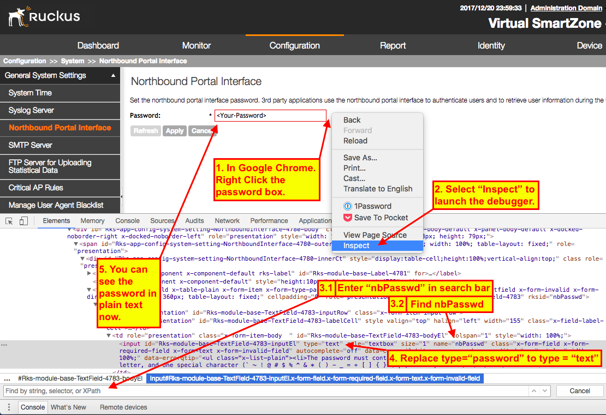
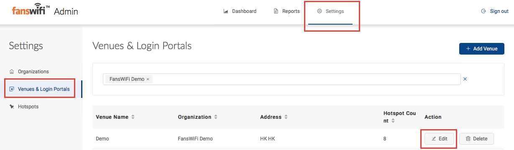

# Ruckus SmartZone / SCG (Version 3.4 or before) Setup Guide

### Information required for FansWiFi Manager

* Mac Addresses of the APs

### Tested Firmware Version

* Version: **3.2.1**

#### FansWiFi Server / Controller Communication

The table below listed the ports that must be opened on the network firewall to ensure that the hotspot system, FansWiFi servers (including RADIUS server) can communicate with each other successfully.

| Port Number                                | Protocol  | Source                                   | Destination                                         | Traffic Direction                                                                                        | Purpose                                                               | Required by Login Method                                    |
| ------------------------------------------ | --------- | ---------------------------------------- | --------------------------------------------------- | -------------------------------------------------------------------------------------------------------- | --------------------------------------------------------------------- | ----------------------------------------------------------- |
| 1812 / 1813                                | UDP & TCP | Controller                               | FansWiFi RADIUS Server (103.6.85.240)               | outbound                                                                                                 | AAA Authentication and Accounting                                     | All                                                         |
| 1700 / 3799                                | UDP & TCP | FansWiFi Radius Server IP (103.6.85.240) | Controller                                          | 
inbound (port forwarding may needed by your firewall / router. Depends on your network setup.)
 | RADIUS CoA Messages                                                   | WeChat Login / Video Login / Advanced Facebook Login...etc. |
| 
8443 / 9443 (Depends on Setting)
 | TCP       | FansWiFi                                 | Northbound Interface of Ruckus SmartZone Controller | 
inbound (port forwarding may needed by your firewall / router. Depends on your network setup.)
 | Ruckus Northbound API Access for WiFi Client Online / Offline Control | All                                                         |

#### Network Topology

#### Setting on Ruckus SmartZone / SCG

**Step 1: Configure the SmartZone**

1. Access the SmartZone by opening a Web Browser
2. Click **Configure -> Service & Profiles -> Authentication** to enter the Authentication configuration Page

**Step 2: Configuration: Authentication Servers**

**Radius Authentication Server**

1. Click “Create New” in the Authentication Page
   1. **Name:** FansWiFi Radius
   2. **Service Protocol:** RADIUS
   3. **Primary Server**
      1. **IP Address:** 103.6.85.240
      2. **Port:** 1812
      3. **Shared Secret:** social123
      4. **Confirm Secret:** social123
2. Click “**OK**” to Save the configuration

**Step 3: Configuration: Accounting Servers**

### Radius Accounting Server

1. Click “Create New” in the Authentication Page
   1. **Name:** FansWiFi Acct
   2. **Service Protocol:** RADIUS Accounting
   3. **Primary Server**
      1. **IP Address:** 103.6.85.240
      2. **Port:** 1813
      3. **Shared Secret:** social123
      4. **Confirm Secret:** social123
   4. **Secondary Server**
      1. **Enable Secondary Server:** Enable
      2. **IP Address:** 52.221.175.51
      3. **Port:** 1813
      4. **Shared Secret:** social123
      5. **Confirm Secret:** social123
2. Click “**OK**” to Save the configuration

**Step 4: Configuration: Create AP Zone**

* a. Select **Configuration -> AP Zones** from the top menu

* b. Click “Create New” with below settings
  * i. **Zone Name:** FansWiFi
  * ii. **AP Admin Logon (Logon ID):** admin
  * iii. **AP Admin Logon (Password):** \[AP Admin Password]
* c. Click “**OK**” to Save the configuration

**4.1. Configuration: Select AP Zone**

* a. Select AP Zone you created from the AP Zone List

**4.2. Configuration: Hotspot (WISPr)**

* a. Select **Hotspot (WISPr)** from the left menu under AP Zones
*   b. Click “Create New” with below settings

    * i. **Portal Name:** FansWiFi Portal
    * ii. **Smart Client Support:** None
    * iii. **Logon URL:** External
    * iv. **Logon URL (Redirect URL):** [https://connect-p.fanswifi.com/auth](https://support.fanswifi.com/hotspot-setup-guide/ruckus/ruckus-smartzone-scg-version-3-4-or-before-setup-guide)
    * v. **Redirected MAC Format:** AA-BB-CC-DD-EE-FF
    * vi. **Start Page (redirect to the following URL):** [https://connect-p.fanswifi.com/auth/?res=success](https://support.fanswifi.com/hotspot-setup-guide/ruckus/ruckus-smartzone-scg-version-3-4-or-before-setup-guide)
    * vii. **Session Timeout:** 1440
    * viii. **Grace Period:** 60

    

    * ix. **Walled Garden List (required)**
      * \*.[fanswifi.com](https://support.fanswifi.com/hotspot-setup-guide/ruckus/ruckus-smartzone-scg-version-3-4-or-before-setup-guide)
      * \*.cloudfront.net
    * x. **Walled Garden List** (Optional, you may skip this if there is no Facebook Login Enabled)
      * \*.facebook[.](https://support.fanswifi.com/hotspot-setup-guide/ruckus/ruckus-smartzone-scg-version-3-4-or-before-setup-guide)com
      * \*.facebook[.](https://support.fanswifi.com/hotspot-setup-guide/ruckus/ruckus-smartzone-scg-version-3-4-or-before-setup-guide)net
      * \*.fbcdn[.](https://support.fanswifi.com/hotspot-setup-guide/ruckus/ruckus-smartzone-scg-version-3-4-or-before-setup-guide)net
      * \*.fbcdn[.](https://support.fanswifi.com/hotspot-setup-guide/ruckus/ruckus-smartzone-scg-version-3-4-or-before-setup-guide)com
      * \*.akamaihd[.](https://support.fanswifi.com/hotspot-setup-guide/ruckus/ruckus-smartzone-scg-version-3-4-or-before-setup-guide)net
      * \*.fbsbx.com
    * xi. **Walled Garden List** (Optional, you may skip this if there is no Weibo Login Enabled)
      * \*.[weibo.com](https://support.fanswifi.com/hotspot-setup-guide/ruckus/ruckus-smartzone-scg-version-3-4-or-before-setup-guide)
      * \*.[weibo.cn](https://support.fanswifi.com/hotspot-setup-guide/ruckus/ruckus-smartzone-scg-version-3-4-or-before-setup-guide)
      * \*.[sinaapp.com](https://support.fanswifi.com/hotspot-setup-guide/ruckus/ruckus-smartzone-scg-version-3-4-or-before-setup-guide)
      * \*.[sina.com.cn](https://support.fanswifi.com/hotspot-setup-guide/ruckus/ruckus-smartzone-scg-version-3-4-or-before-setup-guide)
      * \*.[sinajs.cn](https://support.fanswifi.com/hotspot-setup-guide/ruckus/ruckus-smartzone-scg-version-3-4-or-before-setup-guide)
    * xii. **Walled Garden List** (Optional, you may skip this if there is no Instagram Login Enabled)
      * \*.[instagram.com](https://support.fanswifi.com/hotspot-setup-guide/ruckus/ruckus-smartzone-scg-version-3-4-or-before-setup-guide)
      * \*.[akamaihd.net](https://support.fanswifi.com/hotspot-setup-guide/ruckus/ruckus-smartzone-scg-version-3-4-or-before-setup-guide)
      * \*.[cdninstagram.com](https://support.fanswifi.com/hotspot-setup-guide/ruckus/ruckus-smartzone-scg-version-3-4-or-before-setup-guide)
    * xiii. **Walled Garden List** (Optional, you may skip this if there is no Twitter Login Enabled)
      * \*.[twitter.com](https://support.fanswifi.com/hotspot-setup-guide/ruckus/ruckus-smartzone-scg-version-3-4-or-before-setup-guide)
      * \*.[twimg.com](https://support.fanswifi.com/hotspot-setup-guide/ruckus/ruckus-smartzone-scg-version-3-4-or-before-setup-guide)
    * xiv. **Walled Garden List** (Optional, you may skip this if there is no Video Login Enabled)
      * \*.[akamaized.net](https://support.fanswifi.com/hotspot-setup-guide/ruckus/ruckus-smartzone-scg-version-3-4-or-before-setup-guide)
      * \*.[akamaihd.net](https://support.fanswifi.com/hotspot-setup-guide/ruckus/ruckus-smartzone-scg-version-3-4-or-before-setup-guide)
      * [ssl.google-analytics.com](https://support.fanswifi.com/hotspot-setup-guide/ruckus/ruckus-smartzone-scg-version-3-4-or-before-setup-guide)
      * \*.[scorecardresearch.com](https://support.fanswifi.com/hotspot-setup-guide/ruckus/ruckus-smartzone-scg-version-3-4-or-before-setup-guide)
      * \*.[vimeocdn.com](https://support.fanswifi.com/hotspot-setup-guide/ruckus/ruckus-smartzone-scg-version-3-4-or-before-setup-guide)
      * \*.[vimeo.com](https://support.fanswifi.com/hotspot-setup-guide/ruckus/ruckus-smartzone-scg-version-3-4-or-before-setup-guide)
* c. Click “OK” to Save the configuration

**Step 5: Create WLAN and SSID for customer access**

* Select “WLAN” from the left menu under AP Zones
* Click “Create New” with below settings
  * **Name:** - FansWiFi Free WiFi -
  * **ESSID:** - FansWiFi Free WiFi -
  * **WLAN Usage Type:** Hotspot (WISPr)
  * **Authentication Method:** Open
  * **Encryption Method:** None
  * **Hotspot (WISPr) Portal:** FansWiFi Portal
  * **Bypass CNA:** Disable
  * **Authentication Service:** FansWiFi Radius
  * **Accounting Service:** FansWiFi Acct

* **Under Avanced Options:**
  * **Inactivity Timeout (Under Advanced Options):** 1000 seconds

**Step 6: Northbound Portal Interface (NBI) Password**

* Click **Configuration -> General System Settings -> Northbound Portal Interface**
* If you have a NBI password, you may skip this step. If not, please enter a new password now and click **Apply**.
* This password will be used in the controller setting later on.


If you forgot your NBI password and want to retrieve it without setting a new password, you can follow below HTML method below.


* In Google Chrome, right click the password box, then select "**Inspect**" to launch the developer tools.
* Find '**name="nbPasswd"**' by using the search bar inside the developer tools, locate '**type="password"**' before it in the same row
* Replace '**type="password"**' with '**type="text"**'
* Your NBI password should be visible in the password box now

**Step 7: Configure SmartZone / SCG Domain or IP Address to FansWiFi Admin Pan**

* Access FansWiFi Admin Panel:[https://admin-p.fanswifi.com](https://support.fanswifi.com/hotspot-setup-guide/ruckus/ruckus-smartzone-scg-version-3-4-or-before-setup-guide)
* Login Using your own username / password
* Select “Setting” from the top menu
* Select “Venues & Login Portals” from the left menu
* Click “Edit” in your target Venue

* Select “WiFi -> Controller” from the left menu
* **Ruckus SmartZone (formerly SCG) IP Address or Domain Name:** \<your-controller-domain-or-ip>
* **Port Number (Default: 9080):** \<your-controller-northbound-port-number>
* **Northbound Interface Password:** \<your-northbound-password>


**Exceptional Case: SmartZone / vSCG behinds Router / Firewall** If the SmartZone / vSCG is behind Router / Firewall, it is not directly accessible by FansWiFi Server. In this case, you need to configure port forwarding on your Router / Firewall to forward the port to the SmartZone / vSCG.


**Step 8: Add AP to FansWiFi Admin Panel**

* Login to FansWiFi Admin Panel
* Click **Settings -> Hotspots -> Add Hotspot**
  * **a. Organization:** Select the organization of where your Access Point locates
  * **b. Venue:** Select the venue of where your Access Point locates
  * **c. Hotspot Name:** Name each Access Point to make it identifiable
  * **d. AP Type:** Select “Ruckus SmartZone (formerly SCG)”
  * **e. Mac Address:** Input unique MAC Address of each Access Point in your venue (Not controller)
* Click **Save**

​
